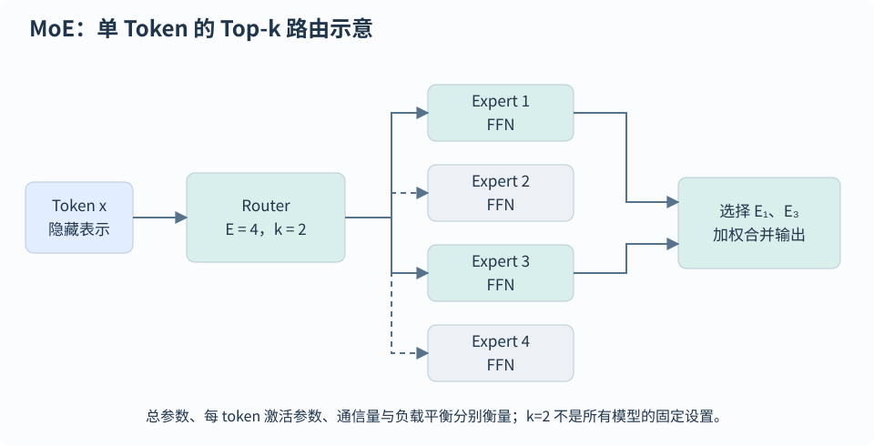

# 模型架构、MoE 与模型家族

[首页](../README.md) · [全部题目](../QUESTION-INDEX.md)

## 目录

- [架构范式与参数](#topic-1)
  - [TFM-004 · Encoder-only、Decoder-only 与 Encoder-Decoder 怎样选择？](#tfm-004)
  - [TFM-014 · 输入 embedding 与输出 LM head 权重共享有什么利弊？](#tfm-014)
  - [ARC-007 · Prefix LM 与 Causal LM 的 attention mask 有何区别，KV cache 有什么限制？](#arc-007)
  - [ARC-010 · 怎样由 config 估算 Transformer 参数量，12Ld² 为什么只是近似？](#arc-010)
  - [ARC-012 · 自回归与非自回归生成有什么区别，为什么并行输出可能牺牲质量？](#arc-012)
  - [ARC-015 · NAS 怎样搜索模型架构，DARTS 与权重共享有哪些取舍？](#arc-015)
- [预训练模型与家族对比](#topic-2)
  - [ARC-001 · BERT 的 MLM 与 NSP 怎么训练，15% 和 80/10/10 代表什么？](#arc-001)
  - [ARC-002 · BERT 的 token、segment、position embedding 为何相加？512 是数学上限吗？](#arc-002)
  - [ARC-003 · RoBERTa、ALBERT 与 SpanBERT 分别改进了 BERT 的什么？](#arc-003)
  - [ARC-004 · XLNet 的排列语言建模和双流注意力是什么，是否把输入词序打乱？](#arc-004)
  - [ARC-005 · GLM 的自回归空白填充、二维位置编码与 ChatGLM 系列怎样理解？](#arc-005)
  - [ARC-006 · LLaMA 1、Llama 2 与 Llama 3 的结构和训练配方有哪些关键变化？](#arc-006)
  - [ARC-011 · T5 与 BART 怎样做去噪预训练，与 BERT MLM 有何区别？](#arc-011)
  - [ARC-022 · DeepSeek-V2、V3、R1 有何区别？它们还是 Transformer 吗？](#arc-022)
  - [ARC-025 · 原始 Qwen3 文本模型相较 Qwen2.5 有哪些结构和后训练变化？](#arc-025)
- [MoE 路由、训练与压缩](#topic-3)
  - [TFM-015 · MoE 与 Dense 的参数量和计算量应怎样比较？](#tfm-015)
  - [ARC-008 · MoE 路由、Top-k、capacity factor 与 token dropping 分别做什么？](#arc-008)
  - [ARC-009 · MoE 的负载均衡损失与 router z-loss 有何区别？](#arc-009)
  - [ARC-013 · MoE 怎样用于模型压缩，WideNet 与 MoEBERT 的思路有什么不同？](#arc-013)
  - [ARC-014 · MoE 微调为什么容易过拟合，专家一定按语言或领域自动分工吗？](#arc-014)
  - [ARC-023 · DeepSeek-V3 的负载平衡、MTP 和 FP8 分别解决什么问题？](#arc-023)
- [推理模型与 MLA](#topic-4)
  - [ARC-021 · MLA 怎样压缩 KV Cache？和 MQA/GQA、RoPE 有什么关系？](#arc-021)
  - [ARC-024 · DeepSeek-R1-Zero、R1 与蒸馏模型的训练流程分别是什么？](#arc-024)

<a id="topic-1"></a>
## 架构范式与参数

<a id="tfm-004"></a>
### TFM-004 · Encoder-only、Decoder-only 与 Encoder-Decoder 怎样选择？

**L1** · 腾讯

#### 答案

Encoder-Decoder 先编码源序列，再由 decoder 自回归生成目标，两边长度可以不同。原始 Transformer 的 encoder 和 decoder 各有 6 层：encoder 每层含双向 self-attention 和 FFN，decoder 另含因果 self-attention 与 cross-attention。源输入被编码为 $`H_{\rm src}`$，目标第 $`t`$ 步依赖源输入与目标历史。

Cross-attention 用 decoder hidden 作 $`Q`$、encoder memory 作 $`K/V`$，可访问完整已知源句并屏蔽源 padding；decoder 自身仍只看目标历史。源 memory 可一次编码，各层的 cross-attention K/V 投影可复用。条件概率分解为 $`p(y\mid x)=\prod_t p(y_t\mid y_{<t},x)`$，训练时用右移目标和 teacher forcing 并行计算各位置损失。原模型使用 PostNorm，并在两边注入位置编码；后续架构不必固定 6 层或同一种归一化。

BERT 等 encoder-only 常用双向表示和 MLM，适合理解及表示任务；GPT 类 decoder-only 用因果目标训练，可把输入与输出串到同一上下文。Prefix LM 的分段可见性不等于具有独立 encoder 和 cross-attention。选型要结合任务形态、源/目标长度、memory 复用、缓存、吞吐与训练数据：encoder-only 可经额外设计用于生成，decoder-only 也能分类，结构标签本身不能保证任务效果。

Decoder-only 把各种任务统一成前缀后的 next-token 预测，可直接利用大量无标注连续文本做因果训练，推理再按相同概率分解配合 KV cache 逐步生成，输入/示例/对话也可用同一序列接口组织。这种统一目标、数据与部署方式是其常见优势，不是“Encoder 完全不能生成”的数学定理。Encoder-Decoder 在条件生成、较长源输入和 memory 复用等条件下仍有优势，训练并行能力也不能与自回归生成必须按步进行混淆。

```math
\begin{aligned}H_{\rm src}&=\mathrm{Encoder}(x)\\p_\theta(y\mid x)&=\prod_t p_\theta(y_t\mid y_{\lt t},H_{\rm src})\\Q&=H_{\rm dec}W_Q,\quad K=H_{\rm src}W_K,\quad V=H_{\rm src}W_V\end{aligned}
```

#### 易错点

- 把 source 与 target 强制要求等长，或把 cross-attention 也无条件设置成目标三角 mask。
- 把 encoder 的双向 attention 直接移到生成中的未知目标位置而造成未来信息泄漏。

#### 追问

- 改变 source 长度时，cross-attention 权重矩阵的哪一轴变化？
- 条件 memory 的缓存与 decoder 历史 KV cache 的增长方式有何不同？

<a id="tfm-014"></a>
### TFM-014 · 输入 embedding 与输出 LM head 权重共享有什么利弊？

**L2**

#### 答案

语言模型将 `H:[B,T,D]` 经 `W_vocab:[D,V]` 与 `b:[V]` 映射为 `logits:[B,T,V]`，再沿词表轴做 softmax，得到下一 token 概率。Logits 本身未归一化，交叉熵实现通常直接接收它。

输入 embedding 表 $`E\in\mathbb R^{V\times D}`$ 与输出 head 维度相容时，可令 $`W_{\rm vocab}=E^\top`$。这样省去一份约 $`VD`$ 的权重，输入表示与输出分类器接收共同梯度；输出 bias 仍可保留，词表分类计算量也不会随之消失。若两边词表或 hidden 维度不同，需额外映射。原始 Transformer 共享两个 embedding 层与 pre-softmax 线性变换，并在 embedding 使用时乘 $`\sqrt D`$。

权重 tying 不意味着标准 Transformer 的各层、各头自动共享参数：相同结构通常分别学习，fused QKV 也只是计算安排。ALBERT 的跨层共享是专门的设计，可共享 attention、FFN 或全部，默认全部共享。验证应检查参数别名、`state_dict`、词表与输出维度；共享也不等于冻结，不能保证所有任务都改善。

```math
\begin{aligned}Z&=HW_{\rm vocab}+b\\p_v&=\frac{\exp z_v}{\sum_u\exp z_u}\\W_{\rm vocab}&=E^\top,\quad \Delta N\approx VD\end{aligned}
```

#### 易错点

- 把同一层内跨位置使用 FFN、embedding/head tying 与跨层或跨头共享混为一谈。
- 对 logits 先 softmax 后再交给期望 logits 的 `CrossEntropyLoss`，或沿 hidden 轴做词表归一化。

#### 追问

- 共享 embedding/head 时，padding token 对应的输出行是否一定永远没有梯度？
- ALBERT 共享参数为何省参数却仍要执行多层计算？

<a id="arc-007"></a>
### ARC-007 · Prefix LM 与 Causal LM 的 attention mask 有何区别，KV cache 有什么限制？

**L2**

#### 答案

Causal LM 的每个位置只访问自身及之前位置；Prefix LM 的前缀内部双向可见，而待生成部分访问整个前缀和此前生成位置。它们都能逐 token 生成后缀，真正差别在前缀表示是否依赖前缀中的未来 token，而不是“只有Prefix LM能带prompt”。

固定前缀计算完成后，两者都可缓存可复用的 K/V 并增量生成后缀。若向双向前缀里插入或追加仍属于前缀的内容，旧前缀表示可能改变，必须重新计算相应缓存；causal 前缀的旧位置则不依赖新增后续内容，通常可复用。训练还须指定前缀/后缀划分、loss范围和position ids，Prefix LM 的结构不要求全部前缀都计算语言建模 loss。适合条件生成和填空的选择应结合预训练目标与任务验证。

```math
M_{ij}=\begin{cases}0,&i\le p,\ j\le p\\0,&i\gt p,\ (j\le p\text{ or }j\le i)\\-\infty,&\text{otherwise}\end{cases}
```

#### 易错点

- 说 causal LM 不能用给定 prompt 生成。
- 对改变了双向前缀的输入盲目复用旧 KV cache。

#### 追问

- 固定 prefix 生成后缀时为什么仍能缓存？
- prefix attention mask 与只对回答计loss是否等价？

<a id="arc-010"></a>
### ARC-010 · 怎样由 config 估算 Transformer 参数量，12Ld² 为什么只是近似？

**L2**

#### 答案

标准MHA的Q/K/V/O四个投影约4d²参数，普通两层FFN约2dd_ff；若d_ff=4d，单层约12d²。L层加输入embedding与输出head、norm和bias，得到常用粗估。GQA/MQA改变K/V投影宽度，SwiGLU含三个矩阵，MoE含全部专家和router，跨层共享或输入输出权重共享都会改变独立参数量。

以head_dim=d_h、query头数h_q、KV头数h_kv表示，Q输出宽度为h_qd_h，K/V为h_kvd_h，O映射回d；只有h_qd_h=d时常用4d²简化才直接成立。共享embedding/head只计一次独立张量，切勿按module路径重复计数。模型磁盘大小约参数字节加元数据/量化scale，训练显存还包括梯度、优化器与激活；参数量、FLOPs、模型文件与显存分别回答。最终核对state_dict的shape及共享storage，避免只读模型名。

```math
\begin{aligned}P_{\rm attn}&=2d(h_q+h_{\rm kv})d_h\\P_{\rm FFN}&=2dd_{\rm ff}\ (\mathrm{MLP}),\quad3dd_{\rm ff}\ (\mathrm{SwiGLU})\\P_{\rm total}&\approx L(P_{\rm attn}+P_{\rm FFN})+n_{\rm table}|V|d+P_{\rm other}\end{aligned}
```

#### 易错点

- 把12Ld²用于任意GQA/SwiGLU/MoE而不改矩阵形状。
- 对共享权重按state_dict名称重复计参数。

#### 追问

- MoE模型怎样分别报告总参数与每token激活参数？
- 量化后为何磁盘大小不等于参数数乘4bit？

<a id="arc-012"></a>
### ARC-012 · 自回归与非自回归生成有什么区别，为什么并行输出可能牺牲质量？

**L2**

#### 答案

自回归模型把输出联合概率分解为逐步条件概率，每一步依赖此前输出；非自回归模型尝试同时预测多个位置，常需先决定长度或结构。最简单NAT近似让位置在给定输入后条件独立，减少串行解码，但难表达多个合法答案之间的相关性，例如不同表达组合可能拼成不一致句子。

改进包括引入latent/fertility、知识蒸馏、反复mask-and-refine、插入/编辑式解码或其他并行生成目标；它们不等于一次前向就生成任意长度的精确AR分布。AR训练用teacher forcing也可并行计算各位置loss，串行瓶颈主要在常规生成。比较速度要报质量、迭代次数、长度、batch与硬件；减少解码轮数不保证所有任务的端到端收益。用于固定格式或延迟敏感任务时，可以接受一定质量折中，而自由文本生成常仍依赖强输出相关性。

```math
p_{\rm AR}(y\mid x)=\prod_t p(y_t\mid x,y_{\lt t}),\qquad p_{\rm NAT}(y\mid x)=p(T\mid x)\prod_{t=1}^{T}p(y_t\mid x,T)
```

#### 易错点

- 把AR训练并行性与AR生成的条件依赖混为一谈。
- 宣称简单NAT与同一AR模型的联合分布精确等价。

#### 追问

- 多模态输出分布为什么容易造成NAT位置间不一致？
- 多轮refinement的延迟应该怎样比较？

<a id="arc-015"></a>
### ARC-015 · NAS 怎样搜索模型架构，DARTS 与权重共享有哪些取舍？

**L2**

#### 答案

NAS 要定义搜索空间、搜索策略和候选评估方式。搜索空间可包含深度、宽度、算子、连接和注意力配置；策略可用随机搜索、进化、强化学习或梯度方法；评估需同时考虑质量、参数量、显存及目标设备延迟。只搜索某个固定结构的学习率属于超参数优化，两者可以联合但不完全相同。

DARTS 用 softmax 权重将离散算子混合成可微结构，训练模型权重和架构参数，再离散选择候选；典型目标是双层优化，训练集拟合权重、验证集优化结构。共享 supernet 避免每个候选从头训练，节省搜索成本，但子结构在共享权重下的排名可能与独立训练不一致。最终候选应重新训练或按统一协议校准，在独立测试集上测性能，并把搜索本身的算力计入成本。FLOPs 与硬件时延不一一对应，不能用单个代理指标宣称最优。

```math
\min_{\alpha}\mathcal L_{\mathrm{val}}(w^*(\alpha),\alpha),\quad w^*(\alpha)=\arg\min_w\mathcal L_{\mathrm{train}}(w,\alpha),\qquad \bar o(x)=\sum_{o\in\mathcal O}\mathrm{softmax}(\alpha)_o\,o(x)
```

#### 易错点

- 把连续混合结构的验证分数当成离散结构的最终测试分数。
- 用测试集反复挑结构，或漏报搜索与重训成本。

#### 追问

- 为什么 shared weights 会改变候选排序？
- 如何在目标 GPU 上把延迟或显存约束纳入搜索？

<a id="topic-2"></a>
## 预训练模型与家族对比

<a id="arc-001"></a>
### ARC-001 · BERT 的 MLM 与 NSP 怎么训练，15% 和 80/10/10 代表什么？

**L1**

#### 答案

原始 BERT 是双向 Transformer encoder。MLM 先选择约 15% 的 WordPiece 位置作为监督集合，在被选位置中约 80% 换为 MASK、10% 换为随机词、10% 保留原词，并对这些位置预测原始 token；未选位置不直接计 MLM loss。80/10/10 缓解预训练与下游没有 MASK 的输入差异，同时保持主要去噪信号，并不是理论最优比例。

NSP 为句对判别任务，原配方约一半用相邻片段、一半用随机片段；利用 CLS 表示预测 IsNext/NotNext，与 MLM loss 组合。MLM 的“遮蔽”是输入 token 扰动，双向 attention 仍可访问被扰动位置及两侧上下文，和 causal attention mask 完全不同。CLS 表示通过预训练任务与下游监督学会聚合信息，不天然是最佳通用句向量。BERT 可接分类、序列标注或起止位置预测头，不能直接把其双向 MLM 当作普通左到右生成器。

```math
\mathcal L_{\rm MLM}=-\sum_{i\in\mathcal M}\log p_\theta(x_i\mid\tilde x),\qquad\mathcal L_{\rm BERT}=\mathcal L_{\rm MLM}+\mathcal L_{\rm NSP}
```

#### 易错点

- 把“15%被选用于预测”说成全部15%都换成 MASK。
- 用 causal attention mask 代替 MLM 的输入扰动。

#### 追问

- 保留原词的10%是否等同于取消所有去噪训练？
- 为什么后来的方法可以去掉 NSP？

<a id="arc-002"></a>
### ARC-002 · BERT 的 token、segment、position embedding 为何相加？512 是数学上限吗？

**L2**

#### 答案

原始 BERT 输入为 WordPiece embedding、token-type/segment embedding 和可学习绝对位置 embedding 的和，再做 LayerNorm 与 dropout。它们共享 hidden 维度，相加能保持后续层输入大小；参数会共同学习各信息如何使用，并不存在“相加必然毁掉语义”的结论。CLS 常用于句级任务，SEP 标识分隔；segment 的 A/B 标签用来区分句对，许多单句任务都用同一个 segment。

512 是原始模型的最大位置表与训练长度配置，不是 Transformer 的普遍数学上限，也不是512个中文词。超长输入可截断、滑窗分块加聚合，或扩位置表并继续训练；直接补随机位置或插值不能保证效果，成本仍受注意力和激活规模限制。若是抽取问答，要保留块到原文的offset与跨块答案处理；若是句向量，验证池化和训练目标。BERT 输入加法与 RoPE 旋转 Q/K 属于不同位置参数化。

```math
h_i^{(0)}=\mathrm{LN}(E_{x_i}+S_{a_i}+P_i),\qquad E_{x_i},S_{a_i},P_i\in\mathbb R^d
```

#### 易错点

- 把最大位置表大小当作算法不能改变的理论上限。
- 把 token 数等同于空格词数或汉字数。

#### 追问

- 没有句对任务时 token-type embedding 能否省略？
- 滑窗问答的答案横跨两个块时该怎样处理？

<a id="arc-003"></a>
### ARC-003 · RoBERTa、ALBERT 与 SpanBERT 分别改进了 BERT 的什么？

**L2**

#### 答案

RoBERTa 重点改训练配方：更多数据和训练、较大 batch、动态 MLM mask、去掉 NSP，并采用 byte-level BPE。它说明训练条件会影响架构对比，不能把其提升全归因于一个新模块。ALBERT 分解词 embedding 的参数：先映射到较小 embedding 维度再投影到 hidden 维度，并可跨层共享 Transformer 参数；它用 SOP 判别连续片段的顺序，尽量减少 NSP 通过主题差异取巧。

SpanBERT 对连续 span 进行遮蔽，并用两端表示及相对位置预测 span 内 token，使表示更适合抽取式问答、指代等 span 任务。三者都以双向表示为核心，但压参数、改训练和改监督目标解决的问题不同。ALBERT 的层共享减少独立参数和模型状态，不等于执行层数减少；SpanBERT 的连续遮蔽也不同于 T5 直接生成被删 span。评价需固定数据、算力、模型规模与任务。

```math
P_{\rm embed}^{\rm BERT}=|V|d,\qquad P_{\rm embed}^{\rm ALBERT}=|V|e+ed,\quad e\ll d
```

#### 易错点

- 认为 ALBERT 减少参数就必然同比减少 FLOPs。
- 把所有去掉 NSP 的模型视为同一训练目标。

#### 追问

- SOP 怎样让负例更难仅靠主题区分？
- SpanBERT 的边界预测为何适合跨度任务？

<a id="arc-004"></a>
### ARC-004 · XLNet 的排列语言建模和双流注意力是什么，是否把输入词序打乱？

**L2**

#### 答案

XLNet 对位置的不同因子分解顺序取期望，让模型在不同预测顺序下利用左右文信息，输入仍保留原始位置与序列顺序，并非把句子随机打乱后学习。给定某个排列，当前位置只依赖排列中已出现的内容；不同排列覆盖不同可见上下文。

若用于预测某个位置的表示直接包含其 token，模型就能泄露标签。双流注意力因此区分 content stream 和 query stream：content stream 含位置内容用于后续上下文，query stream 只携带目标位置信息并访问已知位置的content，不读目标 token 本身。XLNet 还继承 Transformer-XL 的跨段记忆与相对位置思路，记忆常作为停止梯度的旧段状态；这和推理 KV cache 的含义不同。它通过条件概率表达预测项之间的关系，但实际训练部分预测、记忆和排列采样是计算折中，不宜宣称天然解决所有 MLM 局限。

```math
\mathcal L=-\mathbb E_{z\sim\mathcal Z_T}\sum_{t=1}^{T}\log p_\theta(x_{z_t}\mid x_{z_{\lt t}})
```

#### 易错点

- 把排列因子分解等同于打乱文本原始词序。
- 预测目标的 query stream 直接读取目标 token 内容。

#### 追问

- 双流的 query 和 content 更新各有哪些可见项？
- 跨段记忆为什么还需要相对位置表示？

<a id="arc-005"></a>
### ARC-005 · GLM 的自回归空白填充、二维位置编码与 ChatGLM 系列怎样理解？

**L2**

#### 答案

原始 GLM 从文本中删去若干连续 span，在剩余文本中用 mask 占位，再自回归生成缺失片段。未被删的部分互相双向可见，生成部分可访问未删文本和此前已生成内容，因此一个模型可支持理解、条件生成与无条件生成等目标。二维位置通常分别描述原文中的位置/遮蔽点以及缺失span内部的生成步，帮助在没有完整缺失内容时定位生成 token。

ChatGLM 是基于 GLM 思路发展出的对话模型系列，具体 checkpoint 的架构和训练已发生变化，不能把初代的二维位置、激活和 mask 规则套到全部后续版本。初代 ChatGLM-6B 以中英对话为重点，ChatGLM2 引入 MQA 等改动，ChatGLM3 进一步提供工具、代码等能力；回答对比时应明确版本并检查 config、attention mask 与 tokenizer，而非靠模型家族名猜公式。GLM 的 blank infilling 也不等于只在普通 causal LM 前面加一个 prompt。

```math
p_\theta(S\mid A)=\prod_{j}p_\theta(S_j\mid A,S_{\lt j}),\qquad\mathrm{pos}(S_j)=(\mathrm{anchor}(S),j)
```

#### 易错点

- 将 ChatGLM1 的组件断言为所有 GLM/ChatGLM 版本的共同配置。
- 忽略空白填充中未删文本的双向可见性。

#### 追问

- GLM 生成span的顺序与原文顺序有什么关系？
- 如何从实现确认一个模型使用 causal mask 还是 prefix mask？

<a id="arc-006"></a>
### ARC-006 · LLaMA 1、Llama 2 与 Llama 3 的结构和训练配方有哪些关键变化？

**L2**

#### 答案

三者都以 decoder-only Transformer 为基础，RMSNorm、RoPE 和 SwiGLU 是其常见结构。LLaMA1 用 SentencePiece tokenizer、Pre-Norm 与较长时间的 next-token 预训练；Llama2 增加训练数据与上下文长度，较大型号采用 GQA，并提供经 SFT/RLHF 后训练的 Chat 版本。不能把“Llama2”简化为全部型号都新增 GQA，原始7B/13B与70B配置有区别。

2024年首发 Llama3 8B/70B 采用约128K词表的 tokenizer、GQA 和更大、更精细过滤的预训练数据；首发窗口为8K，后来的 Llama3.1 等扩到128K，面试时须分开。架构小改与数据量、混合比例、去重、后训练都影响效果，不能据参数量推断能力。扩词表降低某些语言的 token 长度，但增加 embedding/LM head 成本；GQA 减少 KV 头和缓存负担，RoPE 参数与训练窗口共同决定外推表现。给具体比较应引用 checkpoint 配置而非使用家族级固定数字。

```math
P_{\rm vocab}=|V|d\quad(\text{one table}),\qquad M_{\rm KV}\propto L\,T\,n_{\rm kv}\,d_h
```

#### 易错点

- 把 Llama2 所有大小都说成 GQA，或把首发 Llama3 的窗口说成128K。
- 把后训练改进与 Transformer 模块变化混为一谈。

#### 追问

- 为何较大的词表同时可能减少序列长度并增加模型参数？
- 比较两个型号时如何确认 KV 头数？

<a id="arc-011"></a>
### ARC-011 · T5 与 BART 怎样做去噪预训练，与 BERT MLM 有何区别？

**L2**

#### 答案

T5 将任务统一成文本到文本，常见span corruption把连续片段替换成不同sentinel，decoder按顺序生成被删片段和对应sentinel；BART 用双向encoder与自回归decoder，从被扰动的文本重建完整原文，研究过text infilling、句序打乱等噪声。两者encoder可看到被破坏输入，decoder仍通过causal mask训练条件生成。

BERT的MLM在被选位置接词表分类头，通常不生成整个目标序列；T5/BART的目标在decoder序列上做自回归交叉熵。连续遮蔽、目标格式、目标长度和可见上下文均会影响计算量，不能仅因使用mask就称为同一目标。encoder-decoder很适合输入输出分离的翻译、摘要和条件生成，也能缓存encoder输出及decoder历史；decoder-only的流行并不证明这些结构无效。

```math
\mathcal L_{\rm denoise}=-\sum_{t=1}^{|y|}\log p_\theta(y_t\mid y_{\lt t},\mathrm{corrupt}(x))
```

#### 易错点

- 把T5生成缺失span与BART重建全文的target格式混为一谈。
- 认为encoder-decoder无法复用任何KV缓存。

#### 追问

- 改变span平均长度会怎样改变目标序列长度？
- BART为何能用于文本生成而原始BERT不能直接等价使用？

<a id="arc-022"></a>
### ARC-022 · DeepSeek-V2、V3、R1 有何区别？它们还是 Transformer 吗？

**L2**

#### 答案

以 2024 年 V2、2024 年底 V3 和 2025 年初 R1 的原始报告为准，它们仍属于自回归 Decoder-only Transformer 家族，保留因果注意力、残差和前馈模块；MLA 与 MoE 改变的是注意力和 FFN 的实现。

V2 将 MLA 与 DeepSeekMoE 结合，主要解决容量、激活计算量和 KV 成本。V3 延续这两个模块，并改进负载平衡、增加多 token 预测训练，配合 FP8 与计算通信重叠来提高训练效率；原始 V3 为总参数 671B、每 token 激活约 37B。激活参数少不意味着只需存放 37B 权重。

R1 主要是基于 V3-Base 的推理后训练路线：R1-Zero 探索从底座直接进行推理 RL，R1 增加冷启动、筛选生成数据和更完整的后训练。R1-Distill-Qwen/Llama 是不同底座的蒸馏模型，不能因名字里有 R1 就认为它们也有 V3 的 MLA/MoE。回答模型区别时应同时报 checkpoint、底座、结构和训练路线。

#### 易错点

- 把 DeepSeek 视为 Transformer 的竞争架构名，或把 R1 蒸馏版的结构归为原始 V3。
- 用每 token 激活参数量估算完整权重容量。

#### 追问

- 怎样比较 MoE 和 Dense 的容量、FLOPs、通信以及部署内存？
- R1-Distill-Qwen-14B 的注意力结构应去哪里确认？

<a id="arc-025"></a>
### ARC-025 · 原始 Qwen3 文本模型相较 Qwen2.5 有哪些结构和后训练变化？

**L2**

#### 答案

以 2025 年 4 月发布、同年 5 月报告描述的原始 Qwen3 文本系列为准：Dense 模型继续采用 GQA、SwiGLU、RoPE 与 Pre-RMSNorm，去掉 QKV bias 并引入 QK-Norm 来改善注意力训练稳定性。MoE 版本使用 128 个路由专家、每 token 激活 8 个，不沿用 Qwen2.5-MoE 的共享专家设置；总参数和激活参数必须分别比较。

旗舰模型后训练按长 CoT 冷启动、推理 RL、Thinking Mode Fusion、通用 RL 组织；通过模板和训练让同一原始 checkpoint 支持思考与非思考模式，并提供思考预算的控制。小模型还可以采用强到弱蒸馏。后续标明 Instruct/Thinking 或不同日期的版本可能采用不同模式，不能把原始版本的行为套到全部 Qwen3 名称上。

文本 Qwen3 使用一维文本位置 RoPE，没有图像的 t/h/w 网格或 Qwen3-VL 的 Interleaved M-RoPE。多模态改造需要视觉编码器、连接器、位置处理和相应数据训练，换模型名字或额外塞图像 embedding 不能自动得到这些能力。

#### 易错点

- 把文本 Qwen3 的 QK-Norm 或 hybrid thinking 与 Qwen3-VL 的视觉位置编码混为一谈。
- 省略发布日期，声称全部 Qwen3 checkpoint 都支持相同的 /think 行为。

#### 追问

- QK-Norm 如何影响注意力 logit 的尺度？
- 怎样比较思考模式的准确率收益和额外 token 成本？

<a id="topic-3"></a>
## MoE 路由、训练与压缩

<a id="tfm-015"></a>
### TFM-015 · MoE 与 Dense 的参数量和计算量应怎样比较？

**L2**

#### 答案

MoE 通常把部分 FFN 替换为专家集合，由 router 为每个 token 选择 top-k 专家并加权输出，以较少的激活计算提供较大的总参数容量。Dense 则通常每个 token 使用全部层参数。

总参数、激活参数与真实成本要分别统计：激活参数包含共享模块和被选专家，不能简单用总参数乘 $`k/E`$。路由不均衡会形成热点、容量溢出或 token 丢弃，常需辅助损失等机制。专家并行还有 all-to-all 通信，小 batch、跨节点或低利用率场景可能抵消算术收益，甚至增加时延。



示例为 4 个专家中激活 2 个；真实系统还需要处理负载、容量与通信。

#### 易错点

- MoE 总参数大就必然推理更慢，或激活参数少就必然更快。
- 忽略共享模块、路由与通信成本。

#### 追问

- 负载均衡会不会损害专家专门化？
- 如何区分模型 FLOPs 与实际 GPU 成本？

<a id="arc-008"></a>
### ARC-008 · MoE 路由、Top-k、capacity factor 与 token dropping 分别做什么？

**L2**

#### 答案

稀疏 MoE 常把 FFN 替换成多个专家，router 根据 token 隐状态产生专家分数，只激活 Top-k 专家，按选中权重聚合输出。不同实现对选中概率是否重归一化有差异；Switch 使用Top-1，原始稀疏门控工作也研究噪声Top-k。总参数含全部专家，单 token 计算只涉及所选专家，因此 active参数与总参数必须分开。

capacity 对每个专家设置可接收 token 的预算，常按平均负载乘 capacity factor 取整；负载超过容量时传统实现可 drop 溢出分支、回退或走残差，不能简单理解为从语料删掉该token。提高容量减轻溢出但增加buffer、计算与通信，dropless方案避免drop却须面对不均衡显存和调度。Top-k 的离散选择不是处处可微，router梯度主要来自被选专家的门权重及辅助目标。选型需联合看质量、负载、通信与实际吞吐。

```math
\begin{aligned}p(x)&=\mathrm{softmax}(W_rx)\\y&=\sum_{e\in\mathrm{TopK}(p,k)}\tilde p_e(x)E_e(x)\\C&=\left\lceil\mathrm{capacity\_factor}\cdot\frac{Tk}{E}\right\rceil\end{aligned}
```

#### 易错点

- 只报总参数量就推断每 token FLOPs。
- 把专家溢出drop说成完全删除序列位置。

#### 追问

- dropless MoE 为什么仍可能出现负载瓶颈？
- Top-1 门控概率保留原softmax值与重归一化为1会有何差别？

<a id="arc-009"></a>
### ARC-009 · MoE 的负载均衡损失与 router z-loss 有何区别？

**L3**

#### 答案

负载均衡项避免大量 token 拥挤到少数专家，使容量与通信更可控。Switch 的辅助项用每个专家实际接收比例 f_e 与平均门控概率 P_e 的乘积和，f_e 来自离散路由，梯度主要经过 P_e；它鼓励分配平衡，但系数过大可能牺牲任务特化。除这种形式外还有importance/load、expert-choice或无显式辅助loss的设计，公式不能混用。

ST-MoE 的 router z-loss 对 router logits 的 logsumexp 平方加惩罚，约束其尺度、改善数值稳定性，与把每个专家均匀使用不是同一目标。训练需同时记录专家负载、溢出率、熵、router logits和主loss，不能只看到辅助loss低就认为质量好。router可能用FP32计算敏感归一化；专家FFN仍可用低精度。辅助项大小还依赖token数、Top-k和是否按序列/批次归一化。

```math
\begin{aligned}\mathcal L_{\rm balance}&=\alpha E\sum_{e=1}^{E}f_eP_e\\f_e&=\frac1T\sum_t\mathbf1\{\mathrm{route}(t)=e\},\quad P_e=\frac1T\sum_t p_e(x_t)\\\mathcal L_z&=\frac\beta T\sum_t\left(\log\sum_e e^{z_{t,e}}\right)^2\end{aligned}
```

#### 易错点

- 把 z-loss 说成专家负载均衡的另一种名字。
- 把上式 f_e 定义直接用于任意Top-k实现而不改归一化。

#### 追问

- 为什么对logits加同一常数不改变softmax却会改变z-loss？
- 负载均衡与专家特化之间有什么张力？

<a id="arc-013"></a>
### ARC-013 · MoE 怎样用于模型压缩，WideNet 与 MoEBERT 的思路有什么不同？

**L2**

#### 答案

MoE 可以增加总容量、限制每个 token 的激活计算，也可结合参数共享或蒸馏压缩模型；“稀疏”不自动等于权重文件更小。WideNet 在深度方向共享 Transformer 参数，在宽度方向使用 MoE 增加表达容量，同时让不同层使用独立的归一化参数，以减轻完全共享的表达限制。

MoEBERT 从预训练 BERT 的 FFN 适配出多个较小专家，以神经元重要性指导分配，并用层级蒸馏保留教师表示；推理只选择一个专家，以降低激活计算。它不是先独立训练多个完整 BERT 再投票。评估应同时报告总参数、激活参数、权重常驻显存、路由/通信开销和真实延迟，在相同任务质量下比较。专家很小、batch 很小或路由分散时，额外调度可能抵消理论 FLOPs 收益。

#### 易错点

- 把 MoE 激活 FLOPs 变少直接等同于总存储变少。
- 把跨层共享和 token 路由当作同一种稀疏机制。

#### 追问

- 共享 FFN 而不共享 LayerNorm 有什么作用？
- 怎样设计 dense 学生与 MoE 学生的公平蒸馏对照？

<a id="arc-014"></a>
### ARC-014 · MoE 微调为什么容易过拟合，专家一定按语言或领域自动分工吗？

**L2**

#### 答案

MoE 在较小下游数据集上可能很快拟合训练集，而验证集改善有限；总参数多、专家更新数据不均、路由分布变化都要观察。z-loss 控制 router 数值尺度，负载均衡改善容量分配，不能代替泛化控制。可分别调专家内部 dropout、学习率、batch、训练步数，并对比冻结专家、更新非 MoE 子层或全量更新，检查训练—验证差距与路由统计。

Switch 研究了更强的专家 dropout；ST-MoE 则发现更强 dropout 的收益有限，部分参数微调有时能保持质量，而仅更新专家在其配置下明显变差。这些是具体规模和任务下的证据，不是“永远冻结专家”的规则。专家分工也不能按名称推断：ST-MoE 的 encoder 专家表现出某些句法、语义等特化，decoder 未呈现同样模式，多语言专家也不简单按语言一一划分。应按 token 类型、路由频率、负载、消融后的质量和跨域泛化来验证分工。

#### 易错点

- 把 expert dropout 误解成总是随机删除整个专家；常见含义是专家隐状态的 dropout。
- 认为每个专家天然等于一个人类定义的领域，或 experts 越多下游效果必然越好。

#### 追问

- 仅更新专家为什么可能比更新较少非专家参数效果差？
- 怎样区分专家特化、路由偏置与专家塌缩？

<a id="arc-023"></a>
### ARC-023 · DeepSeek-V3 的负载平衡、MTP 和 FP8 分别解决什么问题？

**L3**

#### 答案

V3 的主要训练改进可从三个瓶颈解释。专家负载不均会造成热点和等待，因此它给专家路由分数增加可动态更新的偏置，过载专家降低偏置，欠载专家提高偏置。偏置影响 top-k 选择，实际聚合权重仍来自原始亲和分数，避免直接用较强的平衡损失干扰主任务；报告仍使用很小的序列级平衡辅助损失，所以“完全没有任何辅助 loss”不准确。

MTP 在主 next-token 目标之外，使用额外模块预测后续 token，使训练能利用更长的预测关系。它不意味着主模型一次前向即可无条件生成多个最终 token；推理可移除额外模块，也可把它作为草稿用于投机验证，是否提速取决于接受率和实现。

FP8 主要降低矩阵乘法与部分存储通信成本，但采用细粒度缩放并保留关键操作的较高精度，不是权重、梯度、优化器、归约全部以 FP8 运行。还需把 MoE all-to-all、DualPipe 和重叠调度一起考虑；单个低精度开关无法复现整套效率。

#### 易错点

- 将 auxiliary-loss-free 解释为训练总目标不含任何辅助项。
- 把 MTP 训练目标与无验证的多 token 最终输出混为一谈。

#### 追问

- 路由偏置和专家聚合权重为什么要分开？
- FP8 溢出、量化误差与通信瓶颈应分别怎样监控？

<a id="topic-4"></a>
## 推理模型与 MLA

<a id="arc-021"></a>
### ARC-021 · MLA 怎样压缩 KV Cache？和 MQA/GQA、RoPE 有什么关系？

**L3**

#### 答案

MLA 将每个 token 的内容 K/V 联合投影为低维 latent $`c_t`$，再由各头的上投影得到内容 K/V。MQA/GQA 直接共享少量 KV 头；MLA 共享压缩表示，同时允许各 query 头具有不同的内容投影。它是一种重新训练的注意力结构，不能把已有 MHA 模型的缓存直接压缩后声称等价。

推理时，内容 key 的上投影可吸收到 query 投影，value 的上投影可与输出投影结合，从而在 latent 空间计算，避免永久缓存展开的每头 K/V。但普通 RoPE 把位置相关旋转夹在两次投影中，不能随意交换矩阵或完成同样的吸收。DeepSeek-V2 将内容分量与位置分量解耦，额外缓存共享的 RoPE key。

若 latent 维为 $`d_c`$，额外位置 key 维为 $`d_R`$，$`B`$ 条等长序列、$`L`$ 层、长度 $`T`$、每元素 $`s`$ 字节，理想缓存为 $`BLT(d_c+d_R)s`$。MHA 则约为 $`2BLTHd_hs`$；这里不含块表、量化元数据和工作区。缓存减少有利于并发和带宽，但最终速度还依赖是否使用适配 MLA 的内核与并行布局。

```math
\begin{aligned}c_t&=W_Dh_t,\quad k_{t,i}^{C}=W_{UK,i}c_t,\quad v_{t,i}=W_{UV,i}c_t\\(q_{t,i}^{C})^\top k_{j,i}^{C}&=(W_{UK,i}^{\top}q_{t,i}^{C})^\top c_j\\M_{\mathrm{MLA}}&\approx BLT(d_c+d_R)s\end{aligned}
```

#### 易错点

- MLA 的 latent 不是单个普通 KV 头，也不是对已训练 MHA 缓存无损做 SVD。
- 省略解耦 RoPE key，或把缓存压缩比例直接当作端到端加速比例。

#### 追问

- 为什么位置相关旋转会破坏权重吸收？
- 使用朴素展开 K/V 的实现时，MLA 的实际峰值显存与带宽有什么变化？

<a id="arc-024"></a>
### ARC-024 · DeepSeek-R1-Zero、R1 与蒸馏模型的训练流程分别是什么？

**L2**

#### 答案

原始 R1-Zero 从 DeepSeek-V3-Base 出发，直接做大规模推理强化学习，不先增加任务冷启动 SFT；这不代表底座未经预训练。训练以 GRPO 使用同题多条生成结果的相对奖励，数学答案或代码测试提供准确性信号，格式规则约束输出。它能形成较长推理，但存在可读性、重复和语言混杂问题。

R1 的主路线是少量长 CoT 冷启动 SFT → 推理 RL → 对较好的生成样本做拒绝采样并加入一般任务数据，形成约 800K 样本，重新从 DeepSeek-V3-Base 做两轮 SFT → 同时覆盖推理及通用偏好的 RL。冷启动提供可读格式，RL 提供结果驱动探索，筛选数据帮助巩固能力和改善通用表现，各阶段不是可随意互换的同一 loss。

蒸馏版则让较小 Qwen/Llama 底座学习 R1 生成并筛选的训练输出，不继承教师的全部结构或运行成本。原论文公布的学生蒸馏配方只做 SFT，没有在这些学生上追加 RL。面试中应区分“教师训练用了 RL”和“学生自己重新做了同等 RL”，并用正确率、推理 token、延迟与语言质量共同衡量收益。

#### 易错点

- “没有 SFT”只描述 R1-Zero 的该后训练路线，不代表没有预训练。
- 蒸馏模型不自动拥有教师的 MLA、专家数量或完整 RL 训练历史。

#### 追问

- 如何防止规则奖励只奖励格式而没有奖励解题？
- 为什么只学习教师最终答案可能与学习筛选后的推理轨迹不同？

## 参考资料

- [Attention Is All You Need](https://arxiv.org/pdf/1706.03762)
- [BERT: Pre-training of Deep Bidirectional Transformers for Language Understanding](https://arxiv.org/abs/1810.04805)
- [Exploring the Limits of Transfer Learning with a Unified Text-to-Text Transformer](https://arxiv.org/pdf/1910.10683)
- [Language Models are Few-Shot Learners](https://arxiv.org/abs/2005.14165)
- [Using the Output Embedding to Improve Language Models](https://arxiv.org/abs/1608.05859)
- [torch.nn.CrossEntropyLoss — PyTorch 2.14 documentation](https://docs.pytorch.org/docs/2.14/generated/torch.nn.CrossEntropyLoss.html)
- [ALBERT: A Lite BERT for Self-supervised Learning of Language Representations](https://arxiv.org/pdf/1909.11942)
- [Switch Transformers: Scaling to Trillion Parameter Models with Simple and Efficient Sparsity](https://arxiv.org/pdf/2101.03961)
- [BERT: Pre-training of Deep Bidirectional Transformers](https://arxiv.org/html/1810.04805v2)
- [RoBERTa: A Robustly Optimized BERT Pretraining Approach](https://arxiv.org/html/1907.11692v1)
- [ALBERT: A Lite BERT](https://arxiv.org/html/1909.11942v6)
- [SpanBERT: Improving Pre-training by Representing and Predicting Spans](https://arxiv.org/abs/1907.10529)
- [XLNet: Generalized Autoregressive Pretraining](https://arxiv.org/abs/1906.08237)
- [GLM: General Language Model Pretraining with Autoregressive Blank Infilling](https://arxiv.org/abs/2103.10360)
- [ChatGLM2-6B 官方仓库](https://github.com/THUDM/ChatGLM2-6B)
- [ChatGLM3 官方仓库](https://github.com/THUDM/ChatGLM3)
- [LLaMA: Open and Efficient Foundation Language Models](https://arxiv.org/abs/2302.13971)
- [Llama 2: Open Foundation and Fine-Tuned Chat Models](https://arxiv.org/abs/2307.09288)
- [The Llama 3 Herd of Models](https://arxiv.org/abs/2407.21783)
- [Exploring the Limits of Transfer Learning with a Unified Text-to-Text Transformer](https://arxiv.org/abs/1910.10683)
- [Switch Transformers](https://arxiv.org/abs/2101.03961)
- [ST-MoE: Designing Stable and Transferable Sparse Expert Models](https://arxiv.org/abs/2202.08906)
- [BART: Denoising Sequence-to-Sequence Pre-training](https://arxiv.org/abs/1910.13461)
- [Non-Autoregressive Neural Machine Translation](https://arxiv.org/abs/1711.02281)
- [Go Wider Instead of Deeper](https://arxiv.org/abs/2107.11817)
- [MoEBERT: from BERT to Mixture-of-Experts via Importance-Guided Adaptation](https://arxiv.org/html/2204.07675v2)
- [Distilling the Knowledge in a Neural Network](https://arxiv.org/abs/1503.02531)
- [Neural Architecture Search: A Survey](https://arxiv.org/abs/1808.05377)
- [DARTS: Differentiable Architecture Search](https://arxiv.org/html/1806.09055v2)
- [Weight-Sharing Neural Architecture Search: A Battle to Shrink the Optimization Gap](https://arxiv.org/abs/2008.01475)
- [DeepSeek-V2 Technical Report](https://arxiv.org/html/2405.04434v5)
- [DeepSeek-V3 official repository](https://github.com/deepseek-ai/DeepSeek-V3)
- [DeepSeek-R1 official repository](https://github.com/deepseek-ai/DeepSeek-R1)
- [DeepSeek-V3 Technical Report](https://arxiv.org/html/2412.19437v2)
- [DeepSeek-R1 Technical Report](https://arxiv.org/html/2501.12948v1)
- [Qwen3 Technical Report](https://arxiv.org/html/2505.09388v1)
- [Qwen3 official repository](https://github.com/QwenLM/Qwen3)
