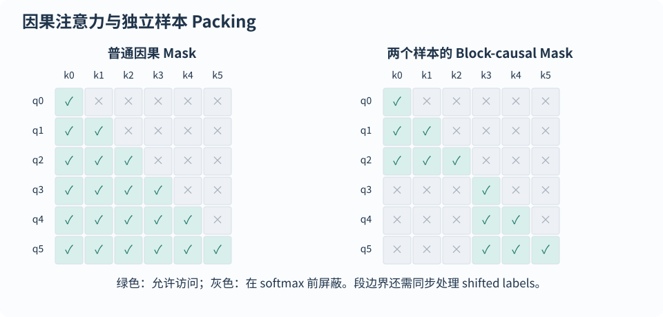
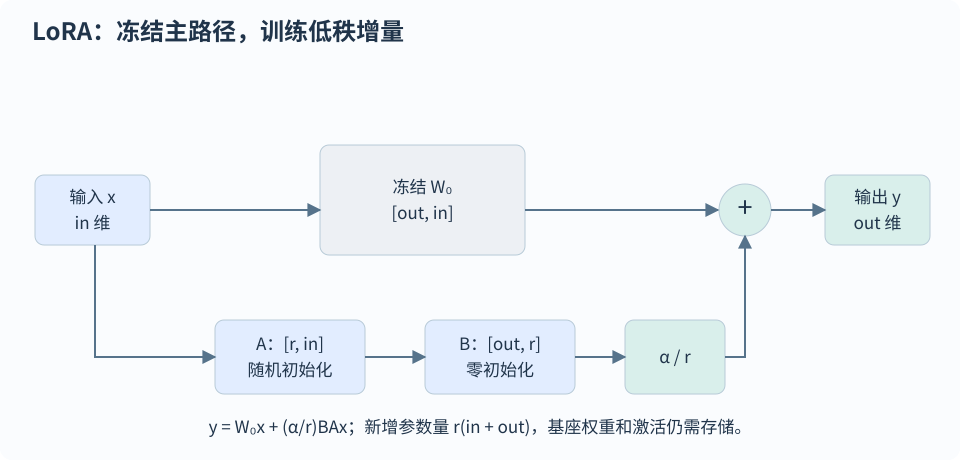

# SFT、PEFT、蒸馏与模型编辑

[首页](../README.md) · [全部题目](../QUESTION-INDEX.md)

## 目录

- [指令数据与训练目标](#topic-1)
  - [FT-001 · 预训练与 SFT 的 loss 有何差异，label shift 如何对齐？](#ft-001)
  - [FT-002 · SFT 怎样只对回答部分计算 loss？](#ft-002)
  - [FT-003 · chat template 错配会导致哪些问题？](#ft-003)
  - [FT-010 · SFT 数据量越大越好吗，怎样构建高质量指令集？](#ft-010)
  - [FT-011 · 用模型生成 SFT 数据怎样避免错误与同质化？](#ft-011)
  - [FT-016 · 领域 SFT 应从 Base 还是 Instruct/Chat 模型开始？](#ft-016)
  - [PRE-010 · SFT 数据 packing 怎样提高效率并保持跨样本隔离？](#pre-010)
- [LoRA 与其他 PEFT](#topic-2)
  - [FT-004 · 全参数微调、LoRA、Adapter 和 Prefix-Tuning 怎样选择？](#ft-004)
  - [FT-005 · LoRA 的低秩更新公式及可训练参数量是什么？](#ft-005)
  - [FT-006 · LoRA 怎样初始化，r、alpha 与 dropout 各控制什么？](#ft-006)
  - [FT-007 · LoRA 的 rank、alpha、dropout 和 target_modules 应怎么调？](#ft-007)
  - [FT-008 · LoRA 与 QLoRA 有何区别，NF4、双重量化与分页优化器做什么？](#ft-008)
  - [FT-009 · Adapter、Prompt-Tuning 与 Prefix-Tuning 有何差别？](#ft-009)
  - [FT-017 · BitFit 为什么只调 bias，适用条件和局限是什么？](#ft-017)
  - [FT-018 · P-Tuning v1、P-Tuning v2 与 Prompt/Prefix Tuning 怎样区分？](#ft-018)
  - [FT-019 · AdaLoRA 如何自适应分配低秩预算，与固定 rank LoRA 有何区别？](#ft-019)
  - [FT-020 · AdapterFusion 和 AdapterDrop 如何组合知识或降低 adapter 开销？](#ft-020)
  - [FT-021 · MAM Adapter、UniPELT 等组合 PEFT 方法为什么要混合不同模块？](#ft-021)
  - [FT-023 · Prompt learning 中 template、verbalizer 与连续提示分别是什么？](#ft-023)
- [训练技巧与排错](#topic-3)
  - [FT-012 · 微调后的灾难性遗忘怎样发现和缓解？](#ft-012)
  - [FT-013 · 梯度累积等价于大 batch 吗？变长样本怎么归一化？](#ft-013)
  - [FT-014 · gradient checkpointing 节省什么，为何会变慢？](#ft-014)
  - [FT-015 · SFT loss 下降但任务效果变差，应该怎样排查？](#ft-015)
- [知识蒸馏与模型编辑](#topic-4)
  - [FT-022 · 知识蒸馏中的 logits、隐藏层和生成答案监督各有什么作用？](#ft-022)
  - [FT-024 · 模型编辑与继续训练、RAG 有何区别？ROME、MEMIT 与 MEND 如何修改知识？](#ft-024)
  - [FT-025 · OPD 的原理和优化目标是什么，与 SFT、RL 怎样选择？](#ft-025)
  - [FT-026 · 拿不到教师 logits 时还能做 OPD 吗，只有文本反馈有哪些限制？](#ft-026)
  - [FT-027 · 教师与学生词表不同，跨 tokenizer 的 OPD 怎样定义对齐和损失？](#ft-027)

<a id="topic-1"></a>
## 指令数据与训练目标

<a id="ft-001"></a>
### FT-001 · 预训练与 SFT 的 loss 有何差异，label shift 如何对齐？

**L1** · 小红书

#### 答案

预训练与常规 SFT 都可使用 next-token 交叉熵，主要差异是数据分布与监督范围。序列 $`x_0,\ldots,x_{T-1}`$ 的 logits 第 $`t`$ 行基于 $`x_{\le t}`$，预测 $`x_{t+1}`$；可对齐 `logits[:,:-1]` 和 `labels[:,1:]`，或用尾部补 ignore 的等价实现，shift 只能由一处负责。

例如输入 `[P0,P1,A0,A1,EOS]`，未 shift 的标签为 `[-100,-100,A0,A1,EOS]`。末 prompt 的 P1 logits 监督首回答 A0，A0 监督 A1，A1 监督 EOS；P0 到 P1 的目标忽略，末 EOS logits 没有下一标签。若额外屏蔽 P1 logits，就会丢掉首回答监督。

预训练通常监督有效文本，排除 padding、无后续目标和配方指定边界；SFT 可以只监督回答、所有 assistant 回合、最后回合或全序列，由训练配方决定，也能学习知识和内容。Loss mask 决定目标贡献，attention mask 决定可读上下文；回答梯度仍可经 prompt 表示回传到共享参数。两种训练都需 causal 约束与正确 packing 隔离。

常规损失按有效 token 平均；若改为每样本等权或加入辅助项，目标也随之改变。比较效果时应核对模板、监督范围、数据和任务指标，不能直接用不同 mask 下的 loss 排名。

```math
\begin{aligned}z_t&\longrightarrow x_{t+1}\\\mathcal L&=-\frac{\sum_{t=0}^{T-2}m_{t+1}\log\mathrm{softmax}(z_t)_{x_{t+1}}}{\sum_{t=0}^{T-2}m_{t+1}}\end{aligned}
```

#### 易错点

- 把 SFT 写成另一种分类 loss，或断言 SFT 永远只能计回答 loss。
- 按预测 logits 所在位置屏蔽 prompt，错误丢掉 prompt→首 answer 的有效预测。

#### 追问

- 多轮对话只监督最后一轮时，前几轮回答是否仍提供上下文？
- 预训练的全 token loss 和 SFT 的回答 loss 能直接比较吗？

<a id="ft-002"></a>
### FT-002 · SFT 怎样只对回答部分计算 loss？

**L1**

#### 答案

只监督回答时，在最终 token 序列中把 prompt、padding 和其他不监督位置的 labels 设为 `ignore_index`，例如 `-100`，回答标签保留真实 ID。应先应用模型 chat template 再标注，多轮可选择所有 assistant 回合或最后回合，并明确正文、角色结束及 EOS 的监督范围，避免混用字符和 token 边界。

若首 answer 在 $`j`$，保留 `labels[j]=input_ids[j]`，prompt 的 `labels[:j]=-100`；shift 后 `logits[j-1]` 预测首回答。因此只忽略 prompt 目标，不删除末 prompt 的 logits，模型内部 shift 时 collator 仍保持标签与输入同位置。合法 prompt 的 attention mask 继续有效，回答 loss 的梯度也能经过它的上下文路径。

Padding 与真实 EOS 即使共用 ID，也必须按位置区分，不能按 EOS ID 全部忽略；EOS 可以是有效停止监督。独立 packing 段首目标不能由上一段末 logits 预测，还需块状可见性或后端段边界。最后用小序列逐项检查 logits 索引、目标、mask、有效数量和 loss。

```math
\mathcal L=-\frac{\sum_{t=0}^{T-2}m_{t+1}\log p_\theta(x_{t+1}\mid x_{\le t})}{\sum_{t=0}^{T-2}m_{t+1}}
```

#### 易错点

- 把 prompt 的 `attention_mask` 设为 0，或把末 prompt logit 的首回答监督删掉。
- collator 和模型内部各 shift 一次，或把 `pad=EOS` 当作所有 EOS 均为 padding。

#### 追问

- 如何验证多轮 assistant-only mask 与 chat template 的 generation 区间？
- 没有任何有效回答目标的样本应怎样过滤或处理？

<a id="ft-003"></a>
### FT-003 · chat template 错配会导致哪些问题？

**L2**

#### 答案

Chat template 将角色与消息转成模型训练过的 token 序列，错配可能导致续写用户、角色混乱或无法停止。Tokenizer、`chat_template` 和特殊 token 配置应与模型、适配器一起版本化，训练和部署保持一致。

训练通常不额外添加新 assistant 回复的起始提示，生成时按模板需要添加 generation prompt；先渲染文本再编码时检查 `add_special_tokens`，避免重复 BOS/EOS。用短对话核对 token ID、角色边界、loss mask 与停止行为，再覆盖多轮对话。

#### 易错点

- 只检查字符串外观，忽略底层 token ID。
- 把所有模型都换成同一套 ChatML 而无需训练。

#### 追问

- 为什么重复 EOS 可能损害生成？
- 模型已有模板时还需要 clone 新模板吗？

<a id="ft-010"></a>
### FT-010 · SFT 数据量越大越好吗，怎样构建高质量指令集？

**L2** · 字节跳动 / 阿里巴巴 / 深势科技

#### 答案

SFT 数据是否有效取决于答案正确性、任务覆盖与真实请求分布，增加数量不一定改善效果。可先用高质量种子构建任务、难度、语言、格式和拒答边界矩阵，再按实际分布补齐，清理重复和冲突；少样本论文结果不能推广为所有场景都只需少量数据。

可验证任务用规则或执行器核验，开放回答用明确标准和抽审。按来源、模板或任务组切分，避免近重复跨训练与验证；在固定 token 预算下比较质量和配比，同时记录通用回归及边缘案例。

#### 易错点

- LIMA 使用少量优质数据，就断言规模不重要。
- 单纯把相同模板扩写数万条当成丰富覆盖。

#### 追问

- 如何区分模型底座能力不足与 SFT 覆盖不足？
- 同一 prompt 多个冲突答案怎么处理？

<a id="ft-011"></a>
### FT-011 · 用模型生成 SFT 数据怎样避免错误与同质化？

**L2**

#### 答案

模型合成 SFT 数据能降低标注成本，也会把教师的错误、风格偏差和有限覆盖传给学生。应先确定能力缺口，再生成多样候选、验证正确性与去重，保留真实或人工数据对照；模型自评高分不能当作事实正确的证据。

Self-Instruct 以种子任务生成指令和回答后过滤无效、相似样本。代码、数学和结构化任务优先用执行器、测试或确定性规则，多提示、来源与难度组合还需统计模板和语义重复。用独立真实验证集比较真实/合成配比，并追踪教师的系统性错误。

#### 易错点

- 只用同一个模型生成并自评分，认为已独立验证。
- 把生成条数当作有效独立样本数。

#### 追问

- 教师强于学生时怎样控制任务难度？
- 蒸馏风格和蒸馏能力有什么区别？

<a id="ft-016"></a>
### FT-016 · 领域 SFT 应从 Base 还是 Instruct/Chat 模型开始？

**L2**

#### 答案

Base模型主要学语言建模，适合希望完全控制指令、格式和领域行为、且有足够高质量SFT数据的情况；Instruct/Chat已有对话和工具等行为，数据或算力较少时常能更快适配。但继续微调可能覆盖原有安全、格式与能力，不能假设Chat版本永远优于Base，也不能认为SFT只是在已有知识上换说话方式。

选型先固定目标任务、评测集、成本和数据，再用小规模相同配方比较；检查许可证、chat template、special tokens、上下文窗口与底座是否适合语言/领域。训练Chat模型要沿用其消息格式、assistant标签与EOS规则，Base则需一致定义并教会该协议。密集领域文本可用继续预训练获得语言与知识分布，指令SFT教任务接口，两者都可能注入或改变知识，知识更新/权限查询也可用RAG。上线前检查领域收益和通用能力回归。

#### 易错点

- 把Base/Chat选择当作无需任务验证的固定规则。
- 给Chat模型更换模板却未同步训练和推理。

#### 追问

- 数据很少时怎样比较PEFT与直接prompt的收益？
- 如何防止领域SFT损坏原先工具调用格式？

<a id="pre-010"></a>
### PRE-010 · SFT 数据 packing 怎样提高效率并保持跨样本隔离？

**L2**

#### 答案

Packing 把多个短样本装入一条训练行，减少 padding。先应用 chat template、分词并标记回答监督区间，再连同 `input_ids`、`labels`、样本编号和边界一起装箱。BFD 等策略可减少空位；截断或拆分会改变保留内容，应统计丢弃的回答 token，而不只报告吞吐。

独立 SFT 样本的可见性必须同时满足同一样本与因果条件 $`j\le i`$，并排除 padding。可以用块对角 causal mask，或给支持变长 attention 的后端显式段边界。EOS 和把 `position_ids` 归零都不会自动隔离通用 attention。

普通全行 label shift 会让前一段末 logits 预测下一段首 token。独立样本目标应把后一段首 label 设为 `ignore_index`，或逐段 shift 并在段尾补 ignore；BOS/EOS 是否监督要按段定义，不能粗暴删除全部 EOS loss。Prompt labels 忽略而首 answer label 保留，末 prompt logits 才能预测首回答；合法 prompt 仍需作为上下文。

连续语料 concatenate-then-split 可有意允许跨文档上下文，这与独立 SFT 目标不同。可对比未 packing 的逐段有效 NLL 与梯度，并扰动另一段检查当前段 logits 是否改变；比较时要控制内核、dropout 和浮点次序，再评估显存与吞吐收益。

式中 $`s_t`$ 是样本编号，$`v_j`$ 标记有效 key，$`m_t`$ 选择监督目标，$`\mathcal H_t`$ 是同一样本的有效历史。

```math
\begin{aligned}\mathrm{allowed}(i,j)&=\mathbf1[s_i=s_j]\,\mathbf1[j\le i]\,\mathbf1[v_j=1]\\\mathcal L&=-\frac{\sum_t m_t\log p_\theta(x_t\mid x_{\mathcal H_t})}{\sum_t m_t}\\\mathcal H_t&=\{j:j\lt t,\ s_j=s_t,\ v_j=1\}\end{aligned}
```



两段样本各有 3 个 token；隔离 attention 时，还要处理 shift 后的跨样本标签。

#### 易错点

- EOS、loss mask 或重置 `position_ids` 任一项就能阻断跨样本 attention。
- 隔离 attention 后仍保留跨边界 shifted label，或在不同实现中重复 shift。

#### 追问

- 如何处理长对话拆分时需要继承的历史 prompt？
- 为何 packing 开启后吞吐提高却可能改变梯度加权？

<a id="topic-2"></a>
## LoRA 与其他 PEFT

<a id="ft-004"></a>
### FT-004 · 全参数微调、LoRA、Adapter 和 Prefix-Tuning 怎样选择？

**L1** · 深势科技

#### 答案

全参数微调更新自由度大，但梯度和优化器状态开销更高；PEFT 冻结大部分底座，训练少量增量，适合资源受限或多任务切换。选型要结合任务差异、数据量、显存与部署，PEFT 不保证总能达到全参数效果。

LoRA 给线性层加低秩更新，合适时可合并回权重；Adapter 加任务独立模块，但可能增加算子和时延；Prefix-Tuning 学习连续前缀，通常提供额外 attention 键值条件。冻结底座仍需前向和用于反传的激活，参数减少比例不能直接当作显存减少比例。

#### 易错点

- 训练参数减少 99% 就声称训练显存减少 99%。
- 仅看单次训练成本，忽略多适配器服务和合并成本。

#### 追问

- 领域迁移很大时为什么全参数值得尝试？
- 多任务适配器如何与 prefix cache 协同？

<a id="ft-005"></a>
### FT-005 · LoRA 的低秩更新公式及可训练参数量是什么？

**L1** · 腾讯 / 百度

#### 答案

LoRA 冻结 $`W_0\in\mathbb R^{d_{\rm out}\times d_{\rm in}}`$，学习 $`\Delta W=(\alpha/r)BA`$，其中 $`A\in\mathbb R^{r\times d_{\rm in}}`$、$`B\in\mathbb R^{d_{\rm out}\times r}`$。更新秩至多为 $`r`$，可训练参数为 $`r(d_{\rm in}+d_{\rm out})`$，不要求底座或整个模型低秩。

前向为 $`W_0x+(\alpha/r)BAx`$，梯度能经过冻结底座传播到需要训练的模块。标准浮点部署可合并增量，免去额外小投影；需要多适配器切换时则未必合并。LoRA 主要节省权重梯度与优化器状态，长序列激活仍可能主导显存。

合并要求底座与 adapter 的 checkpoint、目标层、缩放和 dtype 对齐，并在 eval 模式关闭 adapter dropout。浮点权重 $`W_{\mathrm{merged}}=W_0+sBA`$ 免去额外低秩分支，通常减少内核调用；但不会把大模型权重变成“小 adapter 大小”。低精度舍入使结果未必逐 bit 相同，应比对 logits 与任务结果。保留未合并 adapter 有利于共享底座、多租户切换和回滚；merge_and_unload 后应保留独立原件。量化底座的合并受量化后端支持限制，不能把浮点增量直接加到整数码，必要时反量化合并并重新校准量化。

若给定一个 $`3\times3`$ 权重矩阵，不能只凭形状判断实际秩：$`W_0`$ 可为0到3秩，需看其独立行列或奇异值。LoRA约束的是增量，$`\mathrm{rank}(BA)\le\min(r,3)`$；即便设置r=1，$`W_0+BA`$ 仍可能为满秩3。默认零B初始化时增量秩为0，训练后也只保证秩上界，不保证恰好等于r。

```math
\begin{aligned}\Delta W&=\frac{\alpha}{r}BA\\N_{\rm train}&=r(d_{\rm in}+d_{\rm out})\\\mathrm{rank}(\Delta W)&\le r\end{aligned}
```



常用初始化使增量起始为零；图中采用列向量约定。

#### 易错点

- 把 LoRA 说成对原模型权重做截断 SVD。
- 漏掉不同目标模块的数量，误报总训练参数量。
- “LoRA 无额外推理延迟”依赖合并或有效融合实现；未合并分支并非天然零开销。

#### 追问

- 如何估算同时对 Q/K/V/O 与 FFN 加 LoRA 的参数量？
- 量化底座合并 LoRA 有什么精度风险？
- 多租户共享一个底座时，为什么离线合并每个 adapter 可能增加总权重内存？
- 3×3的底座权重、初始增量和训练后增量，秩分别有哪些上界？

<a id="ft-006"></a>
### FT-006 · LoRA 怎样初始化，r、alpha 与 dropout 各控制什么？

**L2** · 腾讯 / 快手 / 百度

#### 答案

原始 LoRA 使用随机高斯 $`A`$、零 $`B`$，使初始 $`\Delta W=sBA=0`$。PEFT 普通 Linear 默认采用 Kaiming-uniform A、零 B，Gaussian 选项也使用零 B；Embedding 等模块可能有不同约定，其他初始化则应按方法确认。

令 $`G=\partial L/\partial\Delta W`$，有 $`\partial L/\partial A=sB^\top G`$、$`\partial L/\partial B=sGA^\top`$。初始 B 为零时，纯低秩分支的 A 梯度为零，B 通常先更新，随后 A 获得梯度；A/B 同时为零则纯 BA 路径无法启动，零 A 加随机 B 是可启动但轨迹不同的方案。PiSSA、EVA、LoftQ 等使用权重、激活或量化信息，要核对是否改动底座及是否保持初始函数；`init_lora_weights=False` 通常随机初始化 A/B，不再是 no-op。

$`r`$ 控制秩上界与参数量，标准 $`s=\alpha/r`$ 控制分支尺度，rsLoRA 使用 $`\alpha/\sqrt r`$。固定 alpha 改 rank 同时改变容量和缩放，alpha 也不等于学习率。普通 Linear 的 dropout 施加在低秩分支输入，训练时正则、eval 时关闭，底座分支保留。应联合消融 rank、alpha、dropout、目标模块与学习率，没有通用最佳 rank 或 alpha:rank 比例。

PEFT普通Linear的默认调用是 `kaiming_uniform_(A, a=sqrt(5))`，配合默认fan-in约定，其均匀边界为 $`1/\sqrt{d_{\rm in}}`$。它借用了Kaiming函数来实现与 `nn.Linear` 一致的初始化，并不等于给ReLU网络使用方差 $`2/d_{\rm in}`$ 的He配方；初始化函数名称、传入gain/负斜率参数和实际方差应一起核对。

```math
\begin{aligned}\Delta W&=sBA,\quad\mathrm{rank}(\Delta W)\le r\\s_{\rm standard}&=\frac{\alpha}{r},\quad s_{\rm rsLoRA}=\frac{\alpha}{\sqrt r}\\G&=\frac{\partial L}{\partial\Delta W}\\\frac{\partial L}{\partial A}&=sB^\top G,\quad\frac{\partial L}{\partial B}=sGA^\top\end{aligned}
```

#### 易错点

- 把原论文高斯初始化、PEFT Linear 默认和所有新初始化变体说成完全相同。
- 双零 A/B、默认 no-op 与训练阶段梯度为零混为一谈，或把 $`\alpha`$ 当作优化器学习率。

#### 追问

- 如何检查添加 adapter 前后初始输出一致，以及第一步 A/B 的梯度？
- 增大 r 时怎样控制缩放和优化超参数以比较容量收益？

<a id="ft-007"></a>
### FT-007 · LoRA 的 rank、alpha、dropout 和 target_modules 应怎么调？

**L2** · 快手 / 百度 / 深势科技

#### 答案

LoRA 调参需要一起考虑更新容量、分支尺度、正则与适配位置。Rank 的参数预算线性增长，更新秩仅满足 $`\mathrm{rank}(\Delta W)\le r`$，实际容量收益可能饱和或过拟合；比较时控制数据、有效 token、目标模块和学习率，并看验证指标、参数量与吞吐。

标准缩放为 $`s=\alpha/r`$，`use_rslora=True` 为 $`\alpha/\sqrt r`$。固定 alpha 增大 rank 会减小标准分支尺度，固定 alpha/r 也不能保证优化轨迹相同，因此可在同一缩放家族内分别消融容量与尺度。普通 Linear 分支是 $`sBA\mathrm{Dropout}(x)`$，它不删除底座权重，eval 时关闭；小数据可检查正则收益，过大 dropout 也会欠拟合，且它与全模型 attention/hidden dropout 配置不同。

`target_modules` 决定更新位置，可比较 attention 投影、MLP 或 `all-linear`，并核对输出层排除、embedding/LM head 保存及额外 trainable bias。常见 Q/V 实验不意味着 LoRA 只支持 Q/V。记录 PEFT 版本、初始化、缩放变体、优化器和成本；库默认不是数据相关实验中的最优值。

LoRA主要减少可训练权重、梯度、优化器状态及相关通信，不会跳过底座的前向计算；为把梯度传到更早的可训练分支，通常还要计算冻结层的输入梯度并保存或重算必要激活。相比全参可能减少权重梯度计算，但新增低秩矩阵乘法、算子调度、量化解码和小batch利用率也影响耗时，因此不能按可训练参数比例推算加速倍数。应在同卡型、精度、有效batch、序列/帧数及checkpoint配置下实测有效tokens/s、step延迟和峰值显存，区分训练吞吐与合并权重后的推理延迟。

```math
\begin{aligned}h&=W_0x+sBA\mathrm{Dropout}(x)\\N_{\rm train}&\approx r(d_{\rm in}+d_{\rm out})\\s_{\rm standard}&=\alpha/r,\quad s_{\rm rsLoRA}=\alpha/\sqrt r\end{aligned}
```

#### 易错点

- 给所有模型套 $`r=8`$、$`\alpha=2r`$ 等万能值，或声称 dropout 在推理时继续增强多样性。
- 改变 rank/模块/缩放后仍把消融结果归因于单个因素。

#### 追问

- 扩展 `target_modules` 和增大 r，怎样在相同训练参数预算下比较？
- 为什么相同 $`\alpha/r`$ 仍不能保证两个 rank 的有效更新相同？

<a id="ft-008"></a>
### FT-008 · LoRA 与 QLoRA 有何区别，NF4、双重量化与分页优化器做什么？

**L2** · 字节跳动

#### 答案

LoRA 本身不要求量化，通常在 FP16/BF16 底座上训练低秩分支；QLoRA 将冻结底座以 4-bit 形式存储，计算时按块反量化到较高精度，再与可训练 adapter 组合。梯度通过底座计算传到 adapter，但不更新量化底座；权重存储位宽与 GEMM 的 compute dtype 必须区分。

NF4 为近似正态权重设计非均匀码本和块 scale，是有损量化，不等同于线性 INT4。Double Quantization 压缩第一层量化的 scale 等常数，不是再次量化同一权重以提高精度；加载 4-bit 权重也不自动意味着复现完整 QLoRA 配方。

Paged optimizer 借助分页或统一内存管理优化器状态峰值，缓解瞬时显存压力，也可能产生 CPU/GPU 迁移开销；它不压缩激活。长序列的 attention 激活、反量化工作区、adapter 梯度和状态、batch 与 checkpoint 策略仍可决定是否 OOM。

QLoRA 主要改善底座存储和训练可行性，速度与精度要按硬件、内核、权重分布和任务实测。合并部署可先反量化底座、加 $`sBA`$ 再量化，但会引入新误差，不能直接把浮点增量加到整数码；应比较未合并、合并与重新量化的输出。

例如 NF4 存储配 BF16 compute 是“4-bit 冻结权重 + 较高精度算子”，并非全部运算采用 4 bit；BF16 指数范围较宽，FP16 要注意溢出与 loss scaling，选择取决于 GPU 和内核支持。LoRA 底座仍约占 $`2P`$ bytes；QLoRA 的理想权重码约 $`P/2`$ bytes，另外有 scale、未量化层和反量化工作区。两者的 adapter 参数量 $`P_a`$ 相同：若按低精度参数/梯度、FP32 master 和两个 Adam 状态估算，可训练状态约 $`16P_a`$ bytes，但实际 dtype 与优化器应逐项核对。冻结底座不会删除为训练 adapter 所需的中间激活，所以不能仅凭 $`P/2`$ 判断训练显存。

```math
h=\mathrm{Dequantize}(Q(W_0))x+sBAx
```

#### 易错点

- QLoRA 训练全部 INT4 权重，或把 4-bit 权重容量当作训练总显存。
- LoRA 与 QLoRA 是互斥算法，或 QLoRA 在所有任务都与浮点 LoRA 等精度且更快。

#### 追问

- LoRA/QLoRA 的公平比较要统一哪些模块、数据、初始化及评测条件？
- 为什么长上下文训练的显存瓶颈可能从权重转移到激活？
- 长序列时，为什么 QLoRA 相对浮点 LoRA 的节省比例可能变小？

<a id="ft-009"></a>
### FT-009 · Adapter、Prompt-Tuning 与 Prefix-Tuning 有何差别？

**L2** · 腾讯

#### 答案

Adapter 在网络中增加可训练模块，常由降维、非线性、升维和残差组成，参数量由瓶颈维度决定。Prompt-Tuning 学习输入层软提示，虚拟 token 不必对应可读词，也不等同于手写文本 prompt。Prefix-Tuning 给 attention 增加连续前缀，可经重参数化产生多层 K/V，具体实现依架构而异。

这些方法都可冻结底座，但插入位置、容量与开销不同：软前缀占序列或 KV 预算，Adapter 的额外算子可能影响时延与内核融合。

#### 易错点

- 把所有 soft prompt 方法都叫输入 embedding 调参。
- 说 Prefix-Tuning 完全没有服务时开销。

#### 追问

- 参数量相同时哪些实验能比较表达能力？
- 离散 prompt 与软提示怎样保存和部署？

<a id="ft-017"></a>
### FT-017 · BitFit 为什么只调 bias，适用条件和局限是什么？

**L2**

#### 答案

BitFit冻结大部分预训练权重，仅训练模型中的bias项或其子集，通常再训练任务输出头。线性层Wx+b中的bias改变神经元偏移和激活阈值，用很少参数重新激活或组合已有特征；它不等于低秩更新，也不会增加一个adapter分支。原论文主要研究BERT类masked LM在小到中等任务数据上的效果，不应把结论无条件推广到任意LLM生成任务。

参数和optimizer状态小、存储与切任务成本低，但表达能力受可调bias的位置和数量限制。很多现代decoder使用无bias线性层和RMSNorm，没有对应bias就几乎无可调参数，此时BitFit不能凭方法名直接套用。实践应打印requires_grad参数列表，确认没有误解冻整层，比较任务表现、遗忘和训练显存；冻结权重仍可能需要反向经过它们来计算bias梯度。

```math
\min_{b,\theta_{\rm head}}\mathcal L\big(f_{W_0,b}(x),y\big),\qquad W_0\ \text{fixed}
```

#### 易错点

- 对bias-free模型宣称与BERT一样能直接BitFit。
- 认为可训练参数少就意味着全部激活都不需要反向保存。

#### 追问

- 哪些bias最可能改变attention或FFN行为？
- 训练输出头应不应该计入可训练参数比例？

<a id="ft-018"></a>
### FT-018 · P-Tuning v1、P-Tuning v2 与 Prompt/Prefix Tuning 怎样区分？

**L2**

#### 答案

Prompt Tuning通常只学习输入端连续virtual token；Prefix Tuning把可学习前缀注入各层的attention表示，常实现为前缀K/V。P-Tuning v1在模板中插入连续提示，并常用prompt encoder（如BiLSTM/MLP）重参数化，与离散提示共同用于NLU；原方法既有冻结也有联合微调设置，不能只凭名称推断底座一定冻结。

P-Tuning v2将连续提示放到多个层，适配不同规模和序列标注等任务，可视为经过优化的deep prompt tuning，与Prefix Tuning有密切联系。两者究竟增加输入token还是K/V、是否用重参数化网络、任务head是否训练，要看具体实现。冻结底座只减少权重和optimizer更新，前缀到loss的梯度仍穿过网络；更长prompt会增加有效上下文或KV成本。选型需固定可训练参数预算、长度和任务，不能把v2的经验效果解读为所有场景都等价全参微调。

```math
\theta^*=\arg\min_{\theta_p,\theta_h}\mathcal L\big(f_{\theta_0,\theta_p,\theta_h}(x),y\big),\qquad\theta_0\ \text{fixed in the frozen setting}
```

#### 易错点

- 把所有方法的virtual token都理解为普通文本可解码词。
- 把P-Tuningv2说成只是v1换了更大的MLP。

#### 追问

- 层级前缀为什么比只放输入端有更短的梯度作用路径？
- deep prompt对KV cache和上下文预算有哪些影响？

<a id="ft-019"></a>
### FT-019 · AdaLoRA 如何自适应分配低秩预算，与固定 rank LoRA 有何区别？

**L2**

#### 答案

固定LoRA为选中的矩阵指定rank，可能把同样容量分配给重要程度不同的层。AdaLoRA以类似SVD的增量参数化ΔW=PΛQ，跟踪奇异三元组的敏感性/重要性，在全局预算下逐步裁剪不重要的方向，把有效rank留给更需要的矩阵；Λ是可学习的对角尺度，不是每步对完整大矩阵精确做SVD。

训练常从较大预算开始，逐渐降到目标预算，配合正交正则让方向更可辨识。动态重要性依赖当前任务、梯度与训练阶段，不能只根据某层权重范数决定rank。它需要预算调度和更多状态管理，未必比简单LoRA更稳定或更快；比较时保持总参数预算、target modules和数据相同。最终可像低秩增量一样合并到同形状全精度权重，但若底座量化，合并和再量化要单独验证。

```math
\Delta W=P\Lambda Q,\qquad\mathcal L_{\rm orth}=\lVert P^\top P-I\rVert_F^2+\lVert QQ^\top-I\rVert_F^2
```

#### 易错点

- 把SVD式参数化说成每step分解完整基座权重。
- 忽略rank预算调度而直接比较不同参数量的结果。

#### 追问

- 何时裁剪方向会造成不可逆的容量损失？
- 正交约束为何有助于比较不同奇异方向的重要性？

<a id="ft-020"></a>
### FT-020 · AdapterFusion 和 AdapterDrop 如何组合知识或降低 adapter 开销？

**L2**

#### 答案

普通adapter是在主干中加入较小可训练模块，任务通常保存单独adapter。AdapterFusion先分别训练多个任务adapter并冻结，再训练融合模块，让当前token表示选择性地组合各adapter的输出；把知识提取与组合分成两阶段，有助于复用已有任务知识。它不是直接平均checkpoint，也不等于把全部任务重新做一次共享全参训练。

AdapterDrop根据策略跳过部分层的adapter，训练时让模型适应不同保留范围，推理可减少adapter执行开销；应区分跳过adapter分支和删除整个Transformer层。融合多个adapter会额外增加前向成本和存储，Drop则可能牺牲精度。多任务服务要评价任务切换、并发batch、融合数量与延迟，确认减少adapter分支后实际瓶颈是否改善；对深度与任务敏感的能力不能只凭“下层较不重要”固定删除。

```math
h'=h+\sum_{a=1}^{A}\alpha_a(h)\,\mathrm{Adapter}_a(h),\qquad\sum_a\alpha_a(h)=1
```

#### 易错点

- 把多个adapter融合误称为权重平均。
- 把AdapterDrop说成删除Transformer主体层。

#### 追问

- 冻结多个adapter后融合层需要哪些训练数据？
- 多个任务adapter在一个batch内如何调度？

<a id="ft-021"></a>
### FT-021 · MAM Adapter、UniPELT 等组合 PEFT 方法为什么要混合不同模块？

**L2**

#### 答案

PEFT方法可按修改的位置、形式与组合方式统一理解：adapter增加hidden变换，prefix改变attention可见信息，LoRA更新线性投影。不同分支对模型行为的作用和容量不同，因此同一小参数预算下组合互补模块可能有效。MAM Adapter（Mix-And-Match）把attention侧prefix与FFN侧并行adapter组合；UniPELT把adapter、prefix和LoRA等模块放入统一框架，并用门控调整各分支参与程度。

它们不是同一个算法，也不意味着把所有PEFT叠上去总会更好。模块叠加可能增加前向算子、上下文、KV和超参数，门控还可能塌缩到少数分支。比较需控制总可训练参数、推理成本与训练预算，做逐模块消融；保存时明确每个分支配置和底座版本，若某种分支可merge，其他需要执行的prefix/adapter并不会因此自动消失。

```math
h'=h+\sum_{m\in\mathcal M}g_m(h)\,\Delta_m(h)
```

#### 易错点

- 把UniPELT门控混合与MAM固定搭配说成同一方法。
- 认为LoRA可merge就意味着所有组合PEFT模块都无推理开销。

#### 追问

- 如何设计消融证明组合收益不是单纯参数更多？
- 输入相关门控与任务固定门控有什么区别？

<a id="ft-023"></a>
### FT-023 · Prompt learning 中 template、verbalizer 与连续提示分别是什么？

**L2**

#### 答案

Template把任务输入改造成模型熟悉的填空或生成格式，例如情感分类提示“这段评论的情感是MASK”；verbalizer把模型预测的标签词映射回类别，例如“好/差”对应正/负。分类结果会受模板措辞、标签词语义、词频和分词长度影响，模型原生概率不自动成为校准类别概率。

离散prompt可人工设计、搜索或由模型生成；连续prompt直接优化可学习向量，不要求能解释为人类可读词。多标签词verbalizer需定义聚合与归一化，生成式模型对多token标签常算序列概率，还要防止长度偏差；在MLM里多MASK和多token标签的处理也须明确。用验证集选模板和标签词，测试集保持独立，比较多seed、样本顺序和格式扰动。Prompt engineering无需更新权重，prompt tuning则需要训练可学习提示，不能把两者混称“写几句话”。

自动提示搜索可用输入梯度提出离散 trigger 候选，再在验证目标上筛选，例如 AutoPrompt；它不等同于直接优化连续 prompt embedding。KPT 借助外部知识扩展 verbalizer 的标签词，再用语言模型筛选和校准；虚拟标签词还可用可学习向量表示类别。PPT 则先预训练软提示以改善少样本初始化。模板搜索、标签空间设计与提示参数初始化是三个不同优化对象，均需防止在测试集上反复选择。

```math
p(c\mid x)=\frac{\sum_{w\in\mathcal V_c}p_\theta(w\mid\mathrm{template}(x))}{\sum_{c'}\sum_{w\in\mathcal V_{c'}}p_\theta(w\mid\mathrm{template}(x))}
```

#### 易错点

- 把prompt engineering与训练soft prompt混为一谈。
- 类别标签长短不同却直接比较未经处理的序列分数。

#### 追问

- verbalizer校准怎样减小标签词频偏差？
- 连续提示需要怎样保存并与底座配套加载？

<a id="topic-3"></a>
## 训练技巧与排错

<a id="ft-012"></a>
### FT-012 · 微调后的灾难性遗忘怎样发现和缓解？

**L2** · 阿里巴巴 / 腾讯

#### 答案

灾难性遗忘表现为新任务改善、旧能力明显退化。用固定通用与领域评测分别检查新旧任务、指令格式和边界行为，先排除模板错配等实现问题，再考虑混入代表性旧样本、降低学习率和更新范围、早停或正则约束。

Replay 的配比会影响领域收益，参数重要性正则等持续学习方法也需按任务和成本验证。PEFT 可以减少部分风险，但冻结底座不保证带适配器的输出不退化。保留底座和适配器版本可回滚，仍应完成上线前回归。

#### 易错点

- LoRA 不修改底座，因此部署输出永远不可能遗忘。
- 只用新的 validation set 做早停。

#### 追问

- 混入通用数据为何可能削弱领域适配？
- 怎样区分真实遗忘与生成参数变化？

<a id="ft-013"></a>
### FT-013 · 梯度累积等价于大 batch 吗？变长样本怎么归一化？

**L2**

#### 答案

梯度累积汇总多个 micro-batch 后再更新，减少单次激活显存；有效 batch 约为 micro-batch、累积次数和数据并行数的乘积，最后不足的窗口要单独处理。正确归一化时可近似大 batch，dropout 与浮点累加顺序等仍会造成差异。

对 token 平均目标，应累加窗口内有效 token 的 NLL，再除以整个窗口的有效 token 总数，不能等权平均长度不同的 micro-batch 的 token 平均 loss。DDP 的梯度平均和框架自动缩放会影响系数，不能重复除世界大小。Optimizer 和 scheduler 按真实更新推进，累积中可用 `no_sync` 减少通信。

```math
\begin{aligned}B_{\rm effective}&=B_{\rm micro}K_{\rm accum}N_{\rm DP}\\\mathcal L_{\rm window}&=\frac{\sum_{k=1}^{K_{\rm accum}}\sum_{t\in\mathcal T_k}\mathrm{NLL}_{k,t}}{\sum_{k=1}^{K_{\rm accum}}|\mathcal T_k|}\end{aligned}
```

#### 易错点

- 每个 batch loss 除累积次数，就认为变长序列始终等价。
- 累积时忘记清零梯度或每个 micro-step 都更新 scheduler。

#### 追问

- 如何验证累积与一次大 batch 的梯度接近？
- 为什么梯度累积降低显存却可能降低吞吐？

<a id="ft-014"></a>
### FT-014 · gradient checkpointing 节省什么，为何会变慢？

**L2**

#### 答案

Gradient checkpointing 只保留若干边界激活，在反向需要时重算内部前向片段，以额外计算换激活显存。节省程度取决于切分粒度，它不减少参数或优化器状态，主要用于需要反向的训练；冻结底座的 LoRA 也需传播到适配器，长序列场景同样可能受益。

重算要与原前向一致，随机 dropout、状态修改、分支和设备迁移都应遵守框架约束。应确认当前版本的 reentrant/non-reentrant 行为，并比较峰值显存与有效 token/s，不能默认所有函数的重算天然等价。

#### 易错点

- 把 gradient checkpointing 当作保存 checkpoint 文件。
- 无反向的常规推理用它来节省 KV cache。

#### 追问

- 为什么 LoRA 的输入梯度配置会影响 checkpointing？
- 如何选择重算粒度与激活卸载？

<a id="ft-015"></a>
### FT-015 · SFT loss 下降但任务效果变差，应该怎样排查？

**L2**

#### 答案

SFT loss 降低只表示更贴合训练目标，不能证明事实性或真实任务改善。先抽查完整样本的最终 token、监督区间、截断和 EOS，排除模板、mask、样本失效或验证泄漏，再固定生成配置比较 train/validation loss 与任务指标。

按长度、领域和格式分析失败案例，检查高重复、错误答案、教师风格偏差及训练/部署 prompt 差异。确认过拟合或分布错配后，再以单变量实验尝试降低学习率、早停、减 rank、正则或调整配比。

#### 易错点

- 一看到效果差就继续加 epoch。
- 只观察总体 loss，不看大量被 mask 或截断的样本。

#### 追问

- 训练 loss 接近 0 是否一定是好事？
- 如何区分过拟合与生成参数造成的差异？

<a id="topic-4"></a>
## 知识蒸馏与模型编辑

<a id="ft-022"></a>
### FT-022 · 知识蒸馏中的 logits、隐藏层和生成答案监督各有什么作用？

**L2** · 字节跳动 / 深势科技

#### 答案

logits蒸馏让学生拟合教师的软概率分布，温度提高时能显露非最大类之间的关系；常用KL或soft-target交叉熵，加T²使大温度下的梯度尺度更可比。对语言模型逐token做logits蒸馏，需要同一位置的上下文和可对齐词表；不同tokenizer不能直接按词表下标对KL。生成答案蒸馏把教师采样或搜索的回复作为学生SFT数据，兼容不同tokenizer，但丢掉完整分布，并继承教师错误、风格与覆盖偏差。

隐藏层/attention蒸馏用层映射和投影对齐中间表示，PKD、TinyBERT在BERT压缩中采用此类信号，不能简单要求不同深度学生逐层等形状相等。实际还需混合真实标签、过滤教师答案、覆盖学生可能访问的前缀，并独立评测质量/幻觉与成本。蒸馏不保证学生超过教师，也不保证所有知识能在更小容量中保留。

蒸馏不固定发生在某一个训练阶段：可以用教师分布训练更小基础模型，也可以在指令、领域或对齐后训练中传递特定能力；OPD则让学生当前rollout决定教师反馈的状态。需说明教师目标、学生输入分布、监督接口及蒸馏后是否继续SFT/RL，不能仅以“在SFT后运行过”定义蒸馏。

```math
\begin{aligned}p_T&=\mathrm{softmax}(z_T/T),\quad p_S=\mathrm{softmax}(z_S/T)\\\mathcal L&=(1-\lambda)\mathcal L_{\rm hard}+\lambda T^2D_{\rm KL}(p_T\Vert p_S)\\\mathcal L_{\rm hidden}&=\sum_\ell\lVert H_S^{(\ell)}P_\ell-H_T^{(m(\ell))}\rVert_F^2\end{aligned}
```

#### 易错点

- 不同tokenizer的词表下标未经对齐就直接算KL。
- 把教师生成数据无条件当作正确标签。

#### 追问

- 为什么学生自己生成的前缀可能需要教师再标注？
- 温度变大时T²补偿的近似前提是什么？

<a id="ft-024"></a>
### FT-024 · 模型编辑与继续训练、RAG 有何区别？ROME、MEMIT 与 MEND 如何修改知识？

**L2** · 腾讯

#### 答案

模型编辑希望用少量事实更正定向改变模型行为，同时保留无关能力。继续训练通常面向更广的数据分布和目标；RAG 在推理时提供外部证据，无需修改底座权重。编辑方法主要改变参数或加入可检索编辑记忆，不能保证一次更新就让所有表述、推理链和关联事实都同步正确。

ROME 把特定 MLP 的事实关联视为 key—value 映射，用带保留约束的秩一更新写入目标关联；MEMIT 将批量编辑分配到多个 MLP 层；MEND 学习小型编辑网络，转换局部微调梯度以生成可控参数更新。它们的低秩对象、训练需求与适用层不同，不能因出现低秩矩阵就等同于 LoRA。

评估至少看目标事实的编辑成功率、同义改写泛化、无关邻近事实的 locality，以及连续/批量编辑后的累计退化；需要跨实体、反向关系和多跳问题测试。先保存可回滚权重，对比单纯微调和 RAG，再验证困惑度与通用任务。模型编辑是定向纠错工具，不是已证明能无副作用维护完整知识库的保证。

```math
\Delta W=u v^{\top}\quad(\text{rank-one update}),\qquad (W+\Delta W)k_*\approx v_*
```

#### 易错点

- 把一个提示上更正成功等同于事实在所有上下文和推理中都已一致更新。
- 把 ROME 的秩一编辑、MEND 的梯度分解与 LoRA 的训练参数化混为一谈。

#### 追问

- 怎样构造 locality 测试而不只测编辑样例？
- 为什么批量编辑需要关注累计遗忘和更新顺序？

<a id="ft-025"></a>
### FT-025 · OPD 的原理和优化目标是什么，与 SFT、RL 怎样选择？

**L3** · 字节跳动

#### 答案

On-Policy Distillation让学生自己生成rollout，再让冻结教师评价学生实际访问的前缀，解决只在标准答案或教师轨迹上训练、上线却遇到自己错误前缀的分布偏移。OPD规定的是反馈发生在学生状态上，并不唯一规定KL方向或优化器。

以GKD为例，固定本轮学生采样结果，在相同prompt与前缀上计算教师/学生next-token分布，最小化逐步散度；采样本身不反传，只更新学生，prompt和padding不参与回答loss。可用forward KL、reverse KL或JSD，并混合固定数据；forward KL偏覆盖教师多种模式，reverse KL偏选择教师高概率模式，但学生容量和任务会改变实际效果。策略梯度式reverse-KL实现还可用学生所选token的教师log-prob构造稠密反馈，不能与完整分布GKD的梯度路径混写。

SFT通常对给定答案做交叉熵，适合建立新知识、格式与任务基础；教师答案SFT也是序列蒸馏，但固定答案不等于OPD。RL按验证器、环境或偏好奖励优化结果，适合可检验目标；OPD利用教师行为提供更细反馈，适合已有可靠教师、希望低成本学生保留其能力的情况。三者可以组合，不能保证OPD始终胜过RL或学生必然超过教师；关键是教师质量、学生覆盖、在线查询成本与独立评测。

```math
\begin{aligned}s_t&=(x,y_{\lt t}),\quad y\sim\pi_{\mathrm{roll}}(\cdot\mid x)\\ \mathcal L_{\mathrm{OPD}}(\theta)&=\mathbb E_{x,y}\left[\frac1{|y|}\sum_t D\big(p_T(\cdot\mid s_t),p_S^\theta(\cdot\mid s_t)\big)\right]\\ D_{\mathrm{F}}&=D_{\mathrm{KL}}(p_T\Vert p_S),\quad D_{\mathrm{R}}=D_{\mathrm{KL}}(p_S\Vert p_T)\end{aligned}
```

#### 易错点

- 公式描述GKD式固定rollout状态上的分布匹配；π_roll在本轮更新时固定，不将采样步骤当可微。
- 学生rollout不是训练标签，监督来自教师；直接用自己的输出做正例不能自动称为蒸馏。

#### 追问

- 学生与教师初始差距很大时，为什么可能先做SFT再提高on-policy比例？
- 为什么OPD也应测幻觉、任务正确率和输出多样性，而不只看蒸馏loss？

<a id="ft-026"></a>
### FT-026 · 拿不到教师 logits 时还能做 OPD 吗，只有文本反馈有哪些限制？

**L3** · 字节跳动

#### 答案

先区分“没有完整logits”与“完全没有概率”。若接口能在相同前缀下给学生所选token打log-prob，同词表时可用$`\log p_S(a_t\mid s_t)-\log p_T(a_t\mid s_t)`$采样估计reverse KL，无须取全部词表；但仅返回教师自己生成token的概率，未必能评价学生任意续写，不能直接替代这种评分接口。

这个差值可以无偏估计KL的数值，但固定已采样token后直接对差值backward，不能得到正确的KL梯度，因为遗漏了采样分布随学生参数变化的导数。需采用策略梯度类surrogate或有依据的重要性采样；公式的无偏性要求动作确实从对应学生分布采样，温度或top-p改变分布时须重新限定目标。

只有文本时，仍可让学生生成轨迹，在其访问的前缀上请教师给下一步或下一段正确续写，再对这些专家标签做学生交叉熵，迭代刷新状态并聚合数据。这属于on-policy专家纠正，兼容文本监督；若教师能按真实条件分布反复采样，CE可作为该条件分布交叉熵的Monte Carlo估计，教师贪心单答则只提供硬标签。API必须支持保留该前缀，教师若重新解题、改写历史，已不是同状态的next-token监督。

也可让教师评分/比较学生答案，结合可执行验证器训练序列奖励或偏好目标；这属于教师反馈的RL/偏好学习，评分不是教师生成概率，更不等价完整逐token KL。只收集教师对原prompt的完整答案是SeqKD；直接把学生原答案当正确标签没有教师信息。应过滤教师错误、截断和泄露样本，保留独立任务评测，同时控制多次教师查询成本。

```math
\begin{aligned}\hat d_t&=\log p_S(a_t\mid s_t)-\log p_T(a_t\mid s_t),\quad a_t\sim p_S(\cdot\mid s_t)\\ \mathbb E_{a_t}[\hat d_t]&=D_{\mathrm{KL}}(p_S\Vert p_T)\\ \mathcal L_{\mathrm{label}}&=\mathbb E_{s\sim d_{\mathrm{roll}},\ z\sim q_T(\cdot\mid s)}[-\log p_S(z\mid s)]\end{aligned}
```

#### 易错点

- 单个reverse-KL采样项可以为负，非负性约束期望；旧rollout多轮更新需处理策略滞后。
- 只有文本样本通常无法精确恢复教师词表分布或直接计算reverse KL；教师评分不能伪装成log-prob。

#### 追问

- 教师不能续写assistant前缀时，应该如何调整任务接口和监督目标？
- 教师仅给top-k或生成样本的log-prob，怎样判断它是否足够评价学生轨迹？

<a id="ft-027"></a>
### FT-027 · 教师与学生词表不同，跨 tokenizer 的 OPD 怎样定义对齐和损失？

**L3** · 字节跳动

#### 答案

词表下标与序列位置都可能不一致，不能直接逐维KL或把双方第$`t`$个token视为相同文本。先把学生rollout还原为共同文本，用各自tokenizer处理；按原文UTF-8字节偏移合并覆盖相同span的tokens，处理BOS/EOS、零宽特殊符号、空格与decode清理，保证比较的是相同已完成前缀。

若需要规范概率目标，可在具备完整next-token分布、候选token可确定下一输出字节的共同边界上，将概率汇总到“下一个字节/EOS/其余特殊输出”等共同、互斥且完备的类别，再对归一化的$`q_T,q_S`$做KL或JSD。下式$`m_i`$把每个模型的token唯一映射到公共类别，因而概率和为1。它只匹配粗粒度事件，丢掉字节后的语义，不能宣称等价完整文本分布KL；应配合文本监督。

也可采用GOLD的span与词汇匹配方案：已匹配词汇比较对应概率，不匹配部分采用排序质量损失。但合并span沿途log-prob相加只精确给出所选token路径概率，不是所有同文路径的总概率；公开GOLD合并向量也可能非归一化，不能直接代入普通KL。只有top-k时须明确剩余概率质量与OTHER桶；仅重归一化是在截断条件分布上比较。拿不到概率则退回教师文本纠正/序列蒸馏，而非虚构跨词表logits。

```math
\begin{aligned}q_i(b\mid u)&=\sum_{v\in V_i:\,m_i(v;u)=b}p_i(v\mid u),\quad i\in\{T,S\}\\ \sum_{b\in\mathcal B}q_i(b\mid u)&=1\\ \mathcal L_{\mathrm{coarse}}&=\mathbb E_{u\sim d_{\mathrm{roll}}}\left[\sum_{b\in\mathcal B}q_T(b\mid u)\log\frac{q_T(b\mid u)}{q_S(b\mid u)}\right]\end{aligned}
```

#### 易错点

- 首字节汇总是明确可定义的粗粒度目标，并非冒称已有命名算法；映射条件不满足时不能套公式。
- 不同top-k集合的OTHER桶不自动表示相同文本事件；尾部质量未知时不能声称估计了完整KL。
- 候选span概率需要说明枚举路径与结束事件；单条规范tokenization路径得分不能直接等同总文本概率。

#### 追问

- 为什么UTF-8字节对齐能修正位置问题，却仍不能自动解决词表概率比较？
- 怎样用中文、emoji、前导空格和不同BOS设置验证对齐覆盖率及概率和？

## 参考资料

- [TRL SFT Trainer](https://huggingface.co/docs/trl/sft_trainer)
- [LIMA: Less Is More for Alignment](https://arxiv.org/abs/2305.11206)
- [torch.nn.CrossEntropyLoss — PyTorch 2.14 documentation](https://docs.pytorch.org/docs/2.14/generated/torch.nn.CrossEntropyLoss.html)
- [TRL SFT Trainer — loss, labels and packing](https://huggingface.co/docs/trl/main/en/sft_trainer)
- [Transformers v4.57.1 official ForCausalLMLoss](https://raw.githubusercontent.com/huggingface/transformers/v4.57.1/src/transformers/loss/loss_utils.py)
- [Chat templates](https://huggingface.co/docs/transformers/chat_templating)
- [LoRA: Low-Rank Adaptation of Large Language Models](https://arxiv.org/pdf/2106.09685)
- [Parameter-Efficient Transfer Learning for NLP](https://arxiv.org/abs/1902.00751)
- [Prefix-Tuning: Optimizing Continuous Prompts for Generation](https://arxiv.org/abs/2101.00190)
- [PEFT: LoRA](https://huggingface.co/docs/peft/v0.21.0/package_reference/lora)
- [PEFT: Quantization](https://huggingface.co/docs/peft/developer_guides/quantization)
- [PEFT LoRA — initialization and LoraConfig](https://huggingface.co/docs/peft/main/en/package_reference/lora)
- [PEFT official implementation: LoRA layer](https://raw.githubusercontent.com/huggingface/peft/main/src/peft/tuners/lora/layer.py)
- [PEFT LoRA Linear 初始化官方实现](https://github.com/huggingface/peft/blob/main/src/peft/tuners/lora/layer.py)
- [QLoRA: Efficient Finetuning of Quantized LLMs](https://arxiv.org/pdf/2305.14314)
- [LoRA](https://arxiv.org/abs/2106.09685)
- [PEFT: Prompt tuning](https://huggingface.co/docs/peft/main/en/package_reference/prompt_tuning)
- [Self-Instruct: Aligning Language Models with Self-Generated Instructions](https://arxiv.org/abs/2212.10560)
- [Continual Learning Through Synaptic Intelligence](https://arxiv.org/abs/1703.04200)
- [Don't Stop Pretraining: Adapt Language Models to Domains and Tasks](https://arxiv.org/abs/2004.10964)
- [Performing gradient accumulation with Accelerate](https://huggingface.co/docs/accelerate/usage_guides/gradient_accumulation)
- [torch.utils.checkpoint — PyTorch 2.14 documentation](https://docs.pytorch.org/docs/2.14/checkpoint.html)
- [Llama 2: Open Foundation and Fine-Tuned Chat Models](https://arxiv.org/abs/2307.09288)
- [The Llama 3 Herd of Models](https://arxiv.org/abs/2407.21783)
- [BitFit: Simple Parameter-efficient Fine-tuning](https://arxiv.org/abs/2106.10199)
- [GPT Understands, Too](https://arxiv.org/abs/2103.10385)
- [P-Tuning v2](https://arxiv.org/abs/2110.07602)
- [AdaLoRA: Adaptive Budget Allocation for Parameter-Efficient Fine-Tuning](https://arxiv.org/abs/2303.10512)
- [AdapterFusion: Non-Destructive Task Composition](https://arxiv.org/abs/2005.00247)
- [AdapterDrop: On the Efficiency of Adapters in Transformers](https://arxiv.org/abs/2010.11918)
- [Towards a Unified View of Parameter-Efficient Transfer Learning](https://arxiv.org/abs/2110.04366)
- [UniPELT: A Unified Framework for Parameter-Efficient Language Model Tuning](https://arxiv.org/abs/2110.07577)
- [Distilling the Knowledge in a Neural Network](https://arxiv.org/abs/1503.02531)
- [Sequence-Level Knowledge Distillation](https://arxiv.org/abs/1606.07947)
- [Patient Knowledge Distillation for BERT Model Compression](https://arxiv.org/abs/1908.09355)
- [TinyBERT: Distilling BERT for Natural Language Understanding](https://arxiv.org/abs/1909.10351)
- [Pre-train, Prompt, and Predict](https://arxiv.org/abs/2107.13586)
- [AutoPrompt: Eliciting Knowledge from Language Models with Automatically Generated Prompts](https://arxiv.org/abs/2010.15980)
- [Knowledgeable Prompt-tuning: Incorporating Knowledge into Prompt Verbalizer for Text Classification](https://arxiv.org/abs/2108.02035)
- [PPT: Pre-trained Prompt Tuning for Few-shot Learning](https://arxiv.org/abs/2109.04332)
- [Locating and Editing Factual Associations in GPT](https://rome.baulab.info/)
- [Mass Editing Memory in a Transformer](https://memit.baulab.info/)
- [Fast Model Editing at Scale](https://arxiv.org/abs/2110.11309)
- [On-policy Distillation of Language Models: Learning from Self-Generated Mistakes](https://arxiv.org/html/2306.13649)
- [TRL Distillation Trainer](https://huggingface.co/docs/trl/distillation_trainer)
- [Thinking Machines Lab: On-Policy Distillation](https://thinkingmachines.ai/blog/on-policy-distillation/)
- [A Reduction of Imitation Learning and Structured Prediction to No-Regret Online Learning](https://proceedings.mlr.press/v15/ross11a.html)
- [Sequence-Level Knowledge Distillation](https://aclanthology.org/D16-1139/)
- [TRL General Online Logit Distillation (GOLD) Trainer](https://huggingface.co/docs/trl/gold_trainer)
- [Unlocking On-Policy Distillation for Any Model Family](https://huggingfaceh4-on-policy-distillation.hf.space/)
- [Attention Is All You Need](https://arxiv.org/pdf/1706.03762)
- [TRL Reducing Memory Usage — packing and padding-free](https://huggingface.co/docs/trl/main/en/reducing_memory_usage)
- [PyTorch SDPA — masks, shapes and GQA](https://docs.pytorch.org/docs/2.14/generated/torch.nn.functional.scaled_dot_product_attention.html)
