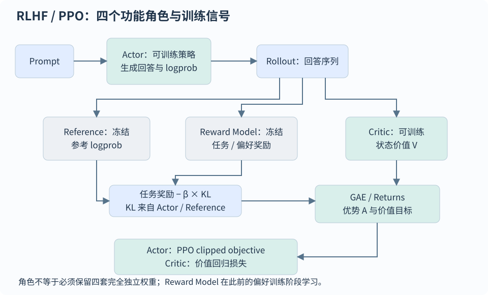

# 强化学习、RLHF 与偏好优化

[首页](../README.md) · [全部题目](../QUESTION-INDEX.md)

## 目录

- [强化学习基础](#topic-1)
  - [ALN-021 · 强化学习怎样建模为 MDP？V、Q、Bellman 与 LLM 生成怎样对应？](#aln-021)
  - [ALN-022 · 动态规划、Monte Carlo、TD 与 n-step return 有什么区别？](#aln-022)
  - [ALN-023 · 怎样推导策略梯度与 REINFORCE，baseline 为什么能降方差？](#aln-023)
  - [ALN-024 · Actor-Critic、A2C 与 A3C 怎样工作，Critic 是奖励模型吗？](#aln-024)
  - [ALN-034 · on-policy、off-policy、importance sampling、TRPO 与 PPO 怎样联系？](#aln-034)
  - [ALN-035 · Q-learning 与 SARSA 的更新、探索策略和适用边界有什么区别？](#aln-035)
  - [ALN-036 · DQN 的经验回放和目标网络做什么，Double DQN 与 Dueling DQN 分别改了什么？](#aln-036)
  - [ALN-037 · DDPG、D4PG、TD3 与 SAC 怎样比较，能直接套到 LLM token 生成吗？](#aln-037)
  - [ALN-038 · 稀疏奖励怎样改善，reward shaping、课程学习与 ICM 有什么风险？](#aln-038)
  - [ALN-039 · 行为克隆、DAgger、IRL 与 GAIL 有何区别，怎样对应 Agent 训练？](#aln-039)
- [RLHF 与 PPO](#topic-2)
  - [ALN-001 · SFT、RLHF 与 DPO 分别解决什么问题？](#aln-001)
  - [ALN-003 · PPO 的概率比、clip 和 min 分别起什么作用？](#aln-003)
  - [ALN-004 · GAE 如何计算，λ 与 γ 如何影响优势估计？](#aln-004)
  - [ALN-005 · RLHF 的 KL 惩罚与 PPO 新旧策略约束有什么区别？](#aln-005)
  - [ALN-008 · PPO 与 DPO 在工程上如何选型？](#aln-008)
  - [ALN-025 · RLHF-PPO 的四模型完整流程是什么？Critic 的 V_target 从哪里来？](#aln-025)
  - [ALN-026 · PPO 需要多少张 GPU，怎样估算四模型、rollout 与训练显存？](#aln-026)
- [DPO 与偏好数据](#topic-3)
  - [ALN-006 · DPO 的损失如何从 KL 正则化 RLHF 目标推出？](#aln-006)
  - [ALN-007 · DPO 的 β 和参考模型如何理解与调参？](#aln-007)
  - [ALN-009 · 如何把点赞、点踩和日志变成高质量偏好数据？](#aln-009)
  - [ALN-018 · IPO、KTO 等偏好优化方法与 DPO 有何区别？](#aln-018)
  - [ALN-019 · 离线偏好优化和在线 RL 的分布差异是什么？](#aln-019)
  - [ALN-042 · 坏数据的 SFT loss 直接取负能代替 RL 吗，与 unlikelihood 有何区别？](#aln-042)
- [GRPO 与在线优化](#topic-4)
  - [ALN-010 · GRPO 与 PPO 怎样计算优势，reward 和 advantage 有什么区别？](#aln-010)
  - [ALN-011 · GRPO 组内标准差归一化带来哪些问题？](#aln-011)
  - [ALN-012 · GRPO 的长度偏差与 Dr. GRPO 有什么关系？](#aln-012)
  - [ALN-013 · RLVR 的可验证奖励如何设计？](#aln-013)
  - [ALN-014 · ORM 与 PRM 的区别和信用分配难点是什么？](#aln-014)
  - [ALN-027 · GSPO 与 GRPO 的 importance ratio、clip 和梯度单位有什么区别？](#aln-027)
  - [ALN-028 · DAPO 相比原始 GRPO 改了什么，四个核心设计分别解决什么问题？](#aln-028)
  - [ALN-029 · 在 verl 中支持 DAPO，需要改哪些配置或训练模块？](#aln-029)
  - [ALN-030 · GRPO 数据必须标注 Thought 吗，完整训练数据与 rollout 怎样组织？](#aln-030)
  - [ALN-031 · GRPO 不收敛或训练奖励升高但能力退化，怎样排查和调参？](#aln-031)
  - [ALN-032 · 正负样本不对称设计有哪些方式，和 PPO/DAPO 的不对称 clip 有何区别？](#aln-032)
  - [ALN-040 · Flow-GRPO 怎样训练图像生成模型，如何把 ODE 转成保持边缘分布的 SDE？](#aln-040)
  - [ALN-041 · RLOO 如何计算 leave-one-out 基线，与 GRPO、PPO 有什么区别？](#aln-041)
  - [ALN-043 · 分类任务只用 SFT 是否够，GRPO 的收益与代价应怎样判断？](#aln-043)
- [奖励与对齐策略](#topic-5)
  - [ALN-002 · 奖励模型如何用成对偏好训练？](#aln-002)
  - [ALN-015 · 如何识别和缓解 reward hacking，RM 业务判别准确率 100% 还会发生吗？](#aln-015)
  - [ALN-016 · 后训练为什么会出现对齐税或遗忘？](#aln-016)
  - [ALN-017 · RLAIF 和 Constitutional AI 如何工作？](#aln-017)
  - [ALN-020 · 多目标奖励发生冲突时如何处理？](#aln-020)
  - [ALN-033 · 提升 RAG 回答质量时怎样选 DPO 或 GRPO，奖励怎样设计？](#aln-033)

<a id="topic-1"></a>
## 强化学习基础

<a id="aln-021"></a>
### ALN-021 · 强化学习怎样建模为 MDP？V、Q、Bellman 与 LLM 生成怎样对应？

**L1**

#### 答案

强化学习优化交互轨迹的期望累计奖励。MDP 用状态、动作、转移、奖励和折扣描述序贯决策；马尔可夫性质要求当前状态包含预测下一步所需的信息。仅有状态转移的是马尔可夫过程，增加奖励得到奖励过程，再增加动作与策略得到决策过程；在 MDP 上固定策略，可诱导一个奖励过程。

LLM 的状态可取 prompt 加已生成前缀，动作是下一个 token，终止由 EOS 或任务规则决定。V 是按策略继续行动的期望回报，Q 是先选某动作再继续的回报；Bellman 方程把当前价值分成即时奖励与后续价值。求最优 Q 后可选择使 Q 最大的动作，但最优策略可能不唯一，不能说 V 与策略存在一一对应。

若观察不完整，使用历史、记忆或 belief state 建模部分可观测性。深度学习是函数表示/优化手段，RL 是学习范式，两者不是对立关系；RL 也可能依赖答案标签、人工反馈或模拟器。

```math
\begin{aligned}G_t&=\sum_{k=0}^{T-t-1}\gamma^k r_{t+k+1}\\ V^\pi(s)&=\mathbb E_{a\sim\pi,\,s^\prime,r}[r+\gamma V^\pi(s^\prime)]\\ Q^\pi(s,a)&=\mathbb E_{s^\prime,r}[r+\gamma\mathbb E_{a^\prime\sim\pi}Q^\pi(s^\prime,a^\prime)]\end{aligned}
```

#### 易错点

- 不能把“RL不需要标签”“所有状态必须能重复到达”当作定义。

#### 追问

- LLM Agent 的外部网页状态不可见时，怎样构造状态？

<a id="aln-022"></a>
### ALN-022 · 动态规划、Monte Carlo、TD 与 n-step return 有什么区别？

**L2**

#### 答案

动态规划使用已知环境模型计算期望并迭代评价/改进策略；MC 用采样轨迹的实际回报估计价值，通常需要等到终止；TD 用一步奖励加下一状态的估计值更新，可以在线学习但会 bootstrap。Model-based 方法使用已知或学到的转移/奖励模型规划，model-free 方法直接从交互学习价值或策略；前者有模型误差，后者也不天然保证泛化更好。

n-step 把前 n 步实际奖励与末状态价值组合。n 增大通常减少对 bootstrap 的依赖，但累计更多随机奖励可能增加方差；这只是常见权衡，不是期望、偏差与方差都必然单调变化的定理。MC 回报在合适采样条件下可作为 V 的无偏样本，TD 目标则受当前价值误差影响，不能简单说两种最终学习算法“永远无偏”。

真实终止令后续价值为零；时间限制截断未必表示环境终止，需要按任务语义处理 bootstrap。GAE 可看作不同步长优势信息的加权组合。

```math
\begin{aligned}V(s_t)&\leftarrow V(s_t)+\alpha\big[r_{t+1}+\gamma V(s_{t+1})-V(s_t)\big]\\ G_t^{(n)}&=\sum_{k=0}^{n-1}\gamma^k r_{t+k+1}+\gamma^n V(s_{t+n})\end{aligned}
```

#### 易错点

- “n越大，价值期望越大”不成立；须区分目标的偏差、估计方差与真实价值。

#### 追问

- 为什么截断成 max_tokens 的回答不应无条件当作真实终止？

<a id="aln-023"></a>
### ALN-023 · 怎样推导策略梯度与 REINFORCE，baseline 为什么能降方差？

**L2**

#### 答案

把轨迹概率写成初始状态、环境转移与各步策略概率的乘积；对期望回报求导，使用 likelihood-ratio 恒等式把梯度转成回报乘轨迹 log-prob 梯度。环境不依赖策略参数时，只有动作概率贡献梯度；再利用因果性，把整条轨迹奖励换成该动作之后的 reward-to-go。

REINFORCE 按当前策略采样轨迹，计算回报，最小化负的 log-prob 与回报乘积。这里回报 G_t 从时刻t开始折扣，若目标是从时刻0起的折扣回报，求和还需乘γ的t次方；LLM有限响应常取γ=1。采样分布每轮变化，代理loss的数值跨轮不能直接作固定监督目标比较，关键是梯度与独立任务奖励。

baseline b(s) 不依赖当前采样动作时，其期望梯度贡献为零，可以降低方差。用 V(s) 得到回报减价值的优势估计。实现中回报/优势应 detach，避免策略梯度通过权重误反传；状态访问权重及折扣须与定义的目标一致。

```math
\begin{aligned}\nabla_\theta J&=\mathbb E_\tau\left[\sum_t \gamma^t\nabla_\theta\log\pi_\theta(a_t\mid s_t)\big(G_t-b(s_t)\big)\right]\\ \mathbb E_{a\sim\pi}[b(s)\nabla_\theta\log\pi(a\mid s)]&=b(s)\nabla_\theta\sum_a\pi(a\mid s)=0\end{aligned}
```

#### 易错点

- 任意与动作相关的 baseline 都不会产生偏差，这一说法是错的。

#### 追问

- 为什么提高好回答的概率不等于只训练这些回答的 SFT？

<a id="aln-024"></a>
### ALN-024 · Actor-Critic、A2C 与 A3C 怎样工作，Critic 是奖励模型吗？

**L2**

#### 答案

Actor 输出策略，Critic 估计当前策略下的未来回报，帮助构造优势并降低策略梯度方差。Actor 可用负 log-prob 乘优势训练，Critic 回归 n-step 或其他 return target；优势、回归目标通常停止梯度。共享骨干时仍需区分两类损失的作用及相互影响。

A3C 让多个 worker 与独立环境交互，从共享参数同步局部副本，再异步提交更新；多环境有助于分散样本相关性，但异步带来参数滞后。A2C 将多个环境的 rollout 同步聚合后更新，便于批量计算。两者通常归入 on-policy 方法，但 A3C 的异步滞后不能被忽略；是否 off-policy 要看数据与学习目标，不由“多线程”决定。

RLHF 的 RM 评价回答质量，Critic 预测包含 RM/KL 等定义后未来能获得的回报，二者不同。优势 A=Q−V 是期望函数；单步 TD residual 是它的一种估计，不能处处当成完全相等的真值。

```math
\mathcal L_{\mathrm{actor}}=-\mathbb E[\log\pi_\theta(a_t\mid s_t)\mathrm{sg}(\hat A_t)],\qquad \mathcal L_{\mathrm{critic}}=\mathbb E[(V_\phi(s_t)-\mathrm{sg}(\hat G_t))^2]
```

#### 易错点

- Critic 不是给回答标好坏的判别器，也不一定需要独立估计 Q 网络。

#### 追问

- Actor 与 Critic 共用 Transformer 时，应怎样检查梯度冲突？

<a id="aln-034"></a>
### ALN-034 · on-policy、off-policy、importance sampling、TRPO 与 PPO 怎样联系？

**L2**

#### 答案

On-policy学习当前交互策略，off-policy允许数据由不同的行为策略产生，学习另一个目标策略。是否经验回放、异步或多轮更新不是唯一判据，须明确行为策略与优化目标及所用校正。

重要性采样用目标/行为密度比重加权行为样本；目标有概率的区域必须被行为分布覆盖。轨迹比例是逐步比例的乘积，长轨迹容易造成高方差。截断、自归一化或使用局部surrogate常降低方差，但通常引入偏差或改变目标，不能声称“PPO clip使任意旧样本都完全无偏”。

TRPO用KL约束限制更新，通常涉及二阶近似和线搜索；PPO-clip采用一阶优化的截断代理目标，PPO-penalty则采用KL惩罚。clip并不是严格KL信任域保证，仍应监控KL/采用早停。RLHF参考模型KL又是行为锚点约束，与本轮新旧策略限制分开。

```math
\mathbb E_{z\sim p}[f(z)]=\mathbb E_{z\sim q}\left[\frac{p(z)}{q(z)}f(z)\right],\qquad p(z)\gt 0\Rightarrow q(z)\gt 0
```

#### 易错点

- PPO通常以on-policy方式收集数据，再有限复用旧策略rollout；不能因存在ratio就称任意off-policy回放算法。

#### 追问

- 为什么重要性比例在长回答上常比短回答更不稳定？

<a id="aln-035"></a>
### ALN-035 · Q-learning 与 SARSA 的更新、探索策略和适用边界有什么区别？

**L2**

#### 答案

两者都是基于采样转移的TD控制方法，区别在下一状态target。Q-learning用下一状态所有动作Q的最大值，学习趋向贪心最优策略；行为仍可用epsilon-greedy探索，因此是off-policy。SARSA使用下一步按当前行为策略实际选择的动作价值，学习包含当前探索行为的策略，因此是on-policy。

Q值是期望回报，不是动作概率；由价值导出的策略也可随机探索。两种方法都使用环境交互数据，不能说Q-learning“不使用行为策略数据”。在悬崖行走等任务，SARSA可能考虑探索风险，而Q-learning的贪心target看起来更激进，但这不表示SARSA始终是更优改进版。

表格型收敛结论需要充分访问、步长条件与有限状态动作等假设，换成神经网络后不能直接套用。连续动作上的max较难，常借助Actor-Critic；LLM词表可作为离散动作，但长程状态、信用分配与计算成本仍令直接Q学习具有挑战。

```math
\begin{aligned}Q_{\mathrm{Q\text{-}learn}}(s_t,a_t)&\leftarrow Q(s_t,a_t)+\alpha[r_{t+1}+\gamma\max_aQ(s_{t+1},a)-Q(s_t,a_t)]\\ Q_{\mathrm{SARSA}}(s_t,a_t)&\leftarrow Q(s_t,a_t)+\alpha[r_{t+1}+\gamma Q(s_{t+1},a_{t+1})-Q(s_t,a_t)]\end{aligned}
```

#### 易错点

- SARSA下一动作要按行为策略选择，但不必实际执行完下一动作后才更新当前transition。

#### 追问

- 若行为策略和target都贪心，两种一步更新还会有什么差别？

<a id="aln-036"></a>
### ALN-036 · DQN 的经验回放和目标网络做什么，Double DQN 与 Dueling DQN 分别改了什么？

**L2**

#### 答案

DQN用神经网络近似动作价值，回归Bellman target。经验回放打散连续样本相关性并复用数据，目标网络暂时固定bootstrap目标以降低追逐同一网络的振荡；二者都不保证训练样本完全独立，也不提供深度函数逼近下的一般收敛保证。

普通DQN用target network同时选最大动作并评价，其max可能放大估计噪声。Double DQN用online network选动作、target network估值，缓解过估计。Dueling将网络分成状态价值V与动作优势A，再聚合成Q；减去动作优势均值等约束处理分解不可辨识，便于在多个动作价值相近时学习状态质量。

Double是target构造的变化，Dueling是网络结构的变化，可以组合。目标网络与actor-critic中的价值模型也不是同一个概念，DQN本身没有独立输出动作的Actor。

```math
\begin{aligned}y_{\mathrm{DDQN}}&=r+\gamma Q_{\mathrm{target}}(s^\prime,\arg\max_aQ_{\mathrm{online}}(s^\prime,a))\\ Q(s,a)&=V(s)+A(s,a)-\frac1{|\mathcal A|}\sum_{a^\prime}A(s,a^\prime)\end{aligned}
```

#### 易错点

- 不能把Double DQN的两个网络称为两个独立Actor，也不能把Dueling称为对抗训练。

#### 追问

- 目标网络更新太频繁或太慢分别可能产生什么问题？

<a id="aln-037"></a>
### ALN-037 · DDPG、D4PG、TD3 与 SAC 怎样比较，能直接套到 LLM token 生成吗？

**L2**

#### 答案

这些方法主要讨论连续动作控制。DDPG用确定性Actor给出动作，Critic学习Q，通过Q对动作的梯度更新Actor；经验回放、目标网络和行为探索噪声使其属于off-policy Actor-Critic。

D4PG在确定性策略梯度框架加入分布式采样、回报分布表示、n-step与优先回放等设计；其中distributional指回报分布，distributed指多个采样者，二者不能混同。TD3用双Critic取较小target、延迟策略更新和target动作平滑缓解估计误差。SAC学习随机策略，优化回报与策略熵的组合，提高探索和鲁棒性。

LLM token是离散词表动作，普通确定性连续动作梯度不能直接穿过采样token；应使用适配离散动作的目标与实现，而非把DDPG的网络名换成Transformer就当作等价算法。SAC存在离散变体，但需要具体说明动作分布、Q计算成本与采样方式。

```math
J_{\mathrm{SAC}}=\mathbb E\left[\sum_t\gamma^t\big(r_t+\alpha\mathcal H(\pi(\cdot\mid s_t))\big)\right]
```

#### 易错点

- “策略梯度只适用于连续动作、价值方法只适用于确定策略”都不是正确边界。

#### 追问

- 离散大词表上计算所有动作Q值与连续动作Actor求导有何成本差异？

<a id="aln-038"></a>
### ALN-038 · 稀疏奖励怎样改善，reward shaping、课程学习与 ICM 有什么风险？

**L2**

#### 答案

稀疏奖励只在少数完成事件提供反馈，探索可能长时间收不到有效信号。可以缩短任务、用课程控制难度、加入示范、设计可验证过程奖励或改善探索。密集奖励若鼓励与最终目标无关的代理行为，会造成reward hacking，因此必须单独验证最终成功率。

势函数型shaping用下一状态势能减当前势能的折扣值，在匹配的折扣及终止条件下可以保留最优策略；任意加上“每步多思考一点就给分”没有这样的保证。ICM在特征空间学习逆动力学表征与前向预测，并用预测误差作内在奖励，引导探索难以预测的状态。

预测误差不等于业务价值，随机噪声也可持续提供奖励，产生“noisy TV”问题。对LLM Agent不应直接把新奇token、更多工具调用或更长轨迹当成功；应设内在奖励权重、资源约束与外部目标验收。

```math
\begin{aligned}r_t^\prime&=r_t+\gamma\Phi(s_{t+1})-\Phi(s_t)\\ r_t^{\mathrm{intrinsic}}&\propto\left\|f(\phi(s_t),a_t)-\phi(s_{t+1})\right\|_2^2\end{aligned}
```

#### 易错点

- 更密集的奖励不保证原任务最优策略不变；好奇心也不保证探索有用信息。

#### 追问

- 如果Agent不断调用返回随机数的工具，怎样发现和修复奖励作弊？

<a id="aln-039"></a>
### ALN-039 · 行为克隆、DAgger、IRL 与 GAIL 有何区别，怎样对应 Agent 训练？

**L2**

#### 答案

行为克隆把专家状态/动作当监督数据，直接学习动作分布；训练只看专家访问的状态，部署时自己的小错误会带到未见状态，造成分布偏移和误差累积。DAgger让当前策略运行，在它实际访问的状态上询问专家动作并聚合数据，代价是需要专家反馈与可控交互环境。

IRL从示范推断能解释专家行为的奖励，再求策略，但奖励通常不唯一，专家也未必最优。GAIL用判别器区分专家与当前策略的状态动作占用分布，策略优化对应代理信号；它是模仿学习目标，不意味着必然恢复唯一真实奖励。判别器与策略的对抗结构类似GAN，但样本来自有环境反馈的轨迹。

Agent SFT相当于示范轨迹上的行为学习；数据应包含工具选择、参数、观察与恢复。修复deployment失误时，可以收集当前Agent错误状态上的示范，而非仅增加更多理想轨迹；危险状态不能为采样而无约束执行。

```math
\mathcal L_{\mathrm{BC}}=-\mathbb E_{(s,a)\sim\mathcal D_E}[\log\pi_\theta(a\mid s)]
```

#### 易错点

- 模仿学习不能保证把专家全部行为精确复制，也不能据示范唯一识别人类真实意图。

#### 追问

- 让专家只重写Agent最终答案，为什么不等于在错误状态上做DAgger？

<a id="topic-2"></a>
## RLHF 与 PPO

<a id="aln-001"></a>
### ALN-001 · SFT、RLHF 与 DPO 分别解决什么问题？

**L1** · 字节跳动 / 阶跃星辰 / 美团 / 阿里巴巴

#### 答案

SFT用优质示范拟合指令到回答，通常最小化有效assistant回答token的负对数似然。它教模型如何完成任务，安全、诚实和推理也可通过示范学习，不能说SFT只学知识、RL只学推理。

SFT后再做RL，是希望在当前策略生成的候选或真实交互轨迹上，用完整回答质量、可验证成功或环境回报选择更好的行为，而不只是模仿固定示范。结果容易评分、正确完整轨迹难以大量编写时，这种反馈有价值；SFT的teacher-forcing前缀和模型真实生成的前缀也可能不同。但RL不会凭空补齐完全缺失的任务知识，奖励弱或错配时反而可能退化。

经典RLHF先收集同prompt回答偏好并训练RM，再用PPO等更新从SFT初始化的Actor。Actor/Critic训练，Reference/RM在RL阶段通常冻结；old policy是本轮rollout快照，reference是行为锚点，四个逻辑角色不必是四套独立大模型。RL也可用可验证规则而非学习RM，并可与示范阶段迭代或混合。

DPO用同prompt的偏好回答对直接更新策略，省去独立RM拟合和在线RL循环，通过reference log-ratio表达相对偏好。若任务已有高质量示范且SFT达到目标，不必为了流程完整而加RL；有可靠离线偏好可比较DPO/KTO；有值得探索的行为和可验奖励才比较在线RL。用相同预算的SFT、偏好优化、RL对照，检查独立质量、泛化与成本，不能由一个bad case推断某算法必需。

#### 易错点

- SFT后RL是常见配方，不是所有任务和所有模型的必要条件。
- “好样本SFT、坏样本loss取负”不等价于完整策略分布上的RL，需另看负CE目标和信用分配。

#### 追问

- 同一bad case何时补SFT示范，何时补偏好对，何时采样做RL？
- 奖励只识别格式时，SFT后RL可能优化出什么错误行为？

<a id="aln-003"></a>
### ALN-003 · PPO 的概率比、clip 和 min 分别起什么作用？

**L2**

#### 答案

PPO 使用新旧策略的概率比 $`\rho_t=\pi_\theta(a_t\mid s_t)/\pi_{\mathrm{old}}(a_t\mid s_t)`$，对本轮旧策略采集的样本进行更新；优势为正时鼓励提高动作概率，为负时鼓励降低概率。

clip 与 min 共同截断有利方向上过度更新带来的目标收益：$`A_t>0`$ 时限制过度增大概率的收益，$`A_t<0`$ 时限制过度减小概率的收益。它削弱大幅更新的动机，并非裁剪模型参数，也不保证所有概率比都留在区间内。多轮 minibatch 更新应同时监测 KL、clip fraction、熵和 value loss。

```math
L^{\mathrm{clip}}=\mathbb{E}\left[\min\left(\rho_t A_t,\mathrm{clip}(\rho_t,1-\epsilon,1+\epsilon)A_t\right)\right]
```

#### 易错点

- clip 不是严格信赖域约束，异常 KL 可触发早停。

#### 追问

- 去掉外面的 min 后，负 advantage 会有什么错误？

<a id="aln-004"></a>
### ALN-004 · GAE 如何计算，λ 与 γ 如何影响优势估计？

**L2** · 字节跳动 / 小红书

#### 答案

GAE 把多个 TD 残差按 $`(\gamma\lambda)^l`$ 衰减求和，可在序列末尾向前递推计算。每步残差为 $`\delta_t=r_t+\gamma V(s_{t+1})-V(s_t)`$，其中 $`\gamma`$ 决定折扣目标，$`\lambda`$ 决定优势估计对多步信息与 bootstrap 的依赖，两者作用不同。

较小的 $`\lambda`$ 更依赖局部价值估计，价值模型不准时可能引入偏差；$`\lambda`$ 接近 1 时更接近回报减基线，通常也有更高方差。终止、超时、截断和 padding 对应的 bootstrap 与 mask 必须和任务定义一致，否则即使递推公式正确，优势也可能算错。

```math
\begin{aligned}\hat A_t^{\mathrm{GAE}}&=\sum_{l\geq 0}(\gamma\lambda)^l\delta_{t+l}\\\delta_t&=r_t+\gamma V(s_{t+1})-V(s_t)\end{aligned}
```

#### 易错点

- 标准 outcome GRPO 用组内相对奖励，通常没有 GAE/value critic。

#### 追问

- 生成被 `max_tokens` 截断时怎样处理末状态价值？

<a id="aln-005"></a>
### ALN-005 · RLHF 的 KL 惩罚与 PPO 新旧策略约束有什么区别？

**L2** · 字节跳动

#### 答案

RLHF 的参考策略 KL 惩罚用于约束模型相对行为锚点的漂移，目标可写为 $`\mathbb{E}[r]-\beta D_{\mathrm{KL}}(\pi_\theta\Vert\pi_{\mathrm{ref}})`$；参考策略通常是冻结的 SFT 模型。PPO 的 clip 或新旧策略 KL 则约束相对本轮采样策略的局部更新，旧策略随 rollout 轮次刷新。

两种约束的参照对象和作用范围不同，不能互相替代。实现中可用采样 token 的 $`\log\pi_\theta-\log\pi_{\mathrm{ref}}`$ 估计参考 KL，但单个采样项未必非负，不能把逐 token 出现负值直接视为实现错误。

β过大可能让策略难以利用任务奖励，过小可能放大奖励过优化与行为漂移。联合监控参考KL、独立胜率/正确率、熵与输出长度，必要时按目标KL自适应调节；不是只让训练RM分数最高。PPO的参考KL系数、clip范围和DPO β作用路径不同，数值不能直接互相移植。

#### 易错点

- KL 惩罚不能保证事实正确或彻底阻止 reward hacking。

#### 追问

- 为何增大 $`\beta`$ 可能伤害偏好奖励提升？

<a id="aln-008"></a>
### ALN-008 · PPO 与 DPO 在工程上如何选型？

**L2** · 字节跳动

#### 答案

有可靠离线偏好对时，DPO 适合作为成本较低、易复现的基线；需要在线探索并能提供明确奖励时，PPO 更有发挥空间，但引入 rollout、价值模型、参考模型及更多调参成本。没有普遍更优的选择，应在一致的数据、预算、奖励和评测条件下比较。

具体需评估奖励模型质量、rollout 成本以及模型与激活的显存占用。DPO 的瓶颈可能是离线候选覆盖不足，PPO 则可能遭遇奖励投机和分布偏移。通常先建立 SFT/DPO 基线，再验证在线学习带来的收益是否值得增加系统复杂度。

若直接用REINFORCE回报，估计方差可能较大；PPO结合Critic/GAE和有限更新约束提高可控性，但也增加价值模型成本。PPO与DPO应在同一初始模型、数据/奖励质量、推理预算和业务评测上比较，并计入在线采样及打分成本，不能拿一个更强SFT起点的DPO与弱起点PPO证明算法优劣。

#### 易错点

- “PPO 一定更强”或“DPO 一定更稳定”都缺少条件。

#### 追问

- 奖励可执行验证且偏好很少时，你会优先试哪条路线？

<a id="aln-025"></a>
### ALN-025 · RLHF-PPO 的四模型完整流程是什么？Critic 的 V_target 从哪里来？

**L2** · 字节跳动 / 阿里巴巴 / 阶跃星辰

#### 答案

经典 RLHF-PPO 中 Actor 和 Critic 训练，Reference 和 RM 通常冻结。RM 先用偏好数据训练，RL 阶段并非四个模型同时各算一份训练 loss。Actor 从 SFT 初始化，Reference 是固定行为锚点，Critic 预测每个生成前缀的后续回报；四个逻辑角色也不意味着必须部署四套同尺寸独立参数。

先用采样旧策略 rollout，缓存响应 token、mask、旧 log-prob 与旧 value；RM 评价整段回答，按约定加入逐 token 参考 KL 惩罚。根据奖励、旧 value 和终止语义计算 GAE，再形成冻结回归目标 V_target=旧 value+优势。Actor 优化 PPO clipped surrogate，Critic 回归目标，可使用 value clipping；更新若干 mini-batch 后刷新采样策略。

V_target 是当前采样批次的估计回报，不是 RM 分数直接广播，也不是新 Critic 自己给自己作标签。只有回答有效位置参与相应 loss，截断是否 bootstrap、KL 正则是否另作损失、价值归一化须保持一致。

```math
\begin{aligned}\tilde r_t&=r_t^{\mathrm{task}}-\beta(\log\pi_{\mathrm{old}}(y_t\mid s_t)-\log\pi_{\mathrm{ref}}(y_t\mid s_t))\\ \hat A_t&=\delta_t+\gamma\lambda\hat A_{t+1},\quad \delta_t=\tilde r_t+\gamma V_{\mathrm{old}}(s_{t+1})-V_{\mathrm{old}}(s_t)\\ \hat V_t^{\mathrm{target}}&=\mathrm{sg}(V_{\mathrm{old}}(s_t)+\hat A_t)\\ \mathcal L_V&=\tfrac12\mathrm{mean}_{t\in\mathcal V}(V_\phi(s_t)-\hat V_t^{\mathrm{target}})^2\end{aligned}
```



四个角色不要求四份独立物理模型；图示经典 Actor 与 Critic 分开训练的流程。

#### 易错点

- 不要让 GAE/return target 通过计算图回传到旧 value，也不要把 reference 与本轮 old policy 混同。

#### 追问

- PPO actor loss 下降而独立胜率降低，先检查哪些日志？

<a id="aln-026"></a>
### ALN-026 · PPO 需要多少张 GPU，怎样估算四模型、rollout 与训练显存？

**L2**

#### 答案

卡数由参数规模、精度、并行切分、回答长度、rollout 数量与每卡显存共同决定，不能仅凭“PPO四模型”给固定数字。先区分可训练 Actor/Critic 的参数、梯度与优化器状态，冻结 Reference/RM 的参数与前向工作区，以及生成引擎的 KV cache、权重副本和缓存轨迹。

常见 BF16 参数/梯度加 FP32 master weights 与 Adam 两个状态，训练状态粗估约16字节/参数；实现未保存 master、状态压缩或LoRA时需改算。冻结 BF16 权重约2字节/参数。ZeRO/FSDP 分片后减少常驻状态，激活、all-gather 临时峰值和通信buffer仍需另计。生成引擎若与训练引擎保留独立副本，也必须计入。

按 rollout、RM/reference 打分、Actor/Critic 更新分别测峰值；角色共卡/分卡与 offload 改变峰值和吞吐。7B Actor+7B Critic+两个7B冻结模型，在上述未分片假设下仅状态就约252 GB十进制，尚未包含激活/KV，不能据此简单平均后断言4张80GB足够。

```math
M_{\mathrm{peak}}\approx\max_{\mathrm{phase}}\big(M_{\mathrm{train\ states}}+M_{\mathrm{frozen\ weights}}+M_{\mathrm{activations}}+M_{\mathrm{KV}}+M_{\mathrm{buffers}}\big)
```

#### 易错点

- 共享角色显存和串行切换需要明确调度，不能把所有阶段峰值机械相加或全部理想分片。

#### 追问

- 长响应先在 rollout OOM、短响应在 update OOM，优化策略为何不同？

<a id="topic-3"></a>
## DPO 与偏好数据

<a id="aln-006"></a>
### ALN-006 · DPO 的损失如何从 KL 正则化 RLHF 目标推出？

**L3**

#### 答案

从奖励最大化并惩罚参考策略 KL 的目标出发，最优策略满足 $`\pi^*(y\mid x)\propto\pi_{\mathrm{ref}}(y\mid x)\exp(r(x,y)/\beta)`$。将奖励改写为 $`r(x,y)=\beta\log[\pi^*(y\mid x)/\pi_{\mathrm{ref}}(y\mid x)]+\beta\log Z(x)`$，再代入 Bradley–Terry 偏好概率；同一问题的奖励差中，$`Z(x)`$ 项抵消，得到 DPO 损失。

该推导要求 $`\beta>0`$，参考策略的支持覆盖候选回答，并采用相应的偏好建模假设。训练时用参数化策略替代最优策略，有限数据、模型容量和优化误差仍然存在，因此推导不能保证实际模型一定达到原目标的最优解。

```math
\mathcal{L}_{\mathrm{DPO}}=-\mathbb{E}_{(x,y_w,y_l)}\left[\log\sigma\left(\beta\left[\log\frac{\pi_\theta(y_w\mid x)}{\pi_{\mathrm{ref}}(y_w\mid x)}-\log\frac{\pi_\theta(y_l\mid x)}{\pi_{\mathrm{ref}}(y_l\mid x)}\right]\right)\right]
```

#### 易错点

- 目标推导对应不等于 DPO 和任意 PPO 实训过程完全等价。

#### 追问

- 当偏好出现循环时，BT 标量奖励假设有什么局限？

<a id="aln-007"></a>
### ALN-007 · DPO 的 β 和参考模型如何理解与调参？

**L2**

#### 答案

参考模型提供偏好优化的行为锚点，通常选用适合任务的 SFT 模型。理论 KL 正则目标中，较大的 $`\beta`$ 意味着更强的参考策略约束，最优策略对奖励变化的响应较弱；在实际 DPO 损失中，$`\beta`$ 同时改变偏好 logit 与梯度尺度，其效果还受学习率、数据和训练时长影响，不能简单断言最终 KL 会单调变化。

调参应比较多组 $`\beta`$，联合观察 chosen/rejected 的隐式奖励差、KL、胜率和通用能力。如果参考模型与偏好数据的生成模型不一致，先检查模板、长度及候选支持是否匹配，再判断超参数的影响。

#### 易错点

- 不要把 β 大简单解释成每步梯度必然更小。

#### 追问

- 同样 $`\beta`$，换参考模型为什么结果会变？

<a id="aln-009"></a>
### ALN-009 · 如何把点赞、点踩和日志变成高质量偏好数据？

**L2**

#### 答案

点赞、点踩和交互日志不能自动形成可靠偏好对。应先统一任务上下文与评价规则，再生成或匹配可比较候选；标注中排除展示位置、回答长度和曝光差异的影响，核验优选回答的正确性，并保留不确定、平局或不可比较样本。

点踩可能来自事实错误、延迟或立场差异，这些信号应分开处理。涉及工具、证据或用户需求时，候选必须拥有可比较条件，不能把缺少证据直接当作负例。训练和测试还应按用户、模板、文档或时间划分，并处理近重复，防止日志泄漏抬高结果。

#### 易错点

- 不能把不同用户不同问题的点赞答案与点踩答案直接配对。

#### 追问

- AI 评分生成偏好时怎样估计标注噪声？

<a id="aln-018"></a>
### ALN-018 · IPO、KTO 等偏好优化方法与 DPO 有何区别？

**L3** · 阶跃星辰

#### 答案

先按数据和目标区分。DPO通常需要同prompt的chosen/rejected成对偏好，优化两条响应相对reference的log-prob差，经log-sigmoid拟合偏好；它省去独立RM和在线RL循环，但仍依赖参考策略、候选覆盖和偏好建模假设。

IPO从更一般的成对偏好目标出发，用identity preference mapping讨论DPO在有限、近确定偏好下的过拟合与正则化问题。偏好未必能由单一标量奖励精确表达，不能把IPO概括为“DPO再加SFT loss”，也不能凭算法名字宣称普遍更好。

KTO可以使用单条(prompt,response,desirable/undesirable)标签，不要求每条都有同prompt的另一候选。它把策略相对reference的序列log-ratio作为隐式奖励坐标，与KL形式的参考点比较，用sigmoid效用及正负权重控制更新。好样本的loss鼓励坐标高于参考点，坏样本相反；不是对坏样本CE乘−1。原论文实践中通过错配prompt/response构造共享参考点估计、截为非负并stop-gradient，这个估计不是精确真实KL。

KTO的β控制效用曲线饱和，λ_D、λ_U和类别数量共同决定有效正负贡献，不能脱离标签比例断言坏样本权重必须更大。把成对数据直接拆成好/坏标签会改变语义：两条都不好时chosen只是相对更好，不一定适合作绝对好标签。已有可靠成对比较可用DPO/IPO；自然收集的点赞/点踩单条日志可考虑KTO，但需纠正曝光、prompt难度与标注偏差。

比较时控制参考模型、数据量、长度和训练预算，同时观察独立胜率、正确率、KL、拒绝率和泛化。三者都是偏好优化方法；不应强称KTO是保持DPO目标不变的实现变体，或从论文中某些实验结果推出全部业务中KTO优于DPO。

```math
\begin{aligned}s_\theta(x,y)&=\log\frac{\pi_\theta(y\mid x)}{\pi_{\mathrm{ref}}(y\mid x)},\quad z=\mathrm{sg}(\hat z_0)\\\ell_{\mathrm{KTO}}(x,y)&=\begin{cases}\lambda_D[1-\sigma(\beta(s_\theta-z))],&y\ \mathrm{desirable}\\\lambda_U[1-\sigma(\beta(z-s_\theta))],&y\ \mathrm{undesirable}\end{cases}\\\mathcal L_{\mathrm{DPO}}&=-\mathbb E\log\sigma\!\left(\beta[s_\theta(x,y_w)-s_\theta(x,y_l)]\right)\end{aligned}
```

#### 易错点

- KTO单条好坏标签与DPO同prompt相对偏好不同，不能无条件互换。
- KTO的近似KL参考点用于效用比较且detach，并非任意加一项可微KL的同义词。
- 有效样本贡献取决于标签数量、采样和loss权重，而非只看λ_U/λ_D。

#### 追问

- 两个候选都错了但一个较好，如何分别为DPO与KTO标注？
- 点赞数据主要来自简单问题时，怎样避免KTO学习曝光/难度偏差？

<a id="aln-019"></a>
### ALN-019 · 离线偏好优化和在线 RL 的分布差异是什么？

**L2**

#### 答案

离线偏好优化使用固定候选，便于复现，但数据可能缺少当前策略的困难负例，尤其当生成模型与学习模型差距较大时，长尾问题或罕见回答的覆盖会不足。在线 RL 随策略更新采样，能够探索新行为，也更容易进入奖励模型未见过的分布。

选择时需综合反馈任务、奖励可靠性与 rollout 预算。迭代更新偏好数据应保留独立留出集与数据版本；在线训练还要关注采样策略与多轮更新策略之间的滞后，监测概率比，防止样本过旧影响优化。

#### 易错点

- 在线 DPO 等变体存在，不能把 DPO 永久等同于固定离线流程。

#### 追问

- 怎样发现离线数据覆盖不足，而非优化器没收敛？

<a id="aln-042"></a>
### ALN-042 · 坏数据的 SFT loss 直接取负能代替 RL 吗，与 unlikelihood 有何区别？

**L2** · 阶跃星辰

#### 答案

不能把“好样本最小化CE、坏样本CE乘−1”直接称为RL的等价替代。对坏目标，CE=−log p_bad，取负后最小化的是log p_bad；它确实推动该目标概率下降，但p_bad趋于0时这一负CE项趋于−∞，没有有限下界。混合正样本后某个数据集是否发散还取决于参数共享、冲突和正则，不能据此保证一般训练稳定；梯度裁剪也不会使目标获得下界。

Unlikelihood 使用−log(1−p_bad)，在0≤p_bad<1上非负，坏候选概率趋于0时loss趋于0。对单个bad token的softmax logit，负CE梯度为1−p_bad，unlikelihood梯度为p_bad：前者在坏概率已很小时仍强烈压低，后者逐渐减弱。可将正答案MLE与指定负候选的unlikelihood按正权重结合；负候选应排除正确目标，并按事实错误、重复片段等规则定义，不能把整条被点踩回答里的每个词都认定有害。

多轮训练只在选定assistant响应或精确错误span上施加目标，屏蔽prompt、padding和无需惩罚的工具结果；正负样本采样比例、每样本长度归约和loss权重要分清，权重大小不是标签语义本身。数值上用稳定的log1mexp(log p)计算log(1−p)，按概率精度处理p接近1的情况；随意clamp会改变目标，应说明阈值并监控。

这些仍是由给定数据和负候选约束概率的监督目标。DPO使用同prompt的相对偏好及reference log-ratio，KTO使用单响应好坏标签与相对参考点的效用；在线RL则在策略生成的轨迹上评价奖励，通过优势、采样分布和策略约束更新。一个on-policy负优势在某次更新中可表现为负权重log-prob梯度，但这不让固定坏数据的负CE整体等价于RL。若仅有少量局部明确错误，修订示范或unlikelihood可能足够；有可靠序列/环境反馈且需探索候选时，再比较在线RL与离线偏好优化，并用独立任务指标验收。

```math
\begin{aligned}\mathcal L_{\mathrm{negCE}}&=\log p_b\longrightarrow-\infty\quad(p_b\to0)\\\mathcal L_{\mathrm{UL}}&=-\log(1-p_b)\ge0,\quad\lim_{p_b\to0}\mathcal L_{\mathrm{UL}}=0\\\frac{\partial\mathcal L_{\mathrm{negCE}}}{\partial z_b}&=1-p_b,\qquad\frac{\partial\mathcal L_{\mathrm{UL}}}{\partial z_b}=p_b\\\mathcal L&=\mathcal L_{\mathrm{MLE}}+\alpha\sum_{t}\sum_{c\in C_t}-\log(1-p_\theta(c\mid x_{\lt t})),\quad\alpha\ge0\end{aligned}
```

#### 易错点

- unlikelihood有下界但不是有上界；p_bad接近1时其loss发散。
- 只要给loss乘正负权重就是RL，这一说法忽略采样分布、奖励/优势、reference和轨迹信用分配。
- 坏回答整体标签不能推出每个token都应被压低，通用词和正确部分也可能受损。

#### 追问

- 一个回答只有最后一个数字错了，你会惩罚哪些位置？
- 若负例概率已经很小，负CE与unlikelihood为何仍产生不同梯度？

<a id="topic-4"></a>
## GRPO 与在线优化

<a id="aln-010"></a>
### ALN-010 · GRPO 与 PPO 怎样计算优势，reward 和 advantage 有什么区别？

**L2** · 小红书 / 字节跳动 / 阶跃星辰 / 阿里巴巴 / 深势科技

#### 答案

Reward是任务评分，advantage是动作或响应相对基线的好坏。理论上A(s,a)=Q(s,a)−V(s)；一个响应即使拿到正奖励，低于同组均值时GRPO优势也可为负，组内零均值不代表整个batch绝对质量改善。

常见PPO让critic预测前缀价值，结合逐步奖励、终止状态与value计算TD残差和GAE，所以同一回答不同token可以有不同优势。结果奖励GRPO对同prompt采样G条回答，减组均值、除组标准差，以组内相对优势代替独立critic，再把每条回答的优势广播到有效生成token。它是样本级反馈，不是GAE，也不能把最终正确性当成每个token的因果贡献；原始GRPO另有过程监督定义，不能概括为永远整条同一优势。

GRPO适合数学验证、代码测试或完整生成结果评分等场景：完整响应有可信奖励，同prompt可采多条且组内有差异，省去critic训练能减一部分显存和拟合复杂度。长期交互、分步奖励和精细信用分配重要时，可比较价值网络/GAE或过程反馈；GRPO也能扩展，但只靠终态sample-level优势不自动解决这些问题。

PPO和GRPO都可使用新旧策略比与clip，仍需rollout和奖励器；奖励器可为规则、RM或环境，reference/KL由方案决定。G=1或组奖励全同没有有效相对信号，epsilon只防除零；增加G有采样、KV、延迟成本。标准差归一会改变各prompt梯度权重，稀疏奖励、假高分与长度偏差需分项日志和独立评测。总资源取决于采样组、回答长度、优化器和激活，不能把去critic直接等同于整体成本降低固定百分比。

```math
\begin{aligned}A^\pi(s,a)&=Q^\pi(s,a)-V^\pi(s)\\\delta_t&=r_t+\gamma V(s_{t+1})-V(s_t),\quad\hat A_t^{\mathrm{PPO}}=\sum_{l\ge0}(\gamma\lambda)^l\delta_{t+l}\\\hat A_{i,t}^{\mathrm{GRPO}}&=\frac{R_i-\bar R}{\mathrm{std}(R_1,\ldots,R_G)+\epsilon}\quad\mathrm{(outcome\ reward)}\end{aligned}
```

#### 易错点

- sample-level优势广播到tokens是更新权重，不是每个token导致结果的因果归因。
- 去critic不等于无baseline、无奖励器或无需rollout；原始GRPO过程监督另有优势构造。

#### 追问

- 组奖励为0.7、0.8、0.9，为何0.7的reward为正但advantage为负？
- 多轮Agent只有最后是否成功，如何改善sample-level反馈的信用分配？

<a id="aln-011"></a>
### ALN-011 · GRPO 组内标准差归一化带来哪些问题？

**L3**

#### 答案

原始 GRPO 的组内优势通常写为 $`\hat A_i=(r_i-\bar r)/(\mathrm{std}(r)+\epsilon)`$；标准差的具体定义需与实现一致。减均值提供相对基线，除以标准差则进一步按每个问题的奖励方差重加权：较小但非零的方差可能放大少数回答的信号。

二元奖励下，全对或全错的组没有相对学习信号；$`\epsilon`$ 只能改善数值稳定性，不能创造奖励差异。组大小影响方差估计及出现混合结果的概率。比较取消标准差归一化、跨 batch 归一化或难度采样时，应控制总采样量，避免把数据分布变化误认为目标函数改进。

#### 易错点

- 不要声称组内标准化天然无偏或对所有任务更优。

#### 追问

- 奖励为连续多维分数时，量纲怎样影响组优势？

<a id="aln-012"></a>
### ALN-012 · GRPO 的长度偏差与 Dr. GRPO 有什么关系？

**L3**

#### 答案

GRPO 的长度偏差与损失归约方式有关。若每条回答先按自身 token 数取均值，短回答的单 token 权重更大；负优势下，较长错误回答的单 token 惩罚相对更小。因此不能把问题概括为“总是偏爱短回答”，它也可能相对偏好较长的错误回答。

Dr. GRPO 讨论移除回答长度和组内标准差归一化，并采用常数尺度。实现中必须区分回答均值、batch token 均值与常数分母，它们给样本的权重不同。评估还需同时固定 mask、EOS、截断与采样长度设置，联合观察长度和正确率。

#### 易错点

- 某项修正有益不等于对所有训练目标无偏；需说明比较的目标函数。

#### 追问

- 全 batch token mean 会怎样改变样本之间的相对权重？

<a id="aln-013"></a>
### ALN-013 · RLVR 的可验证奖励如何设计？

**L2** · 字节跳动 / 深势科技

#### 答案

RLVR 用可执行规则提供奖励，例如数学答案校验或代码单元测试，以减少主观偏好标注。奖励设计仍要明确正确性与执行环境的边界，并将格式奖励和内容奖励分开；可验证结果并不等于所有推理过程都可靠。

数学任务需处理等价表达与解析失败，代码任务需隔离执行环境、超时及隐藏测试。格式权重过高可能使模型只优化格式，弱测试器也可能被利用。应通过对抗样本、人工复核和独立测试集检查验证器漏洞，防止把测试器投机当作能力提升。

#### 易错点

- 一个正则或少量公开测试不是完备的 correctness oracle。

#### 追问

- 工具调用成功但业务目标未完成，应怎样给奖励？

<a id="aln-014"></a>
### ALN-014 · ORM 与 PRM 的区别和信用分配难点是什么？

**L2**

#### 答案

ORM 对最终结果评分，PRM 对中间步骤评分，后者有机会更早发现错误，但需要一致的步骤标注与额外成本。信用分配的难点是确定哪些步骤真正贡献了结果；把同一结果奖励广播到所有 token，并不意味着每个 token 的因果贡献相同。

PRM 的步骤边界、可验证性及分数聚合方式会影响结果，模型也可能利用评分粒度。用于训练的过程奖励与用于推理候选排序的过程奖励需要分别验证。数学任务中的实验收益不能直接外推到全部开放领域任务。

结果奖励可以只在序列结束给出，经return/GAE产生逐token优势；这不等于逐token直接获得真实过程奖励。步骤PRM、token-level奖励、sequence-level评分与loss聚合是不同粒度，增加过程监督能提供更细信号，但价值估计与评分器都可能出错，不能声称彻底解决因果信用分配。

#### 易错点

- 步骤看似合理不代表整个推理或最终结果正确。

#### 追问

- Agent 的检索、工具、答复步骤如何构造过程评分？

<a id="aln-027"></a>
### ALN-027 · GSPO 与 GRPO 的 importance ratio、clip 和梯度单位有什么区别？

**L3** · 阿里巴巴 / 深势科技

#### 答案

GRPO 使用组内相对奖励作优势，常见实现逐 token 计算新旧策略概率比。GSPO 保留组内优势，但用整段回答似然比的长度归一化几何平均作比例，对整段回答进行 clip，使优化单位与序列奖励对齐。

计算时先在有效回答 token 上求新旧 log-prob 差的均值，再指数化；不能先把序列概率直接相乘，否则长回答容易下溢。这个长度归一化比例也不是未经改变的整条轨迹 importance weight，须按论文目标理解。一个响应的 token 梯度共享序列权重，其 clipping 行为与 token 级 GRPO 不同，因此不能直接照搬同样的 epsilon。

论文在特定 Qwen3/MoE 实验中报告稳定性与效率收益；这不保证所有数据、模型与奖励下都优于 GRPO。比较时应固定 rollout 预算、奖励、响应长度和训练算力，并记录 clip fraction、策略漂移和独立能力。

RL训练MoE还要检查路由变化：同一rollout在旧/新策略下可能激活不同专家，导致逐token log-prob与ratio剧烈波动。GSPO论文在其Qwen3实验中指出更新后的专家激活变化，并讨论Routing Replay：缓存旧策略选中专家，在计算当前策略比例时重放该路由，以约束一致的计算路径；这会增加内存/通信并限制路由自由度。GSPO使用序列级比例，在这些实验中无需该策略即可稳定训练，但不能推广成所有MoE或奖励任务的保证。

工程上保存对应参数快照和实际rollout log-prob，核对有效token、概率温度与旧/新策略版本；先用同权重的训推引擎比较概率和路由，排除精度/内核差异，再观察更新后的路由翻转、专家负载、KL和clip比例。训练推理精度不一致与策略更新引起的路由变化是两类问题。序列级目标不能代替负载均衡，也不会消除全专家权重及RL多个模型的显存。

```math
\begin{aligned}s_i(\theta)&=\exp\left(\frac{1}{|y_i|}\sum_t\log\frac{\pi_\theta(y_{i,t}\mid x,y_{i,\lt t})}{\pi_{\mathrm{old}}(y_{i,t}\mid x,y_{i,\lt t})}\right)\\ J_{\mathrm{GSPO}}&=\mathbb E\left[\frac1G\sum_i\min(s_i\hat A_i,\mathrm{clip}(s_i,1-\epsilon,1+\epsilon)\hat A_i)\right]\end{aligned}
```

#### 易错点

- “GSPO只是把token loss先平均”不足以描述序列比例和clip条件的变化。

#### 追问

- 两个响应某个 token 的 ratio 极端，但序列均值接近1，GSPO与GRPO会怎样不同？
- RL训练MoE为何需要关注旧/新策略的专家选择？
- Routing Replay有什么缓存和优化自由度代价，GSPO能否保证所有MoE收敛？

<a id="aln-028"></a>
### ALN-028 · DAPO 相比原始 GRPO 改了什么，四个核心设计分别解决什么问题？

**L3** · 阿里巴巴

#### 答案

DAPO 是一套大规模推理RL方法与系统方案，不能只理解为换一个优势公式。其主要设计包括上下界分开的 Clip-Higher、动态采样、token级损失聚合，以及超长响应奖励处理。

Clip-Higher 放宽正优势概率增加的上边界，以缓解探索受限，同时保留独立下边界。动态采样剔除同一prompt组内全部相同结果的组，并继续采样补够训练批次，使训练看到有区分度的信号，但也改变了训练问题分布并增加生成成本。token-mean 聚合让所有有效响应 token 共同归一化，与“先每序列平均再对序列平均”权重不同，长短回答的梯度贡献会变化。

超长处理通过长度缓冲区等减轻硬截断对奖励的错误归因；论文recipe去掉显式KL也不能外推为所有任务都应去KL。应同时检查熵、非零优势组比例、长度/截断率与独立正确率；只提高训练奖励不能证明能力改善。

```math
J\propto\frac{\sum_{i,t}m_{i,t}\min(\rho_{i,t}\hat A_i,\mathrm{clip}(\rho_{i,t},1-\epsilon_{\mathrm{low}},1+\epsilon_{\mathrm{high}})\hat A_i)}{\sum_{i,t}m_{i,t}}
```

#### 易错点

- 不对称clip上下界不等于给正负样本直接乘不同数据权重。

#### 追问

- 过滤全对/全错组会对样本难度和每步采样成本产生什么影响？

<a id="aln-029"></a>
### ALN-029 · 在 verl 中支持 DAPO，需要改哪些配置或训练模块？

**L3**

#### 答案

先固定 verl commit 和 DAPO recipe，配置名随版本变动，不能只在普通 PPO脚本里改一个 estimator 就声称完整复现。官方recipe暴露 actor 的 clip_ratio_low/high、loss_agg_mode，algorithm.filter_groups 的开关/指标/生成批次上限，以及 reward_model.overlong_buffer 的长度和penalty。

例如把损失聚合设为 token-mean；组过滤按 acc、score 等指定指标判断同组是否没有差异，反复生成到训练prompt批次满足要求或达到上限。gen_batch_size控制生成候选数，train_batch_size控制实际训练批次，须区分prompt数与乘 rollout.n 后的轨迹数。长度惩罚应基于有效响应长度，排除padding。

若当前trainer不支持过滤后的补采样，需要改rollout收集/组筛选循环；奖励shaping在奖励路径实现，分离clip和归一化在actor loss实现。用小批次检查mask、组ID、长度边界和优势有效性，再按官方消融逐项开启。这里依据官方文档2025-06-19的recipe接口示例；文档说明它没有实现论文中的额外Overlong Filtering，复现时应锁定commit并交代这一边界，不能当作所有新版本永久不支持。

#### 易错点

- “DAPO=GRPO+调高epsilon”漏掉数据选择、loss归一化和奖励路径。

#### 追问

- 启用filter_groups后一直采不够批次，应检查数据难度、奖励还是采样策略？

<a id="aln-030"></a>
### ALN-030 · GRPO 数据必须标注 Thought 吗，完整训练数据与 rollout 怎样组织？

**L2** · 小红书 / 字节跳动

#### 答案

GRPO 的训练基本输入是prompt及奖励计算所需的任务元数据，不要求每条样本都提供人工标注的推理过程。数学任务可保存题目与可核验答案，代码任务可保存测试环境，Agent任务可保存初始状态和成功判定。模型对同一prompt采样G条响应，奖励器评分，再以组内相对结果构造优势并更新策略。

若采用cold-start SFT，需要带高质量目标响应的数据，这是另一个阶段；把SFT的带Thought示例直接当成GRPO必备字段，会混淆监督标签与在线rollout。过程奖励可使用步骤标签或验证器，但不是GRPO定义的强制要求。

实现要保留prompt组ID、有效回答mask、终止/截断状态、采样旧log-prob和奖励；同组不能混入其他prompt。优势与reward通常停止梯度，训练需按具体框架区分组标准差、loss聚合和KL位置。G=1通常无法从组内相对结果提供有效学习信号。

#### 易错点

- “GRPO不需要数据标签”过于绝对：可验证奖励常需要答案/测试/环境信息，只是不必人工Thought。

#### 追问

- 模型全部回答错误时，为什么改成更多人工推理文本未必解决GRPO零优势？

<a id="aln-031"></a>
### ALN-031 · GRPO 不收敛或训练奖励升高但能力退化，怎样排查和调参？

**L3** · 小红书 / 字节跳动

#### 答案

先确认奖励可信：离线重放正确、错误、格式异常和截断样本，检查答案解析器、测试超时和格式奖励是否被钻空子。再看每组奖励方差与非零优势比例；全对/全错过多时，可能是题目难度、采样熵或group size不合适，而非单纯学习率过低。

检查组ID、response mask、log-prob对齐、detach与loss归一化；在更新前，新旧策略同权重时ratio应接近1，训练/推理引擎精度和模板不一致会破坏这一条件。监控熵、KL、clip fraction、梯度范数、响应长度、截断率与独立验证正确率。长答上升可能只是奖励偏好冗长，训练平均loss也不应期望像SFT一样单调下降。

用能产生正负结果的少量任务先跑通，再单变量调整学习率、每批更新次数、clip、KL、G、采样温度和回答预算；设稳定SFT基线与冻结评测集。若验证持续退化应回滚checkpoint并定位机制，盲目延长训练通常放大奖励偏差。

熵坍缩是策略概率过快集中到少数续写，导致同题采样近乎相同、探索不足；它不同于低温解码造成的采样多样性下降。用固定温度的原始分布熵、组内重复率、非零优势比例与留出正确率共同诊断。降低学习率/更新轮数、调整clip或KL、恢复合理采样和难度分布，必要时采用受控熵正则；DAPO的Clip-Higher是一种缓解方案，不能盲目提高上界。OPD中reverse KL的mode-seeking及低熵教师也可能降低多样性，可对比forward KL/JSD、混合数据和温度；不能把随机输出变多当作能力恢复。

#### 易错点

- 策略梯度loss接近0可能是零优势、clip饱和或梯度错误，不等于已经收敛。

#### 追问

- 组内奖励有方差但ratio始终1且权重不变，如何定位未更新问题？
- 怎样区分策略本身的熵下降、低温解码和奖励驱动的模式坍缩？

<a id="aln-032"></a>
### ALN-032 · 正负样本不对称设计有哪些方式，和 PPO/DAPO 的不对称 clip 有何区别？

**L3**

#### 答案

先确认“正负”的定义：偏好数据是同prompt的chosen/rejected对，二分类数据是正负标签，策略优化通常按优势正负区分。三者不能使用一个未说明的“正样本权重”概念。

样本加权可改变各偏好对或类别对目标的贡献，用于类别不平衡、错误成本不同或标签可信度不同；DPO本身已在同一logistic loss里提高chosen相对rejected的log-ratio间隔。若分别额外拉高/压低两者绝对概率，便改变了目标，可能带来长度偏差、遗忘或过度拒答，不是标准DPO的等价写法。

PPO/DAPO的clip取决于优势符号：正优势只限制过度增加概率，负优势只限制过度减少概率。不对称上下界改变允许更新区间，而非直接给正负样本乘不同常数。选型应说明业务成本、归一化和最终阈值，并报告正负分层的收益与误伤。

```math
\begin{aligned}\mathcal L_{\mathrm{weighted\ BCE}}&=-\mathbb E[w_+y\log p+w_-(1-y)\log(1-p)]\\ \ell_{\mathrm{PPO}}&=\min(\rho A,\mathrm{clip}(\rho,1-\epsilon_{\mathrm{low}},1+\epsilon_{\mathrm{high}})A)\end{aligned}
```

#### 易错点

- 不能把类别权重、chosen/rejected概率项、正负优势clip三种机制当作同一算法。

#### 追问

- 高风险拒答任务怎样验证提高负类权重没有导致过度拒答？

<a id="aln-040"></a>
### ALN-040 · Flow-GRPO 怎样训练图像生成模型，如何把 ODE 转成保持边缘分布的 SDE？

**L3** · 小红书 / 美团 / 快手

#### 答案

Flow-GRPO把图像去噪看作多步MDP：状态是prompt、时间和当前latent，动作是下一个latent，策略是它的条件转移密度，最终图像提供结果奖励。同一prompt采样多条轨迹，计算组内相对优势，缓存旧log-prob，再固定这些轨迹计算当前策略的log-prob，用GRPO裁剪目标与参考策略KL更新生成模型，不训练独立critic。奖励随任务选择：物体检测、属性与空间关系验证，OCR文字匹配，或PickScore人类偏好评分；GRPO本身不规定必须使用哪种奖励器。

Rectified Flow取$`x_t=(1-t)x_0+t\epsilon`$，这里0是数据、1是噪声，模型学习噪声方向速度，生成时从1向0积分。不同初始噪声仍可产生不同图像，但固定当前状态后的ODE下一步是确定的Dirac转移，无法直接套用普通连续密度的PPO逐步概率比。ODE可以通过变量变换计算输出边缘密度，这与这里需要的转移密度不是一回事。

保持边缘分布需要同时改漂移和加噪声。令递增采样时钟$`u=1-t`$、$`q_u=p_{1-u}`$、ODE漂移$`b_u=-v_{1-u}`$。在噪声系数只依赖时间时，选SDE漂移$`b_u+\sigma_t^2\nabla\log q_u/2`$；Fokker–Planck中的该score漂移与扩散项相消，得到原ODE的连续性方程。线性高斯插值满足$`\nabla\log p_t(x)=-[x+(1-t)v_t(x)]/t`$：由条件高斯score等于$`-\epsilon/t`$取条件期望，再联立$`x=(1-t)\mathbb E[x_0\mid x]+t\mathbb E[\epsilon\mid x]`$与$`v_t=\mathbb E[\epsilon-x_0\mid x]`$即可导出。

用正步长$`h>0`$更新到$`t-h`$，均值取下式，噪声标准差为$`\sigma_t\sqrt h`$，因而每步策略是可计算log-prob的高斯。论文采用$`\sigma_t=a\sqrt{t/(1-t)}`$控制探索。连续时间、精确score与相同初始分布下才有上述同边缘分布结论；学到的近似速度、有限步Euler采样及端点修正会引入误差，不能说离散实现严格保持每一步分布，更不能只加高斯噪声而省略漂移修正。

工程上必须处理$`t=1`$的噪声系数发散和$`t=0`$的除法：官方sde分支在起点用调度表下一个时间值替代分母中的1，只从正时间计算更新；均值与log-prob转FP32。零方差的确定性步不能当普通高斯算log-prob或ratio。原实现还对latent各维log-prob求平均，所以代码的比例是完整联合密度比的维度归一化版本，改变归约时不能直接沿用同样的clip和KL尺度。

训练采样可减少去噪步数，评测仍使用原推理日程，这是denoising reduction；不是直接把训练中的低步数图像质量等同于最终推理质量。检查分组、采样/训练scheduler与CFG一致性、旧策略同权重时ratio接近1，并同时评测任务奖励、画质和多样性，避免奖励涨了却只会制造评分器喜欢的伪图像。

迁移到视频需同时区分视频帧轴与去噪时间轴，并为每条完整视频轨迹定义结果奖励、组ID和有效随机步骤。原Flow-GRPO论文主要验证图像任务，把视频奖励设计、多目标权衡和采样成本列为未来方向；因此不能从图像提升直接担保视频效果。分组与流水调度、视频动作/手部奖励及SFT基线需另行控制实验，固定ODE条件转移也不能直接冒充可计算连续随机密度。

```math
\begin{aligned}q_u&=p_{1-u},\quad b_u=-v_{1-u},\quad s_t=\nabla\log p_t\\ \partial_u q_u&=-\nabla\!\cdot[(b_u+\tfrac12\sigma_t^2\nabla\log q_u)q_u]+\tfrac12\sigma_t^2\Delta q_u=-\nabla\!\cdot(b_uq_u)\\ \mu_\theta(x_t,t,h,c)&=x_t-h\left[v_\theta(x_t,t,c)+\frac{\sigma_t^2}{2t}\big(x_t+(1-t)v_\theta(x_t,t,c)\big)\right]\\ x_{t-h}&=\mu_\theta+\sigma_t\sqrt h\,z,\quad z\sim\mathcal N(0,I),\quad h\gt 0\\ \pi_\theta(x_{t-h}\mid x_t,t,c)&=\mathcal N(\mu_\theta,\sigma_t^2hI)\\ \hat A_i&=\frac{R_i-\bar R}{\mathrm{std}(R)+\epsilon},\quad \rho_{i,t}=\exp(\log\pi_\theta-\log\pi_{\mathrm{old}})\\ J&=\mathbb E\left[\frac1G\sum_i\frac1T\sum_t\left(\min(\rho_{i,t}\hat A_i,\mathrm{clip}(\rho_{i,t},1-\eta,1+\eta)\hat A_i)-\beta D_{\mathrm{KL}}(\pi_\theta\Vert\pi_{\mathrm{ref}})\right)\right]\end{aligned}
```

#### 易错点

- 采样时间递减时噪声用sqrt(-dt)，不能把负dt直接开平方；同边缘分布也不意味着同轨迹或同转移分布。
- 旧轨迹与旧log-prob必须固定，策略梯度更新不要求把最终评分器梯度穿过整条ODE；奖励函数可能不可微。

#### 追问

- 若只在部分步加噪声，哪些步能参与概率比更新，和原始全SDE方案有何区别？
- 把latent维log-prob的mean换成sum，为什么概率比、clip fraction和KL尺度都会改变？

<a id="aln-041"></a>
### ALN-041 · RLOO 如何计算 leave-one-out 基线，与 GRPO、PPO 有什么区别？

**L2** · 阶跃星辰

#### 答案

RLOO 是 REINFORCE Leave-One-Out。对同一 prompt 用采样策略独立生成 G≥2 条响应，评分得到 R_i，用另外 G−1 条响应的平均奖励作第 i 条的 baseline，优势为本条奖励减这个基线。原论文把整条回答作为动作，响应 log-prob 是有效生成 token 的 log-prob 求和，最小化负的优势乘序列 log-prob；不是把回答概率相乘后直接取浮点数。

以下无偏性分析在 on-policy 更新点 θ=θ_old 上成立。在同 prompt、i.i.d. 采样、奖励/优势 detach 的条件下，其他样本构成的 baseline 不依赖本条采样动作，因此它乘本条 score-function 梯度的期望为零，保留原始策略梯度的期望。若把本样本也纳入均值，未作标准差归一时的组中心化梯度会缩为 (G−1)/G；RLOO 恰好乘 G/(G−1) 修正。此结论不能直接套到跨 prompt 混组、相关采样、筛选 top-k 后的样本或继续除随机组标准差的目标。G=1无定义；所有奖励相同则优势全零。

结果奖励 GRPO 常用(R_i−组均值)/组标准差，也不训练独立 critic，但标准差缩放改变了不同 prompt 的梯度权重，不等于原始无偏 RLOO。PPO 常用价值网络、TD/GAE来估计前缀级优势，适合需要逐步信用分配的轨迹；三者不能仅按有没有 critic 区分全部实现。

当前 TRL main 的 RLOO 文档还支持同一 rollout 的多步更新，用整序列新旧策略概率比与 clip 构造 surrogate，并将采样策略相对 reference 的 log-ratio 惩罚在 no_grad 下并入序列 reward。原论文的 on-policy REINFORCE 与这个实现扩展需分开说明；裁剪后的多步更新不能继续宣称完全无偏。单条 log-ratio Monte Carlo 值可为负，只有正确采样下的期望才对应非负 KL；也不要重复计算 reward 内和显式 loss 中的 KL。

RLOO 适用于能为完整响应提供可靠评分、同 prompt 多次采样可承受且不想训练 critic 的任务。省去 critic 仍有多响应 rollout、奖励器、reference、激活和KV缓存成本；组内缺少奖励差异、奖励噪声与奖励投机仍需独立评测和调参。

```math
\begin{aligned}y_i&\overset{\mathrm{i.i.d.}}{\sim}\pi_{\mathrm{old}}(\cdot\mid x),\quad G\ge2,\quad\theta=\theta_{\mathrm{old}}\\b_i&=\frac1{G-1}\sum_{j\ne i}R_j,\quad A_i=R_i-b_i=\frac{G}{G-1}(R_i-\bar R)\\\mathcal L_{\mathrm{RF}}&=-\frac1G\sum_i\mathrm{sg}(A_i)\sum_{t\in\mathcal V_i}\log\pi_\theta(y_{i,t}\mid x,y_{i,\lt t})\\\mathbb E[(R_i-\bar R)\nabla_\theta\log\pi_\theta(y_i\mid x)]&=\frac{G-1}{G}\mathbb E[R_i\nabla_\theta\log\pi_\theta(y_i\mid x)]\quad\mathrm{(on\ policy)}\end{aligned}
```

#### 易错点

- 无偏性针对满足独立采样条件的未裁剪REINFORCE梯度；不能推广到任意同名Trainer、组标准差归一或off-policy多步训练。
- 同组均值并非leave-one-out均值；G=1不能靠epsilon修复分母G−1。
- 样本奖励是整序列反馈，广播优势不提供每个token的因果责任。

#### 追问

- RLOO的G=2优势与组均值中心化有何关系？
- 若只有top-k筛选后的回答参与更新，原来的无偏基线证明还成立吗？

<a id="aln-043"></a>
### ALN-043 · 分类任务只用 SFT 是否够，GRPO 的收益与代价应怎样判断？

**L2** · 字节跳动

#### 答案

固定类别、可靠标签的分类任务应先建立交叉熵/SFT基线，并比较分类头、受限标签解码、类别加权和阈值调整。若输出标签由多个token构成，需计算整段标签的条件概率或用分类头；不能只比较第一个token，也不应让不同长度标签和自由格式输出造成评测偏差。

SFT拟合标签分布；结果奖励可直接关联预测正确、拒答、业务代价等非可微目标，但需要额外采样且梯度方差较大。以下简化推导只考虑采样一个类别：真实条件分布为$`\eta(c\mid x)`$时，若模型分布族可表示该真实分布，交叉熵的总体最优预测是该分布；正确性奖励的期望是$`\sum_c\eta(c\mid x)p_\theta(c\mid x)`$，无正则时偏好把概率集中到最可能类别。它不是argmax分类准确率的可微公式，也不能保证概率校准。

GRPO适合有可验证终态、推理或工具链、代价约束且采样组能提供奖励差异的场景。纯单标签0/1奖励中，一组全对或全错会失去相对优势信号；还会受类别不平衡、标签噪声及裁判漏洞影响。宏平均F1是数据集级指标，不能未经推导就当作每条样本独立奖励。先清洗标签、检查抽样与失败类型，再决定RL是否比增加高质量SFT数据更有效。

比较时固定模型、数据划分和推理预算，同时报告accuracy、macro-F1/各类召回、拒答覆盖率、log loss或校准指标、延迟及训练成本；若任务含图像，还需文本单模态、图像遮挡或替换对照。用多种子和独立测试集确认提升，避免把更长推理或更大采样预算的收益全部归因于GRPO。没有实测依据时，应说明实验设计和预期机制，不能编造项目提升。

```math
\begin{aligned}\mathcal L_{\mathrm{CE}}&=\mathbb E_x\!\left[-\sum_c\eta(c\mid x)\log p_\theta(c\mid x)\right]\\ J_{\mathrm{correct}}&=\mathbb E_x\!\left[\sum_c\eta(c\mid x)p_\theta(c\mid x)\right]\end{aligned}
```

#### 易错点

- 固定标签分类不自动需要RL；结果奖励并不必然提升宏平均F1或校准。
- 奖励全同导致组内优势为零；KL项仍可能产生梯度。
- 标签字符串的长度、tokenization、无效输出处理和决策阈值都属于公平对比协议。

#### 追问

- 一组候选标签全部错误时，怎样判断需要改善初始化还是奖励？
- 类别不平衡时，accuracy提升而macro-F1下降应怎么排查？

<a id="topic-5"></a>
## 奖励与对齐策略

<a id="aln-002"></a>
### ALN-002 · 奖励模型如何用成对偏好训练？

**L2** · 阿里巴巴

#### 答案

奖励模型对完整回答输出一个标量。对同一问题 $`x`$ 的优选回答 $`y_w`$ 和非优选回答 $`y_l`$，用分数差的 sigmoid 拟合偏好概率，再最小化二元负对数似然。这里采用 Bradley–Terry 建模假设，不能把它当作所有真实偏好都必然遵循的规律。

成对比较只能约束相对分数：对同一问题的全部回答加上相同常数，偏好概率不变，因此绝对奖励零点无法由这些比较唯一确定，实际使用还需校准。数据与评测应按领域、回答长度和标注者分层，防止模型主要学到“越长越好”或套话风格。

成对比较常比绝对打分更易校准，但仍有平局、不传递、领域差异与标注噪声；它不直接说明质量差距大小。完整排序并非必须做全部O(K²)比较，可用排序/主动选择减少次数。RM常在语言骨干上加标量head，架构和参数规模不必与Actor完全一致；对奖励排序准确率之外，还应测当前策略生成分布上的泛化。

```math
\mathcal{L}_{\mathrm{RM}}=-\mathbb{E}_{(x,y_w,y_l)}\left[\log\sigma\left(r_\phi(x,y_w)-r_\phi(x,y_l)\right)\right]
```

#### 易错点

- RM 高准确率不代表策略优化后分布外仍可靠。

#### 追问

- 如何处理平局与偏好不传递？

<a id="aln-015"></a>
### ALN-015 · 如何识别和缓解 reward hacking，RM 业务判别准确率 100% 还会发生吗？

**L2** · 小红书 / 字节跳动 / 阶跃星辰 / 美团 / 快手 / 深势科技

#### 答案

Reward hacking 是策略提高奖励代理，却降低真实任务效用。训练reward上涨本身不证明模型变好；应联合观察独立任务指标、回答长度、多样性、工具行为和人工盲评，复核高分失败样本。关键词堆砌、迎合裁判、空洞安全套话、绕过验证器都可能是待检验的表现。

“RM在业务数据上判别100%”首先要明确数据范围和指标。有限测试集的二分类或成对排序全对，只约束这些样本的标签/排序；不证明奖励数值校准、分数差、覆盖所有响应，更不证明业务标签就是事实性、帮助性、成本等多维真实目标。即使策略仍在业务分布内，正确的粗分类也可能容许错误的类内排序：两个都被判为合格的回答，空泛长文可能比简洁正确回答得分更高。RL优化连续分数，就可能放大这种差异，无须把所有原因都归结为OOD。

还要区分两个代理差距：RM预测业务标签的误差，以及业务标签/评分规格相对真实意图的遗漏。评分仅检查答案命中、不检查证据；工具结果伪造后奖励函数只读伪造日志；超时样本被错误记成功，这些属于评价或实现规格的问题。它们能与有限业务集100%正确率同时存在，不能只靠增加RM容量解决。

但若题目加强为：在所有策略可达轨迹上，评分确实等于完整真实效用，评测输入与实现正确，任务分布、约束和优化目标一致，那么单纯利用“代理与真实目标不一致”的投机按定义被排除，不能继续断言仍必然reward hacking。正比例仿射的等价奖励也保留期望排序；仅仅单调变换、分类全对或有限排序全对没有这个保证。剩余退化需另查有限采样、优化失败、训练目标中的其他权重、环境变化和真实效用定义。

排查时保留rollout及分项reward，做长度/风格/事实控制样本，检查RM是否奖励文风而忽略内容，比较训练RM、独立裁判与人工。多模态场景再用独立检测/OCR、画质、多样性与动作完成指标审查计数、文字和构图投机。KL、提前停止、多样反馈和对抗数据可降低风险，但不能修补不完整奖励规格；换GRPO的相对优势或同一个LLM judge也没有免疫性。

```math
\begin{aligned}\mathrm{Acc}_{\mathcal D}(\hat r)&=1\ \not\Rightarrow\ \hat r(x,y)=u(x,y)\ \mathrm{on\ all\ reachable}\ (x,y)\\\hat r(x,y)&=a\,u(x,y)+b(x),\quad a\gt 0\\\mathbb E_{x\sim P,\,y\sim\pi}[\hat r]&=a\,\mathbb E[u]+\mathbb E_{x\sim P}[b(x)]\end{aligned}
```

#### 易错点

- 有限集分类全对既不意味着奖励标定全对，也不意味着业务标签涵盖真实目标。
- 若全可达支持域的完整真实效用确实由正确评分实现，就不能把不存在的代理误差当作hacking解释。
- reward hacking、模式崩溃、谄媚与对齐税相关，但不是同义词。

#### 追问

- 保持业务数据分布不变，怎样构造分类仍全对但类内reward排序错误的控制例？
- 训练reward和人工质量分离后，怎样区分评分规格错误与RM泛化错误？

<a id="aln-016"></a>
### ALN-016 · 后训练为什么会出现对齐税或遗忘？

**L2**

#### 答案

后训练改变目标与数据分布，可能使部分原有能力下降，表现为对齐税或遗忘。评估应在相同设置下比较基础模型、SFT 和偏好优化模型，并分别报告数学、代码、多语言和安全表现，不能只用一个总分判断。

格式、拒答行为或解码变化也可能造成表面退化，应先排除这些评测因素。混合数据、正则化和预训练数据回放可调节能力保留与新目标之间的权衡；InstructGPT 的 PPO-ptx 展示过混合预训练目标的部分收益，但不保证对所有能力都有效。

Agent场景的对齐税可表现为通用任务成功率下降、过度拒绝合法工具、规划变保守或流程成本增加；应分别评价业务效用与安全约束，保持相同工具权限和预算，分析是否来自能力遗忘、奖励偏差或执行策略。安全验收改善而某类能力下降是具体权衡，不能把所有上线质量下降都统称对齐税。

#### 易错点

- LoRA 或小学习率可降低变化幅度，但不能保证没有遗忘。

#### 追问

- 如何区分知识丢失和评测 parser 失配？

<a id="aln-017"></a>
### ALN-017 · RLAIF 和 Constitutional AI 如何工作？

**L2**

#### 答案

RLAIF 用 AI 提供偏好或反馈，减少人工逐样本标注成本。Constitutional AI 由人定义原则，引导模型自我批评与修订，再利用 AI 偏好构造奖励模型和策略训练；其中自我修订可用于 SFT，AI 成对标签可用于偏好强化学习。

这仍需要人类制定原则和审计结果，并非无需人工，也不自动消除偏差。原则、提示词、裁判与训练数据应可追踪并版本化；用专家和独立留出样本检查少数群体、事实质量及过度拒答，避免反馈模型的偏差被反复放大。

#### 易错点

- 模型反馈可能传播同类错误，数据量增加不能替代质量核验。

#### 追问

- 同一个模型生成和打分会产生哪些相关误差？

<a id="aln-020"></a>
### ALN-020 · 多目标奖励发生冲突时如何处理？

**L3** · 深势科技

#### 答案

正确性、简洁性、有用性和安全性可能冲突，应先区分必须满足的约束与可以交换的质量目标，再采用约束优化、门控或加权奖励，并公开各维度的取舍。一般质量可以分析 Pareto 权衡，严重违规则可作为硬约束处理。

加权前需校准奖励的单位、方差和样本分布，避免数值较大的分项无意占主导。保留分项奖励及失败案例，单独检查过度拒答、正确但冗长等冲突情形；一个综合分数无法完整说明多目标表现。

PPO奖励设计会直接改变策略偏好：准确、证据支持、合规、长度与格式代理应分别验证。调权重前用简单正确/错误/套话/超长样本检查每个奖励分量的方向与尺度，再监控分层实际目标。奖励项更多不必然更可靠，冲突目标可能需约束优化或明确优先级。

#### 易错点

- 奖励简单相加不保证满足硬约束，也不保证各项单调改善。

#### 追问

- 如何确定安全阈值并防止模型输出空答案拿高分？

<a id="aln-033"></a>
### ALN-033 · 提升 RAG 回答质量时怎样选 DPO 或 GRPO，奖励怎样设计？

**L3**

#### 答案

DPO适合已有同一问题、同一证据上下文下的可靠chosen/rejected数据，直接优化回答偏好且不需要在线采样循环。GRPO适合能重复采样并得到相对可信任务奖励的场景，例如基于可核验引用/事实/数据库结果的问答；其优势是可探索当前策略，但奖励设计和rollout成本更高。

构造DPO数据时控制检索证据，避免chosen拿到正确文档而rejected没拿到，使优化主要学习输入差异。在线GRPO可把答案正确、证据支持、引用有效、指令约束等分层验证，防止只奖励引用数量或与参考的词面重合。开放域judge本身有偏差，组内归一化不会将坏奖励变成可靠监督。

若失败源于召回漏证据，单独微调回答模型无法替代改检索。实验先冻结索引、检索器、prompt与预算，比较SFT/DPO/GRPO，并在相同检索条件和端到端系统上分别测效果、拒答、成本与分布外泛化。

#### 易错点

- RAG不是天然必须用DPO；GRPO也不因组内比较就免于奖励作弊。

#### 追问

- 怎样区分策略更会回答与它只是更会迎合引用评分器？

## 参考资料

- [Training language models to follow instructions with human feedback](https://arxiv.org/html/2203.02155v1)
- [Direct Preference Optimization](https://arxiv.org/html/2305.18290v3)
- [Training language models to follow instructions with human feedback](https://arxiv.org/abs/2203.02155)
- [Training language models to follow instructions with human feedback](https://arxiv.org/pdf/2203.02155)
- [Direct Preference Optimization: Your Language Model is Secretly a Reward Model](https://arxiv.org/html/2305.18290v2)
- [Reward Modeling — TRL](https://huggingface.co/docs/trl/reward_trainer)
- [PPO — Spinning Up](https://spinningup.openai.com/en/latest/algorithms/ppo.html)
- [Proximal Policy Optimization Algorithms](https://arxiv.org/abs/1707.06347)
- [Generalized Advantage Estimation](https://arxiv.org/pdf/1506.02438)
- [Secrets of RLHF in Large Language Models Part I: PPO](https://arxiv.org/pdf/2307.04964)
- [DPO Trainer — TRL](https://huggingface.co/docs/trl/dpo_trainer)
- [Is DPO Superior to PPO for LLM Alignment?](https://arxiv.org/abs/2404.10719)
- [Spinning Up: Intro to Policy Optimization](https://spinningup.openai.com/en/latest/spinningup/rl_intro3.html)
- [Direct Preference Optimization](https://arxiv.org/abs/2305.18290)
- [UltraFeedback](https://arxiv.org/html/2310.01377v1)
- [DeepSeekMath](https://arxiv.org/html/2402.03300v3)
- [DeepSeekMath](https://arxiv.org/abs/2402.03300)
- [DeepSeekMath: Pushing the Limits of Mathematical Reasoning in Open Language Models](https://arxiv.org/html/2402.03300v1)
- [GRPO Trainer — TRL](https://huggingface.co/docs/trl/grpo_trainer)
- [Understanding R1-Zero-Like Training: A Critical Perspective](https://arxiv.org/html/2503.20783v2)
- [DeepSeek-R1](https://arxiv.org/html/2501.12948v1)
- [Let's Verify Step by Step](https://arxiv.org/abs/2305.20050)
- [Scaling Laws for Reward Model Overoptimization](https://arxiv.org/abs/2210.10760)
- [Flow-GRPO: Training Flow Matching Models via Online RL](https://arxiv.org/html/2505.05470v2)
- [Scaling Laws for Reward Model Overoptimization](https://proceedings.mlr.press/v202/gao23h/gao23h.pdf)
- [Constitutional AI](https://arxiv.org/abs/2212.08073)
- [A General Theoretical Paradigm to Understand Learning from Human Preferences](https://arxiv.org/abs/2310.12036)
- [KTO: Model Alignment as Prospect Theoretic Optimization](https://arxiv.org/html/2402.01306v3)
- [A General Theoretical Paradigm to Understand Learning from Human Preferences](https://arxiv.org/html/2310.12036v2)
- [Online DPO Trainer — TRL](https://huggingface.co/docs/trl/online_dpo_trainer)
- [Safe RLHF](https://arxiv.org/abs/2310.12773)
- [Spinning Up: Key Concepts in RL](https://spinningup.openai.com/en/latest/spinningup/rl_intro.html)
- [Spinning Up: Kinds of RL Algorithms](https://spinningup.openai.com/en/latest/spinningup/rl_intro2.html)
- [Asynchronous Methods for Deep Reinforcement Learning](https://arxiv.org/abs/1602.01783)
- [verl Hardware Resource Needed for RL](https://verl.readthedocs.io/en/latest/perf/device_tuning.html)
- [Group Sequence Policy Optimization](https://arxiv.org/html/2507.18071v2)
- [DAPO: An Open-Source LLM Reinforcement Learning System at Scale](https://arxiv.org/html/2503.14476v2)
- [verl DAPO recipe](https://verl.readthedocs.io/en/latest/algo/dapo.html)
- [verl GRPO documentation](https://verl.readthedocs.io/en/latest/algo/grpo.html)
- [DAPO: An Open-Source LLM Reinforcement Learning System at Scale](https://arxiv.org/html/2503.14476)
- [On-policy Distillation of Language Models: Learning from Self-Generated Mistakes](https://arxiv.org/html/2306.13649)
- [Trust Region Policy Optimization](https://arxiv.org/abs/1502.05477)
- [Spinning Up: Deep Deterministic Policy Gradient](https://spinningup.openai.com/en/latest/algorithms/ddpg.html)
- [Deep Reinforcement Learning with Double Q-learning](https://arxiv.org/abs/1509.06461)
- [Dueling Network Architectures for Deep Reinforcement Learning](https://arxiv.org/abs/1511.06581)
- [Distributed Distributional Deterministic Policy Gradients](https://arxiv.org/abs/1804.08617)
- [Addressing Function Approximation Error in Actor-Critic Methods](https://arxiv.org/abs/1802.09477)
- [Soft Actor-Critic](https://arxiv.org/abs/1801.01290)
- [Curiosity-driven Exploration by Self-supervised Prediction](https://arxiv.org/abs/1705.05363)
- [Policy invariance under reward transformations](https://people.eecs.berkeley.edu/~russell/papers/icml99-shaping.pdf)
- [A Reduction of Imitation Learning and Structured Prediction to No-Regret Online Learning](https://arxiv.org/abs/1011.0686)
- [Generative Adversarial Imitation Learning](https://arxiv.org/abs/1606.03476)
- [Flow-GRPO official SDE sampler with log probabilities](https://github.com/yifan123/flow_grpo/blob/main/flow_grpo/diffusers_patch/sd3_sde_with_logprob.py)
- [Flow-GRPO official SD3 training loop](https://github.com/yifan123/flow_grpo/blob/main/scripts/train_sd3.py)
- [Score-Based Generative Modeling through Stochastic Differential Equations](https://arxiv.org/html/2011.13456)
- [Flow-GRPO: Training Flow Matching Models via Online RL（v4）](https://arxiv.org/html/2505.05470v4)
- [Back to Basics: Revisiting REINFORCE-Style Optimization for Learning from Human Feedback in LLMs](https://aclanthology.org/2024.acl-long.662.pdf)
- [TRL RLOO Trainer (main)](https://huggingface.co/docs/trl/main/en/rloo_trainer)
- [Neural Text Generation with Unlikelihood Training](https://arxiv.org/pdf/1908.04319)
- [scikit-learn: Log loss and classification metrics](https://scikit-learn.org/stable/modules/model_evaluation.html#log-loss)
