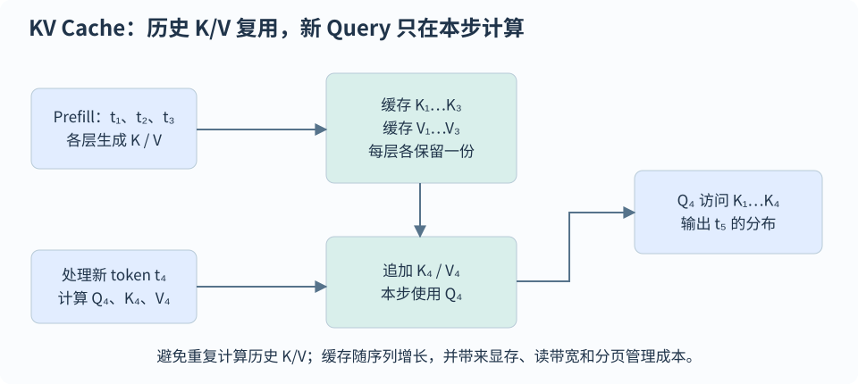

# 推理、解码、量化与服务引擎

[首页](../README.md) · [全部题目](../QUESTION-INDEX.md)

## 目录

- [KV Cache 与服务调度](#topic-1)
  - [INF-001 · KV cache 缓存什么，为什么通常不缓存历史 Q？](#inf-001)
  - [INF-002 · 怎样估算推理权重、KV cache 与总显存？](#inf-002)
  - [INF-003 · MHA、MQA 与 GQA 的结构、KV 显存及速度有何差异？](#inf-003)
  - [INF-004 · prefill 与 decode 各在做什么，瓶颈为何不同？](#inf-004)
  - [INF-006 · PagedAttention 与 FlashAttention 解决的问题有何不同？](#inf-006)
  - [INF-007 · continuous batching 与普通 dynamic batching 有何区别？](#inf-007)
  - [INF-014 · prefix caching 与普通 KV cache 有何区别？](#inf-014)
  - [INF-015 · 如何同时优化 TTFT、每 token 延迟与吞吐？](#inf-015)
  - [INF-016 · Decoder-only 批量生成为什么通常左 padding？右 padding 一定不可以吗？](#inf-016)
  - [INF-017 · SGLang、vLLM 与其他推理部署方案怎样选型，能直接断言哪一个延迟更低吗？](#inf-017)
- [解码与采样策略](#topic-2)
  - [INF-008 · temperature、top-k 与 top-p 如何影响生成？](#inf-008)
  - [INF-013 · 投机解码怎样保证目标模型的采样分布？](#inf-013)
  - [INF-031 · Greedy、Beam Search 与采样分别优化什么，beam 越大越好吗？](#inf-031)
  - [INF-032 · LLM 为什么会复读或不停生成，重复惩罚应怎样正确使用？](#inf-032)
  - [INF-034 · JSON Schema、正则或 CFG 约束生成如何实现，能否保证内容正确？](#inf-034)
- [注意力与算子加速](#topic-3)
  - [INF-005 · FlashAttention 的核心思想是什么，会改变注意力结果吗？](#inf-005)
  - [INF-018 · torch.contiguous、stride、view 与 reshape 有什么关系？为什么影响推理？](#inf-018)
  - [INF-033 · 算子融合、torch.compile 与 CUDA Graphs 分别降低什么开销？](#inf-033)
- [量化与稀疏推理](#topic-4)
  - [INF-009 · PTQ、QAT、W4A16 与 per-group quantization 是什么？](#inf-009)
  - [INF-010 · GPTQ 为什么利用二阶信息进行逐层量化？](#inf-010)
  - [INF-011 · AWQ 怎样保护重要权重，是否把 1% 权重保留为 FP16？](#inf-011)
  - [INF-012 · SmoothQuant 为什么把激活的量化困难迁移到权重？](#inf-012)
  - [INF-019 · 模型剪枝与量化有何区别，结构化、非结构化和 2:4 稀疏为何不一定加速？](#inf-019)

<a id="topic-1"></a>
## KV Cache 与服务调度

<a id="inf-001"></a>
### INF-001 · KV cache 缓存什么，为什么通常不缓存历史 Q？

**L1**

#### 答案

KV cache 保存已处理 token 在各层的 K/V，prefill 建立前缀缓存，decode 只计算新 token 并追加。历史 Q 的注意力结果已用于原位置，未来通常不再用它查询，因此无需保存。复用依赖因果性：新 token 不改变历史位置表示；双向 attention 一般不能原样套用。

新 query 仍要读取历史 K/V，单步 attention 成本随上下文增长。缓存以显存换取重复计算减少，改变底座权重、LoRA、前缀或位置约定时须检查缓存是否仍有效。



第 4 个位置新增 Q/K/V，复用已有 K/V，并输出第 5 个 token 的概率分布。

#### 易错点

- KV cache 能把每个生成 token 的 attention 复杂度变成常数。
- 把节省重算等同于减少模型总显存。

#### 追问

- 为什么训练时通常不以同样方式使用 KV cache？
- 滑动窗口注意力能怎样限制缓存大小？

<a id="inf-002"></a>
### INF-002 · 怎样估算推理权重、KV cache 与总显存？

**L2**

#### 答案

推理显存应拆为权重、KV cache、激活/工作区和框架预留。全注意力 KV 约为 $`2BLTH_{\rm kv}d_hs`$：$`B`$ 是并发序列数，$`L`$ 是层数，$`T`$ 是缓存长度，$`H_{\rm kv}`$ 是 KV 头数，$`d_h`$ 是头维，$`s`$ 是每元素字节；应使用 KV 头数而非 query 头数。

32 层、32 KV 头、头维 128、长度 4096、单序列 FP16 的 KV 为 2 GiB，改为 8 KV 头则为 0.5 GiB。70 亿参数 FP16 权重约 14 GB，即 13.0 GiB，仅指权重。请求长度不同时按 $`\sum_iT_i`$ 累加，并检查并行布局是否均分或复制 KV；分页、量化 scale、对齐与碎片都可能增加实际占用，应与实测峰值比较。

以十进制 14B 即 $`14\times10^9`$ 个参数为例，纯 FP16/BF16 权重约 28 GB，即 26.1 GiB；纯 INT8 码约 14 GB，即 13.0 GiB，还未计 scale、未量化模块与运行时开销。这不能直接推出“14 GB 卡可完整运行 14B INT8”。长回答会逐步增加每个请求的 KV；分页复用、准入限制、较低 KV dtype 或有效窗口可控制容量，裁掉上下文则会改变可见信息，需要质量评测。prefill 和 decode 峰值还可能不同，应记录生成到接近最大长度时的显存，而非只测模型刚加载完。

```math
M_{\rm KV}\approx2BLTH_{\rm kv}d_hs
```

#### 易错点

- 把 GB 和 GiB 混为一谈。
- 用 MHA 的 query 头数计算 GQA 的 KV 大小。
- 纯 INT8 权重算例不是完整服务所需显存，也不是 INT8 训练的状态大小。

#### 追问

- 多模态视觉 token 怎样计入 KV 长度？
- 为什么 4-bit 权重文件大小不等于线上显存？

<a id="inf-003"></a>
### INF-003 · MHA、MQA 与 GQA 的结构、KV 显存及速度有何差异？

**L1**

#### 答案

MHA 的各 query 头有独立 K/V，MQA 的全部 query 头共用一组 K/V，GQA 按组共享，保留 query 头数 $`H_q`$。对应 $`H_{\rm kv}=H_q`$、$`H_{\rm kv}=1`$ 和 $`1<H_{\rm kv}<H_q`$，均匀分组通常要求 $`H_q`$ 能被 $`H_{\rm kv}`$ 整除；query 头 $`i`$ 使用组 $`g(i)`$，并非先平均 query。

典型形状为 `Q:[B,H_q,L_q,d_h]`、`K/V:[B,H_kv,L_k,d_h]`，每个 query 头单独匹配其组内 K/V，再拼接输出。逻辑上的重复映射可由内核直接实现，显式物理 repeat 可能抵消显存和带宽收益。

$`N`$ 层、总缓存 token 数 $`T_{\rm total}`$、每元素 $`b`$ 字节时，KV 约为 $`2NT_{\rm total}H_{\rm kv}d_hb`$。32 头改 8 头使理论 KV 降为 1/4，但 Q、输出投影与大部分 FFN 不随之下降。Decode 在小 Q、长 K 时常受 KV 读带宽限制；prefill 仍要处理各 query 头，速度还依赖 batch、内核、上下文与硬件。TP 超过 KV 头数时可能复制 KV，不能理想地继续均分。

已有 MHA 转换 GQA 可按组聚合 K/V 权重后再 uptraining，直接平均上线不能保证质量恢复。GQA 是容量与效率的折中，MQA 也可能有任务精度代价，应同时用任务评测、长上下文测试和服务压测验证。

```math
\begin{aligned}M_{\rm KV}&\approx2NT_{\rm total}H_{\rm kv}d_hb\\O_i&=\mathrm{softmax}\!\left(Q_iK_{g(i)}^\top/\sqrt{d_h}\right)V_{g(i)}\\H_q\bmod H_{\rm kv}&=0\end{aligned}
```

#### 易错点

- 将 GQA 写成减少全部 attention heads，或认为逻辑共享等于张量实现完全不复制。
- 用 KV 头比例直接预测端到端 latency、训练 FLOPs 或质量变化。

#### 追问

- GQA 的 query-to-KV 分组在多 GPU 分片时如何保持一致？
- 同样的 KV 缓存预算下，增加并发和增加上下文长度怎样权衡？

<a id="inf-004"></a>
### INF-004 · prefill 与 decode 各在做什么，瓶颈为何不同？

**L2**

#### 答案

Prefill 一次处理输入前缀并建立 KV cache，token 并行度较高，线性层能形成较大的 GEMM，稠密 attention 有长度二次项。Decode 通常每请求每步只处理一个新 token，反复读取权重和历史 KV，新 query 的 attention 计算约为 $`O(Td)`$。

前者常更偏计算，后者在小 batch 下常更偏带宽，但长上下文、batch 与硬件会改变瓶颈。扩大 batch 能摊薄权重读取、提高利用率，也增加排队、显存和请求间竞争。先用 profiler 区分权重/KV 带宽、算子启动和计算瓶颈，再选择量化、batching 或融合。

#### 易错点

- prefill 永远算力瓶颈、decode 永远带宽瓶颈。
- 只看总 tokens/s 而不看输入输出长度。

#### 追问

- chunked prefill 为什么有助于控制 decode 干扰？
- 如何用 roofline 判断量化是否可能加速？

<a id="inf-006"></a>
### INF-006 · PagedAttention 与 FlashAttention 解决的问题有何不同？

**L2**

#### 答案

PagedAttention 将 KV 分成块，通过逻辑块到不连续物理块的映射按需分配，减少最大窗口预留浪费和碎片。块表指导内核访问，块尺寸影响尾部浪费、映射开销与效率；共享前缀或分支可以用引用计数管理，并在修改时避免覆盖其他请求。

FlashAttention 优化注意力计算的 IO 和中间矩阵，PagedAttention 优化 KV 管理，两者可配合。分页不减少同样 K/V 的理论元素数，高并发仍可能耗尽容量，需要准入、抢占等调度策略。

#### 易错点

- 分页可以让单序列无限增长且不占显存。
- 以论文倍数直接承诺任意服务吞吐提升。

#### 追问

- 块尺寸如何影响尾部浪费？
- 共享块在分支生成时为什么可能需要 copy-on-write？

<a id="inf-007"></a>
### INF-007 · continuous batching 与普通 dynamic batching 有何区别？

**L2**

#### 答案

普通 dynamic batching 常在开始处理请求前拼批，continuous batching 则在生成迭代间移除已完成请求、加入新请求，使空出的 batch 位置能立即利用，适合到达时间与生成长度不同的负载。

调度还要处理长 prefill 对 decode 的干扰、KV 容量和长请求公平性，可用单轮预算或分块 prefill 控制计算量。评估时固定请求率、输入/输出长度分布和 SLO，扫描负载比较吞吐与尾延迟，不能只看最大 batch 的吞吐。

#### 易错点

- 把 continuous batching 简单解释为所有请求永远组成最大 batch。
- 只报告峰值 throughput，不报告排队时间。

#### 追问

- 短请求如何避免被长请求拖累？
- batch size 上限和每轮 token budget 含义有何不同？

<a id="inf-014"></a>
### INF-014 · prefix caching 与普通 KV cache 有何区别？

**L2**

#### 答案

普通 KV cache 复用同一请求的历史，prefix caching 则在请求间复用完全相同前缀的 KV，主要节省重复 prefill。缓存键需包含父块上下文和当前 token，以及模型、LoRA、相关预处理等信息，防止同样局部文本在不同历史下误共享；语义相似不等于精确 KV 相同。

权重或适配器变化须失效或隔离缓存，多模态占位 token 相同但图像不同，还需模态内容哈希。缓存占用会与活跃请求竞争，需要淘汰；多租户共享应考虑隔离和时间侧信道。

#### 易错点

- 只用当前文本片段哈希，不考虑前缀上下文。
- prefix cache 会加速输出 token 的全部 decode 计算。

#### 追问

- 相同 system prompt 放在最前面为什么更利于命中？
- 多适配器和多租户怎样隔离缓存？

<a id="inf-015"></a>
### INF-015 · 如何同时优化 TTFT、每 token 延迟与吞吐？

**L2**

#### 答案

TTFT 是从请求发出到首 token 的时间，包含排队与 prefill；ITL 是相邻输出 token 的间隔，吞吐是单位时间产出。体验还受客户端流式传输影响，不能只测 prefill 内核时间。

评估时固定负载与输入/输出长度分布，记录 P50/P95/P99、失败率、请求率、并发和 token 数，区分服务端与客户端口径。扩大 batch 可提升利用率，也可能增加排队和 ITL，需联合权衡 chunked prefill、缓存与调度。逐步增加到达率找饱和点，并比较延迟 SLO 内的有效吞吐 goodput，而不只报告离线最大 tokens/s。

#### 易错点

- 首 token 很快就断言整体响应快。
- 把输入吞吐与输出吞吐混用或省略长度分布。

#### 追问

- 低并发与高并发应采用同一调度参数吗？
- 缓存命中率变化怎样影响 benchmark 公平性？

<a id="inf-016"></a>
### INF-016 · Decoder-only 批量生成为什么通常左 padding？右 padding 一定不可以吗？

**L2**

#### 答案

常见 Transformers 生成循环取每条序列张量末位 logits 来选下一个 token。长度不同时若右 padding，短样本的末位是 PAD，即使 attention_mask 屏蔽了它作为 key，末位 query 的输出也不等于原文本最后有效位置的输出；mask 不能自动改变“从哪一位取 logits”。左 padding 让所有样本的有效前缀都在张量右端结束，因此更适合这种批量生成实现。

还要正确传 attention_mask、位置编号和 cache_position；不能只改 tokenizer.padding_side 却忽略模型如何编号。把 EOS 用作左侧 padding 时，应显式给 mask，并检查停止条件是否只依据新生成 token。

这不是自回归数学要求必须左补齐。能按每条长度收集最后有效 logits、正确管理位置与 cache 的实现也可支持右 padding；无 padding 的 ragged/paged serving 又是另一种布局。SFT 的 padding 方向取决于训练实现，真正关键是注意力、labels 和有效位置一致。

#### 易错点

- attention_mask 屏蔽 PAD key 不会自动修复从末尾 PAD query 取生成 logits 的问题。
- 将推理左 padding 的经验当作所有训练与 serving 引擎的硬规则。

#### 追问

- 手写右 padding 生成循环时，第一步 logits 应按什么索引 gather？
- pad_token_id 与 eos_token_id 相同时，为什么仍需显式 attention_mask？

<a id="inf-017"></a>
### INF-017 · SGLang、vLLM 与其他推理部署方案怎样选型，能直接断言哪一个延迟更低吗？

**L2**

#### 答案

两者都是模型 serving 框架，比较应落到具体版本、模型、硬件和负载。SGLang 的 RadixAttention 用 radix tree 组织共享前缀 KV 的匹配、复用和驱逐，适合存在模板、多轮历史或分支共享的工作负载；vLLM 以分页 KV 管理和请求调度见长，同时也有自动前缀缓存。因此“一个能复用前缀，另一个完全不能”已不是有效比较。

先固定 checkpoint、dtype/量化、张量并行、上下文长度与输出分布，再明确冷缓存或热缓存，测 P50/P95 TTFT、ITL、端到端耗时、失败率和 SLO 内 goodput。共享前缀多时减少的是重复 prefill；长输出场景仍可能受 decode 带宽限制。模型支持、注意力内核、调度参数与结构化输出实现都会影响结果。

原始 SGLang 论文与旧版 vLLM 的倍数是那组实验的结果，不能直接作为当前版本承诺。选择时还要评估上线接口、运维、稳定性和迁移成本，最终用真实请求回放验证。

扩展到其他部署方案时，先分清推理运行时、模型服务与集群编排：CTranslate2 是需转换模型格式的 C++/Python CPU/GPU 推理库，MLC LLM 侧重编译与跨平台部署，DeepSpeed-MII 封装 DeepSpeed-Inference/FastGen；TGI 提供模型服务，官方截至 2026 年 10 月已将其标记为维护模式。OpenLLM 使用 BentoML 做服务部署并以 vLLM 为后端，Ray Serve LLM 则在 vLLM/SGLang 等引擎上组织多节点、多模型、自动扩缩容与请求路由。这些层次可以组合，不能仅按项目名称视为互斥替代；也不能把旧榜单、旧模型支持范围或旧接口当作当前能力。

#### 易错点

- 把历史论文的旧版 baseline 倍数当作当前框架固定性能差距。
- 一边使用热前缀缓存、一边冷缓存，或者只看最大 tokens/s。

#### 追问

- 前缀复用率变化时，TTFT 与 TPOT 分别会怎样变化？
- 高缓存命中是否可能掩盖高并发下的排队与长尾？

<a id="topic-2"></a>
## 解码与采样策略

<a id="inf-008"></a>
### INF-008 · temperature、top-k 与 top-p 如何影响生成？

**L1**

#### 答案

Temperature 用 $`p_i\propto\exp(z_i/\tau)`$ 调整分布尖锐程度，$`\tau>0`$ 时较小值通常更集中，$`\tau=0`$ 应按框架的贪心等特殊规则处理。Top-k 保留固定数量候选，top-p 保留累计概率达到阈值的最小候选集合，其大小随分布变化。

过滤后须重新归一化，多参数联用的执行顺序依实现而定。这些设置控制多样性，不保证事实正确；创作和可验证问答可用不同配置。固定种子有助于复现，但并行数值与运行环境仍可能使贪心或采样结果不能跨环境逐 token 一致。

#### 易错点

- `temperature=0` 就绝对不会出现幻觉。
- 把 top-p 当作独立地保留概率大于 p 的 token。

#### 追问

- 为什么 beam search 在开放生成中可能重复？
- top-p 与 temperature 的顺序为什么重要？

<a id="inf-013"></a>
### INF-013 · 投机解码怎样保证目标模型的采样分布？

**L3**

#### 答案

投机解码用便宜的 draft 模型提出多个 token，由 target 并行验证并执行接受/修正采样。对草稿分布 $`q`$ 提出的候选 $`x`$，以 $`\min(1,p(x)/q(x))`$ 接受；首次拒绝后从归一化的 $`\max(p-q,0)`$ 修正分布采样，不能直接从 $`p`$ 重采仍套用相同分布证明。全部接受时通常还能从 target 下一位置分布采额外 token。

标准算法保持目标模型分布，不要求每次随机运行文本完全相同。Tokenizer、采样变换与约束需协调；速度由接受率、draft 成本及验证开销决定，草稿越长不一定越快，低接受率或大 batch 可能收益不足。

```math
\begin{aligned}a(x)&=\min\!\left(1,\frac{p(x)}{q(x)}\right)\\p_{\rm correction}(x)&=\frac{\max(p(x)-q(x),0)}{\sum_y\max(p(y)-q(y),0)}\end{aligned}
```

#### 易错点

- 投机解码靠牺牲目标模型精度换速度。
- 分布一致就宣称固定种子下文本逐 token 必然一致。

#### 追问

- 怎样根据接受率选择草稿长度？
- 贪心验证与随机采样验证的规则有什么区别？

<a id="inf-031"></a>
### INF-031 · Greedy、Beam Search 与采样分别优化什么，beam 越大越好吗？

**L2**

#### 答案

Greedy每步选最大条件概率token；beam保留B条得分最高的候选前缀，扩展后再筛选，是联合序列最大概率搜索的近似；温度/top-k/top-p采样按经过变换的分布抽样，更注重输出多样性。Greedy的局部最优不保证全局最优，有限beam也不保证找到真正最优序列。

序列得分通常为log概率和，长度越长更容易累计负值，因此beam常配length penalty、EOS规则或任务约束；这些会改变搜索目标。beam增大提高搜索覆盖却增加KV/cache、重排和计算，可能更偏向高概率但重复/空泛的文本，也未必提升任务质量。翻译等输入强约束任务常可用beam，自由生成常更适合合理采样；选择要看事实性、可复现性、多样性和成本。流式beam还须处理候选共享前缀、终止和cache重排。

```math
S(y)=\sum_{t=1}^{|y|}\log p_\theta(y_t\mid x,y_{\lt t}),\qquad S_{\rm norm}(y)=S(y)/|y|^\alpha
```

#### 易错点

- 说Greedy总能最大化整个序列概率。
- 把beam越宽等同于任何生成任务质量越高。

#### 追问

- beam候选被重新排序时KV cache怎样同步？
- 长度惩罚为什么会改变最优输出而非仅加快搜索？

<a id="inf-032"></a>
### INF-032 · LLM 为什么会复读或不停生成，重复惩罚应怎样正确使用？

**L2**

#### 答案

复读可能来自数据中的重复模式、模型在某些前缀上的高概率循环、EOS/模板错配、KV或position实现bug，以及过强的确定性搜索；先区分输入回显、短语循环和未正常终止。检查训练EOS、stop tokens、max_new_tokens、chat template及缓存正确性，再在同一prompt下比较greedy和采样，避免把所有问题归因于temperature低。

常见repetition penalty对已出现token的logit按符号处理：正值除以r、负值乘r，r>1时两者都降低相对概率；frequency/presence penalty分别按次数或是否出现减去分数，no_repeat_ngram则硬禁重复片段。这些方法改变模型分布，可能误伤代码、引文、必要术语和正常重复，不能保障事实正确。应按任务调节、保留必要EOS并回归质量，数据或模板根因优先在训练和协议层修复。

```math
z_i'=\begin{cases}z_i/r,&z_i\gt 0\text{ and }i\text{ repeated}\\rz_i,&z_i\lt 0\text{ and }i\text{ repeated}\\z_i,&\text{otherwise}\end{cases},\quad r\gt 1
```

#### 易错点

- 只对正logit除r，导致负logit除r后反而增加该token概率。
- 为消除复读过度惩罚所有重复术语。

#### 追问

- presence与frequency penalty对反复出现一个词的区别是什么？
- 如果EOS没被训练，增大temperature为何未必能修复？

<a id="inf-034"></a>
### INF-034 · JSON Schema、正则或 CFG 约束生成如何实现，能否保证内容正确？

**L2**

#### 答案

约束解码维护当前输出对应的语法状态，确定哪些下一token的字节串仍能延伸成合法结果，将不允许token的logits屏蔽后再采样。正则可用有限状态机，嵌套JSON等结构通常需要CFG/栈式解析或等价引擎，Schema还可限制键、类型和枚举；必须基于token到字节串的真实映射，而非按单个字符简单处理。

它比生成后repair更直接保证已完成输出的语法，但实际保证取决于引擎支持的Schema子集、终止、长度和tokenizer规则。遇到空允许集合、截断或工具取消时仍需显式错误处理。合法JSON不保证字段事实正确、业务一致或工具执行安全，因此还应在应用层做类型、范围、权限和业务校验。grammar编译与每步mask有开销，可缓存固定schema和常见语法状态；约束越复杂越应实测延迟和准确率。

```math
p'(i\mid s)=\frac{\mathbf1\{i\in A(s)\}\exp(z_i)}{\sum_{j\in A(s)}\exp(z_j)},\qquad A(s)\ne\varnothing
```

#### 易错点

- 把“格式合法”当成“事实正确且可直接执行”。
- 忽略一个token可能包含多个字符或部分UTF-8字节。

#### 追问

- no allowed token与达到max_new_tokens应该怎样向调用方报告？
- 约束解码会如何改变原模型采样分布？

<a id="topic-3"></a>
## 注意力与算子加速

<a id="inf-005"></a>
### INF-005 · FlashAttention 的核心思想是什么，会改变注意力结果吗？

**L2**

#### 答案

FlashAttention 分块加载 Q/K/V，在片上 SRAM 计算局部分数，维护每行最大值与归一化累计量，以在线 softmax 累积输出，避免将完整 $`T\times T`$ 分数矩阵写回 HBM。它优化 IO 与中间存储，仍计算精确稠密注意力，算术复杂度为二次。

分块改变浮点求和次序，可产生小误差，并不保证逐 bit 相同，也不同于近似稀疏 attention。训练反向可重算部分分数和统计，以局部计算换更少保存与 IO。收益受长度、dtype、硬件、mask 和内核支持影响，短序列或不兼容场景不保证加速。

#### 易错点

- 说它把稠密注意力 FLOPs 从 $`O(T^2)`$ 降到 $`O(T)`$。
- 把 FlashAttention 与 KV cache 视为同一技术。

#### 追问

- 在线 softmax 合并两个块时为什么需要重缩放？
- FlashAttention-2 进一步优化了什么？

<a id="inf-018"></a>
### INF-018 · torch.contiguous、stride、view 与 reshape 有什么关系？为什么影响推理？

**L2**

#### 答案

张量不仅有 shape，还通过 storage offset 与 stride 描述逻辑索引怎样映射到存储。transpose/permute 常只改变这组元数据并共享原 storage，因而输出可能不满足默认连续布局。shape 为 2×3、stride 为 (3,1) 的连续张量转置后是 3×2、stride 为 (1,3)，数据并未立即搬动。

contiguous 在输入已经满足指定 memory format 时返回自身，否则复制成连续布局。view 要求当前 shape/stride 兼容所需重解释，不能任意展开一个转置张量；reshape 可以在兼容时返回 view，也可能隐式复制，不能依赖它总是零拷贝。连续性还应指定默认行优先或 channels_last 等格式。

推理中的频繁转置、拼头、KV 布局转换若触发大张量拷贝，会增加带宽消耗、临时显存和内核启动。但不少算子支持 strided 输入，不必在每个操作前无条件 contiguous；应依据后续内核要求，用 profiler 找出真正的复制与耗时。

```math
\mathrm{offset}(i_1,\ldots,i_n)=\mathrm{storage\_offset}+\sum_{j=1}^{n}i_j\,\mathrm{stride}_j
```

#### 易错点

- contiguous 可能复制数据，不是无需成本的 shape 操作。
- reshape 不保证总是 view；非默认 memory format 也可能连续。

#### 追问

- 为什么 transpose 后 view(-1) 可能失败，而 reshape(-1) 可成功？
- 如何确认一个推理瓶颈是隐式复制而不是 GEMM？

<a id="inf-033"></a>
### INF-033 · 算子融合、torch.compile 与 CUDA Graphs 分别降低什么开销？

**L2**

#### 答案

算子融合把连续的点操作或归约组合进较少kernel，减少launch次数和中间张量读写，但过度融合可能增加寄存器压力、降低occupancy。编译系统追踪计算图、特化shape并生成或选择kernel，还能做图级优化；它不会自动消除所有数据依赖或改成完全不同的模型。CUDA Graphs记录一组GPU操作并重放，主要减少CPU调度与kernel launch开销，尤其适合decode的小算子路径。

Graph replay通常要求captured地址和执行结构稳定；动态batch/长度可用shape bucket、固定buffer或partial capture，相关框架有不同支持。数据相关控制流、CPU同步、内存分配和graph break会削弱收益，compile和CUDA Graphs也可能叠加。先profile确定launch/访存/计算瓶颈，区分首次编译/捕获时间与warm稳态，核对输出误差、显存增长及真实输入分布；不能只跑一个固定shape就宣称端到端总能加速。

```math
t_{\rm eager}\approx t_{\rm compute}+N_{\rm launch}t_{\rm launch}+t_{\rm memory},\qquad t_{\rm replay}\approx t_{\rm compute}+t_{\rm graph\ launch}+t_{\rm memory}
```

#### 易错点

- 把CUDA Graphs说成压缩KV cache的算法。
- 把首次编译成本混入稳态结果或隐去生产中频繁recompile成本。

#### 追问

- shape bucketing怎样在浪费padding和graph重用之间权衡？
- 融合为什么有时反而变慢？

<a id="topic-4"></a>
## 量化与稀疏推理

<a id="inf-009"></a>
### INF-009 · PTQ、QAT、W4A16 与 per-group quantization 是什么？

**L1**

#### 答案

PTQ 在训练后量化，QAT 在训练中模拟或考虑量化误差。W4A16 表示权重约 4 bit、激活约 16 bit，不表示全部算子都使用 INT4。仿射量化常取 $`q=\mathrm{clip}(\mathrm{round}(x/s)+z)`$，反量化为 $`\hat x=s(q-z)`$，其中 $`s`$ 为 scale，$`z`$ 为 zero-point。

Per-tensor、per-channel、per-group 分别是量化参数的共享粒度；组越小通常误差更低，也增加元数据和实现成本。总存储还含 scale、zero-point、未量化层与对齐，不能只按参数量乘位宽估算。校准要覆盖部署输入、长度和领域，速度也要结合硬件及内核实测。

INT8/INT4不必比FP16/BF16快：小batch decode若权重带宽是瓶颈，低bit可减少读取；较大batch或prefill若更受GEMM计算约束，反量化、scale和布局转换可能抵消收益。CPU与GPU的kernel支持、SIMD/Tensor Core、shape及线程配置不同，不能给一个脱离硬件的固定速度倍数。基于相同输入/输出长度、batch和质量约束测端到端延迟与吞吐，才能比较量化收益。

```math
\begin{aligned}q&=\mathrm{clip}(\mathrm{round}(x/s)+z)\\\hat x&=s(q-z)\end{aligned}
```

#### 易错点

- 低 bit 一定比 FP16 更快。
- 把权重量化与 KV cache 量化混成同一项。

#### 追问

- outlier 为什么会增大量化误差？
- 怎样选择校准集并评估任务精度损失？

<a id="inf-010"></a>
### INF-010 · GPTQ 为什么利用二阶信息进行逐层量化？

**L2**

#### 答案

GPTQ 用校准输入 $`X`$ 形成近似二阶信息，逐步量化权重，并补偿尚未量化权重的误差，目标是减少原层 $`WX`$ 与量化层 $`\hat WX`$ 的输出差异。输入二阶统计反映权重误差对输出的敏感性，比独立 round-to-nearest 更有信息。

工程上按列或块处理和更新以控制成本，通常属于低 bit 权重 PTQ。它仍是有损压缩，效果依赖校准覆盖、分组和阻尼；领域、长上下文或多模态校准错配须通过端到端回归检查。

和 AWQ 比较，GPTQ 用输入二阶统计近似层输出误差，逐步量化并补偿剩余权重；AWQ 用激活统计选择通道缩放，再搜索有利于低 bit 表示的尺度。两者都属于依赖校准数据的权重 PTQ，不能仅凭缩写判断谁更准或更快；公平比较要固定位宽、group size、校准数据、部署内核和真实任务，量化误差与推理速度分别测量。

#### 易错点

- GPTQ 会更新底座进行完整反向训练。
- 把论文中某模型的近乎无损结果推广到所有位宽和场景。

#### 追问

- 校准 Hessian 病态时为什么可能需要 damping？
- GPTQ 与普通舍入怎样公平比较？

<a id="inf-011"></a>
### INF-011 · AWQ 怎样保护重要权重，是否把 1% 权重保留为 FP16？

**L2**

#### 答案

AWQ 利用激活统计识别重要权重通道，通过放大对应权重、对激活逆缩放，在未量化时保持线性结果等价，降低低 bit 量化误差。敏感性要结合激活幅度，单看权重绝对值不足以判断。

Scale 由离线校准搜索，正式方案不需完整梯度训练。论文讨论少量显著权重的重要性，但正式 AWQ 避免硬件不友好的混合精度，因此不能简化为把 1% 权重保留 FP16。部署仍需有效的 weight-only 内核，并实测任务精度、长度与硬件速度。

#### 易错点

- 把 AWQ 的启发性实验混成最终采用的混合精度方案。
- AWQ 只看权重统计，不看激活。

#### 追问

- 为什么通道缩放能改变量化误差却不改变未量化输出？
- AWQ 与 GPTQ 的校准目标有何差别？

<a id="inf-012"></a>
### INF-012 · SmoothQuant 为什么把激活的量化困难迁移到权重？

**L2**

#### 答案

SmoothQuant 针对激活少数大值通道造成的量化困难，用离线等价通道缩放压低激活、相应放大权重，让两者更适合 W8A8。线性层可写为 $`XW=(XS^{-1})(SW)`$，$`S`$ 是按输入通道定义的可逆正对角矩阵。

缩放前浮点函数等价，量化后仍有误差；平滑系数需平衡两边动态范围，压低一方也可能增大另一方的误差。缩放可吸收到相关参数，减少额外运行操作，实际效果取决于激活量化粒度、代表性校准长度和 INT8 硬件支持。

```math
XW=(XS^{-1})(SW)
```

#### 易错点

- 浮点等价变换就意味着量化后零误差。
- 把 SmoothQuant 一概称为 W4A16 权重量化。

#### 追问

- 为什么逐输入通道激活 scale 不一定适合常规 INT8 GEMM？
- 部署输入出现新 outlier 时怎么办？

<a id="inf-019"></a>
### INF-019 · 模型剪枝与量化有何区别，结构化、非结构化和 2:4 稀疏为何不一定加速？

**L2**

#### 答案

量化降低权重或激活的表示精度；剪枝删除或屏蔽连接、通道、注意力头或层。非结构化剪枝将任意权重置零，通常保留原矩阵形状；结构化剪枝直接缩小通道、head或层；N:M 半结构化要求每 M 个权重保留 N 个，例如 2:4，便于支持相应模式的稀疏硬件执行。普通 dense GEMM 仍可能处理完整矩阵，所以零权重比例不能直接换算为速度收益。

幅值剪枝按权重绝对值估计重要性，Wanda 结合权重幅值与输入激活尺度，也有方法使用近似二阶信息；这些都是近似，应固定校准数据并测试恢复训练的收益。LLM-Pruner 等方法考虑模块依赖；删通道或头时必须同步相关投影、残差维度和配置，不能孤立删除一个张量维度。校准与恢复训练不得污染最终评测集。

结构化剪枝较容易复用密集内核，但不适配硬件对齐的小矩阵也可能变慢。稀疏加速依赖硬件、dtype、布局、尺寸与内核，索引和不规则访存也有开销。比较实际权重内存、端到端延迟、吞吐、尾延迟和质量，并计入恢复训练预算；剪枝与量化可以组合，误差和内核兼容性需要联合验证。

```math
\mathrm{score}_{ij}^{\rm Wanda}=|W_{ij}|\,\lVert X_{:,j}\rVert_2,\qquad\rho=1-\frac{\#\text{nonzero weights}}{\#\text{weights}}
```

#### 易错点

- 非结构化权重置零不自动缩小稠密权重文件或 GEMM 计算。
- 独立删除通道却忽略残差和耦合模块维度。
- 声称50%权重为零就必然把dense推理速度翻倍。
- 进行结构化剪枝时不同投影维度未同步修改。

#### 追问

- 相同参数减少比例下，删层与删 FFN 通道的质量和延迟影响怎样比较？
- 怎样把剪枝后的恢复训练预算纳入公平比较？
- 2:4稀疏为何与任意50%零权重不同？
- 剪枝后哪些评测能发现少数关键能力被破坏？

## 参考资料

- [Fast Transformer Decoding: One Write-Head is All You Need](https://arxiv.org/pdf/1911.02150)
- [GQA: Training Generalized Multi-Query Transformer Models from Multi-Head Checkpoints](https://arxiv.org/pdf/2305.13245)
- [Efficient Memory Management for Large Language Model Serving with PagedAttention](https://arxiv.org/abs/2309.06180)
- [vLLM: Automatic Prefix Caching](https://docs.vllm.ai/en/latest/features/automatic_prefix_caching/)
- [vLLM: Quickstart](https://docs.vllm.ai/en/latest/getting_started/quickstart/)
- [PyTorch SDPA — masks, shapes and GQA](https://docs.pytorch.org/docs/2.14/generated/torch.nn.functional.scaled_dot_product_attention.html)
- [FlashAttention: Fast and Memory-Efficient Exact Attention with IO-Awareness](https://arxiv.org/pdf/2205.14135)
- [Orca: A Distributed Serving System for Transformer-Based Generative Models](https://www.usenix.org/conference/osdi22/presentation/yu)
- [Attention Is All You Need](https://arxiv.org/pdf/1706.03762)
- [The Curious Case of Neural Text Degeneration](https://arxiv.org/abs/1904.09751)
- [Transformers: Utilities for generation — sampling warpers](https://huggingface.co/docs/transformers/internal/generation_utils)
- [QLoRA: Efficient Finetuning of Quantized LLMs](https://arxiv.org/pdf/2305.14314)
- [GPTQ: Accurate Post-Training Quantization for Generative Pre-trained Transformers](https://arxiv.org/pdf/2210.17323)
- [AWQ: Activation-aware Weight Quantization for LLM Compression and Acceleration](https://arxiv.org/abs/2306.00978)
- [SmoothQuant: Accurate and Efficient Post-Training Quantization for Large Language Models](https://arxiv.org/pdf/2211.10438)
- [NVIDIA TensorRT：Advanced Topics](https://docs.nvidia.com/deeplearning/tensorrt/latest/inference-library/advanced.html)
- [Fast Inference from Transformers via Speculative Decoding](https://arxiv.org/pdf/2211.17192)
- [Automatic Prefix Caching — vLLM v0.20.1](https://docs.vllm.ai/en/v0.20.1/design/prefix_caching/)
- [Metrics — vLLM v0.20.1](https://docs.vllm.ai/en/v0.20.1/design/metrics/)
- [Transformers: Text generation](https://huggingface.co/docs/transformers/llm_tutorial)
- [Qwen3-VL official repository](https://github.com/QwenLM/Qwen3-VL)
- [SGLang: Efficient Execution of Structured Language Model Programs](https://arxiv.org/html/2312.07104v2)
- [SGLang official repository](https://github.com/sgl-project/sglang)
- [Text Generation Inference 官方文档](https://huggingface.co/docs/text-generation-inference/en/index)
- [CTranslate2 官方仓库](https://github.com/OpenNMT/CTranslate2)
- [DeepSpeed-MII 官方仓库](https://github.com/deepspeedai/DeepSpeed-MII)
- [Ray Serve LLM 官方文档](https://docs.ray.io/en/latest/serve/llm/index.html)
- [OpenLLM 官方仓库](https://github.com/bentoml/OpenLLM)
- [MLC LLM 官方文档](https://llm.mlc.ai/docs/)
- [PyTorch: Tensor Views](https://docs.pytorch.org/docs/2.14/tensor_view.html)
- [LLM-Pruner: On the Structural Pruning of Large Language Models](https://arxiv.org/abs/2305.11627)
- [A Simple and Effective Pruning Approach for Large Language Models](https://arxiv.org/abs/2306.11695)
- [Transformers：Generation strategies](https://huggingface.co/docs/transformers/main/en/generation_strategies)
- [PyTorch：torch.compile](https://docs.pytorch.org/docs/stable/generated/torch.compile.html)
- [PyTorch：CUDA semantics](https://docs.pytorch.org/docs/main/notes/cuda.html)
- [XGrammar: Flexible and Efficient Structured Generation Engine](https://arxiv.org/abs/2411.15100)
