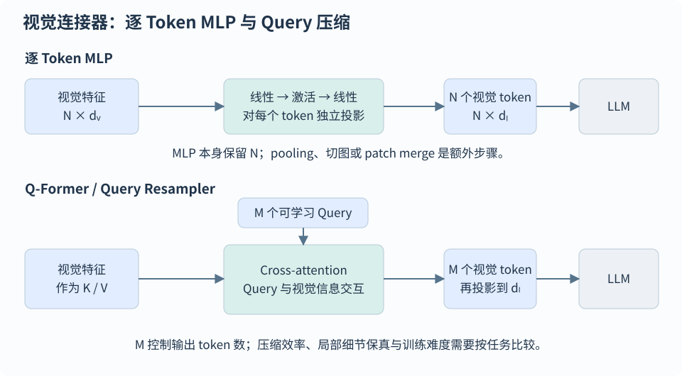

# 视觉语言模型与图文多模态

[首页](../README.md) · [全部题目](../QUESTION-INDEX.md)

## 目录

- [图文表示与预训练](#topic-1)
  - [VLM-001 · CLIP 的结构和双向对比损失是什么？](#vlm-001)
  - [VLM-002 · CLIP 如何做零样本分类？提示模板有什么作用？](#vlm-002)
  - [VLM-003 · 图文检索很好，为什么关系和计数题仍可能答错？](#vlm-003)
  - [VLM-004 · SigLIP 与 CLIP 的损失主要区别是什么？](#vlm-004)
  - [VLM-005 · BLIP 的 ITC、ITM、LM 三个目标各做什么？](#vlm-005)
  - [VLM-006 · BLIP 的 CapFilt 为什么同时需要 captioner 和 filter？](#vlm-006)
- [视觉连接器与训练](#topic-2)
  - [VLM-007 · BLIP-2 的 Q-Former 为什么能连接冻结的视觉编码器和 LLM？](#vlm-007)
  - [VLM-008 · Q-Former 与两层 MLP 连接器怎样选，MLP 已普遍淘汰 Q-Former 吗？](#vlm-008)
  - [VLM-009 · 原始 LLaVA 的两阶段训练分别更新哪些模块？](#vlm-009)
  - [VLM-010 · VLM 指令微调的 labels 应怎样掩码？](#vlm-010)
  - [VLM-021 · 微调 VLM 时，视觉骨干、连接器和 LLM 该怎样冻结？](#vlm-021)
  - [VLM-024 · 多模态预训练和 SFT 的数据配比怎样设计？](#vlm-024)
  - [VLM-028 · Qwen3-VL 四阶段预训练分别训练什么模块、数据和目标？](#vlm-028)
- [动态分辨率与位置编码](#topic-3)
  - [VLM-012 · Qwen2-VL 的动态分辨率解决了什么问题？](#vlm-012)
  - [VLM-013 · M-RoPE 如何统一文本、图像和视频位置？](#vlm-013)
  - [VLM-015 · InternVL 的动态切图与全局缩略图各有什么作用？](#vlm-015)
  - [VLM-029 · 不同版本 Qwen-VL 的视觉压缩比例和连接器层数如何确认？](#vlm-029)
  - [VLM-030 · Interleaved M-RoPE 怎样改善频率分配？与文本 Qwen3 的 RoPE 有何区别？](#vlm-030)
  - [VLM-032 · Qwen3-VL 为什么用文本时间戳表示视频时间，采样后怎样保证对齐？](#vlm-032)
- [模型结构与版本对比](#topic-4)
  - [VLM-011 · LLaVA-1.5 相比原始 LLaVA 的关键改进是什么？](#vlm-011)
  - [VLM-014 · Qwen2.5-VL 的视觉编码器和时间建模有哪些变化？](#vlm-014)
  - [VLM-026 · 以 LLaVA-1.5-7B 与 InternVL2.5-8B 为例，除骨干和训练之外有哪些差异？](#vlm-026)
  - [VLM-027 · Qwen3-VL 的基本模块与相较 Qwen2.5-VL 的结构变化是什么？](#vlm-027)
  - [VLM-031 · Qwen3-VL 的 DeepStack 如何注入多层视觉特征，是否把视觉 token 翻倍？](#vlm-031)
- [感知、文档与视觉评测](#topic-5)
  - [VLM-016 · OCR/文档问答差，怎样判断是视觉瓶颈还是语言瓶颈？](#vlm-016)
  - [VLM-017 · 单图 VLM 怎样扩展到多页文档问答？](#vlm-017)
  - [VLM-018 · 视觉幻觉怎样定义、评测和缓解？](#vlm-018)
  - [VLM-019 · 多模态模型看起来不看图，如何排查？](#vlm-019)
  - [VLM-020 · VLM 能力如何评估，为什么不能只报一个榜单分数？](#vlm-020)
  - [VLM-022 · 交错图文和多图输入如何保持图像与指代关系？](#vlm-022)
  - [VLM-023 · Grounding 与普通图像问答有什么区别？](#vlm-023)
  - [VLM-025 · 多模态检索模型与生成式 VLM 问答怎样分工？](#vlm-025)

## 图文表示与预训练

### VLM-001 · CLIP 的结构和双向对比损失是什么？

**L1**

#### 答案

CLIP 使用图像、文本双编码器，将图文映射到同一表示空间，再用归一化特征的相似度区分匹配图文对。一个 batch 中，同一索引的图文对通常是正例，其他配对是负例；图到文和文到图分别做分类，两个交叉熵损失取平均。它学习跨模态匹配表征，并非直接训练文本生成器。

若图像、文本单位向量为 $v_i,t_j$，相似度为 $s_{ij}=v_i^\top t_j/\tau$。温度 $\tau$ 控制 softmax 的尖锐程度，原始实现使用可训练的对数尺度。实际图文数据可能含同义描述，此时 batch 内其他配对也可能相关，形成假负例。

$$
\begin{aligned}
s_{ij}&=\frac{v_i^\top t_j}{\tau},\qquad \|v_i\|_2=\|t_j\|_2=1\\
\mathcal L_{\mathrm{CLIP}}&=\frac{1}{2}\left[\operatorname{CE}(s,\operatorname{diag})+\operatorname{CE}(s^\top,\operatorname{diag})\right]
\end{aligned}
$$

#### 易错点

- 不要把 CLIP 的文本编码器当作生成式 LLM。

#### 追问

- 大 batch 为什么有帮助，又有什么代价？

### VLM-002 · CLIP 如何做零样本分类？提示模板有什么作用？

**L1**

#### 答案

零样本分类将候选类别写成自然语言模板，经文本编码器得到类别向量，再与图像向量计算相似度并排序。比如将类别名嵌入描述照片的句子，比只输入孤立标签更能匹配图文预训练分布。

图像和文本特征归一化后计算点积；多模板可先聚合每个类别的特征，再统一归一化与打分。模板应通过验证集选择或集成，候选类别集合也会影响 softmax 结果，因此输出分数不天然等于校准后的置信度。

#### 易错点

- 零样本不代表类别概念从未出现在预训练数据。

#### 追问

- 如何评估跨域类别和相似类别？

### VLM-003 · 图文检索很好，为什么关系和计数题仍可能答错？

**L2**

#### 答案

整体图文匹配得分高，不等于可靠理解主体、关系、顺序和数量。应构造只交换关系或属性的最小对照样本，检验模型能否区分，再分别检查视觉细节、局部表示、训练监督和语言先验。

Winoground 用同词不同组合的图文配对检验组合性。计数题还要区分遮挡、小目标、重复目标与语言猜测；整体检索和关系问答应分开评估，不能由一个平均分代表所有能力。

#### 易错点

- 不要由单例错误推断所有 VLM 都缺乏该能力。

#### 追问

- 怎样生成不引入答案泄漏的对照集？

### VLM-004 · SigLIP 与 CLIP 的损失主要区别是什么？

**L2**

#### 答案

CLIP 在 batch 内用 softmax 比较图文相似度；SigLIP 对每个配对分别做 sigmoid 二分类，让正对和负对各自贡献二分类损失，无需为损失归一化获取完整相似度分布。这改变了负样本和通信的组织方式，也便于分块计算，但仍需考虑负样本与计算预算。

不同 batch 大小下的效果取决于样本数、负正比例和训练设置。改变损失函数也不会让编码器自动获得生成或 grounding 能力。

#### 易错点

- 不能说 SigLIP 完全不需要负样本或跨卡通信。

#### 追问

- 逐对损失如何实现分块计算？

### VLM-005 · BLIP 的 ITC、ITM、LM 三个目标各做什么？

**L1**

#### 答案

BLIP 的三个目标分别负责整体匹配、细粒度对应和条件生成：ITC 分别编码图像与文本，做图文对比学习；ITM 通过跨模态交互判断一对图文是否匹配，可使用困难负例；LM 以图像为条件，在因果文本注意力下预测后续文本。

三者在编码交互和监督形式上不同，共同支持理解与生成任务。ITM 的配对二分类不能直接等同于 ITC 的对比 softmax。

#### 易错点

- ITM 是配对匹配，不是对比 softmax 的另一个名字。

#### 追问

- 三种目标的 attention mask 有何不同？

### VLM-006 · BLIP 的 CapFilt 为什么同时需要 captioner 和 filter？

**L2**

#### 答案

网络图文对可能包含与图像无关的文字。CapFilt 中，captioner 根据图像补充描述，filter 判断原始描述和生成描述是否与图像匹配，并筛除错配，让生成与过滤共同改善训练信号。

合成描述也会出错，需配合独立过滤、人工抽检、去重和质量分层。提高描述精确性可能减少多样性或长尾覆盖，因此还要做域外抽检。

#### 易错点

- 过滤器与生成器同源时可能共享错误偏好。

#### 追问

- 如何测量过滤后的长尾覆盖损失？

## 视觉连接器与训练

### VLM-007 · BLIP-2 的 Q-Former 为什么能连接冻结的视觉编码器和 LLM？

**L1**

#### 答案

Q-Former 是带可学习查询的 Transformer，用查询间的自注意力与读取视觉特征的交叉注意力，提取固定数量的表示，再投影成 LLM 的软提示。若视觉特征 shape 为 `N×d_v`，查询为 `M×d_q`，交叉注意力的 Q 来自查询，K/V 来自视觉特征，输出为 `M×d_q`，随后映射到 `M×d_LLM`；查询数量 $M$ 不随 patch 数 $N$ 直接增长。原始 BLIP-2 使用 32 个查询，这只是其配置。

原始 Q-Former 从 BERT-base 初始化共享自注意力层，每隔一个 Transformer block 插入视觉 cross-attention。查询会相互交互，因此它并非对每个 patch 独立做投影。BLIP-2 用两阶段训练连接冻结的视觉骨干和 LLM：

- 第一阶段通过 ITC、ITM、ITG 学图文表示。ITC 隔离 query 和文本；ITM 允许两者双向交互；ITG 中 query 相互双向可见且不看文本，文本可看全部 query 和已生成文本，所以 query 子图并不是 causal。
- 第二阶段以 LLM 的生成目标更新 Q-Former 和投影层。冻结骨干指参数不更新，梯度仍须经过冻结的 LLM 回到连接器；将其前向整体放入 `no_grad` 会切断训练路径。

原始 BLIP-2 生成阶段的视觉查询不直接接收用户指令；InstructBLIP 才将指令送入 Q-Former，以提取指令相关特征。

$$
\begin{aligned}
Z&=\operatorname{QFormer}(Q_{\mathrm{learned}},X)\in\mathbb R^{M\times d_q}\\
V_{\mathrm{soft}}&=ZW_{\mathrm{proj}}\in\mathbb R^{M\times d_{\mathrm{LLM}}}
\end{aligned}
$$

#### 易错点

- 可学习 query 是模型参数向量，不等于用户问题文本、检测框或 LLM 每步的 query。
- 32 是原始 BLIP-2 实验设置；更多查询会改变瓶颈与 LLM 成本，不能当成架构必须值。

#### 追问

- ITC、ITM、ITG 的 query/text 可见关系为什么不同？
- 冻结 LLM 时，如何验证连接器仍有非零梯度？

### VLM-008 · Q-Former 与两层 MLP 连接器怎样选，MLP 已普遍淘汰 Q-Former 吗？

**L2**

#### 答案

两层 MLP 逐 patch 做维度映射；Q-Former 则通过查询自注意力和视觉交叉注意力交互提取信息，并压缩成固定数量的查询表示。MLP 结构简单，通常保留 patch 粒度；Q-Former 增加连接器计算，却可减小 LLM 的序列长度、prefill 和 KV 预算。选择时要比较视觉编码、连接器和 LLM 的端到端成本。

以 LLaVA-1.5 为例，连接器为 `Linear→GELU→Linear`，输入的 $N$ 个视觉 token 映射后仍为 $N$ 个。连接器本身不新增跨 token 混合，但视觉编码器此前已可通过注意力融合上下文；保留 patch 粒度不等于像素信息无损。Q-Former 用 $M$ 个查询汇聚 $N$ 个视觉特征，固定 $M$ 可能形成细节瓶颈。

需要小字识别、局部定位且 token 预算充足时，可先试逐 patch MLP；多图、视频或 LLM 输入预算紧张时，可试查询压缩。压缩是否损害 OCR 要在相同任务、分辨率、数据和冻结策略下消融，不能只比较整模型成绩。

MLP 是简洁有效的基线；BLIP-2 的两阶段表征学习服务于冻结骨干，InstructBLIP 使用指令感知 Q-Former，MiniCPM-V 4.5 使用 3D-Resampler 压缩图像和视频。不同设计并存，这些实例不足以证明商业部署占比或“业界普遍淘汰 Q-Former”。Resampler 的可学习查询、位置编码与 cross-attention，也不等于 BLIP-2 的 BERT 初始化、共享文本分支及 ITC/ITM/ITG 目标；不能把所有固定 token 压缩器统称 Q-Former。

比较完整融合范式时，CLIP双塔输出可比表示但不能直接完成生成对话；LLaVA/BLIP-2等把转换后的视觉token作为LLM条件输入；Flamingo使用Perceiver Resampler压缩视觉特征，再在冻结语言模型层间加入可训练的gated cross-attention。BLIP-2的cross-attention主要发生在Q-Former，不能等同于Flamingo在LLM内部插层；“连接器/跨注意力”也并非互斥，因为连接器本身就可使用cross-attention。

$$
\begin{aligned}
\text{MLP:}\quad&\mathbb R^{N\times d_v}\longrightarrow\mathbb R^{N\times d_{\mathrm{LLM}}}\\
\text{Query bridge:}\quad&\mathbb R^{N\times d_v}\longrightarrow\mathbb R^{M\times d_q}\longrightarrow\mathbb R^{M\times d_{\mathrm{LLM}}}
\end{aligned}
$$

MLP 通常保留输入 token 数；固定查询的 Q-Former 可压缩视觉序列，具体配置依模型而定。

#### 易错点

- 不同视觉骨干、数据和冻结策略的整模型成绩不能全部归因连接器，也不能外推成“MLP 一定更强”。
- MLP 本身通常不压 token；若系统另有 pooling/pixel shuffle，压缩应归于那些操作。

#### 追问

- 同一视觉骨干下，怎样分别控制视觉 token 数与总 FLOPs 做比较？
- 若查询压缩使 OCR 退化，你会调整查询数、切图、训练数据还是连接器？

### VLM-009 · 原始 LLaVA 的两阶段训练分别更新哪些模块？

**L1**

#### 答案

原始 LLaVA 的第一阶段冻结视觉编码器和 LLM，只训练投影层，用图文描述数据将视觉特征接入语言嵌入空间；第二阶段继续冻结视觉编码器，更新投影层和 LLM，用对话、详细描述和推理指令学习回答格式与任务。

特征对齐和指令跟随是两个阶段的不同职责，指令能力不能只靠增大连接器获得。回答时应注明版本，后续 VLM 的视觉解冻策略和阶段划分可能不同，“端到端”也不代表所有模块都解冻。

MiniGPT-4复用带ViT与Q-Former的BLIP-2视觉部分，以可训练线性层接到Vicuna；其预训练视觉/语言部分冻结，先用图文数据学习投影，再以精选描述数据继续改善生成质量。原始LLaVA使用CLIP视觉特征与线性投影，指令阶段训练连接器和语言模型；两者都利用预训练模块，但连接路线、训练数据与更新模块并不相同，不能把MiniGPT-4简化成LLaVA-1.5两层MLP。

#### 易错点

- 原论文说 end-to-end 不代表所有模块都解冻。

#### 追问

- 域内视觉分布变化时是否应解冻视觉骨干？

### VLM-010 · VLM 指令微调的 labels 应怎样掩码？

**L2**

#### 答案

常见对话式 VLM 仅对 assistant 的文本答案及结束标记计算自回归损失，用户问题、系统提示、视觉占位和 padding 使用忽略标签。视觉 token 展开会改变序列位置，应先得到最终多模态序列，再核对 `labels` 与 token 位置、因果移位是否一致。

逐样本检查有效监督 token 数，防止答案全部被屏蔽。多轮历史是否监督遵循具体数据配方，不能直接照搬纯文本模板；attention mask 控制信息可见性，loss mask 控制哪些预测参与损失。

#### 易错点

- attention mask 与 loss mask 控制不同事情。

#### 追问

- 如何用单样本打印核对输入与目标？

### VLM-021 · 微调 VLM 时，视觉骨干、连接器和 LLM 该怎样冻结？

**L3**

#### 答案

先判断差距来自视觉域、跨模态对齐还是任务指令，再选择更新模块。仅训练连接器成本较低；LLM LoRA 可调整任务行为；视觉分布明显变化时可考虑解冻视觉骨干。

先验证连接器和格式，再扩大更新范围，并按参数组记录学习率、梯度和可训练参数数目，用消融验证收益。加入通用图文与纯文本回归集测遗忘，防止少量域数据破坏原有能力。冻结参数不等于切断向前层传递的梯度。

#### 易错点

- 冻结参数不等于禁止该模块向前层传递梯度。

#### 追问

- 新视觉骨干替换后能直接复用旧连接器吗？

### VLM-024 · 多模态预训练和 SFT 的数据配比怎样设计？

**L3**

#### 答案

多模态预训练与 SFT 配比应围绕目标能力和数据质量设计。自然图像、OCR、文档、区域问答及纯文本的 token 成本和难度不同，先建分任务评测，再通过受控采样与消融寻找能力和成本的平衡。

记录去重后样本数、视觉 token 数和有效答案 token 数，防止低质量海量描述压过稀缺的细粒度监督。持续检查纯文本回归、视觉细节和域外泛化，而非只按原始样本量混合。

已有 VLM 适应新领域时，增量预训练先明确新能力缺口，规范原图、区域、文本与时间的对应关系，做文档/用户/时间维度切分与去重，防止同源页面或视频片段跨入评测集。以领域图文和任务样本配合一定通用图文、纯文本回放，从较小学习率与受控更新范围开始；域差异明显才扩大解冻范围。预训练式生成目标和回答监督式 SFT 要按样本目的设置 mask，不能混用固定模板。按旧能力、新领域、长上下文和视觉依赖分别回归，出现遗忘时调整采样、训练步数和模块更新，不能只以训练 loss 下降判定增量学习成功。

#### 易错点

- 不能把单篇论文的配比当跨模型最优配方。

#### 追问

- 如何区分数据质量收益与训练步数收益？

### VLM-028 · Qwen3-VL 四阶段预训练分别训练什么模块、数据和目标？

**L3**

#### 答案

报告中的“四阶段”特指 S0～S3 预训练，不能把它和后训练阶段混算：

| 阶段 | 可训练模块 | 数据重点 | 长度与 token 预算 |
|---|---|---|---|
| S0 对齐 | 仅 MLP merger；冻结视觉编码器和 LLM | 图文描述、视觉知识、OCR | 8,192；约 67B |
| S1 多模态预训练 | 全部模块 | 图文、交错文档、grounding、VQA、STEM、少量视频，加纯文本 | 8,192；约 1T |
| S2 长上下文预训练 | 全部模块 | 增加长文本、视频和 Agent 相关数据 | 32,768；约 1T |
| S3 超长上下文适配 | 全部模块 | 长视频与长文档，加纯文本 | 262,144；约 100B |

共同使用生成建模建立和扩展能力，阶段差异主要是更新范围、数据组成与长度课程。S0 先让新连接器对齐已有骨干，随后联合训练，再逐步承担长序列成本。表中预算是训练 token 数，不是样本数，也不是每阶段单步 batch。

预训练之后，报告另有 SFT、强到弱蒸馏、RL 的后训练流程，其中 SFT 又逐步扩展上下文。复现时应对齐具体阶段的数据格式、监督 mask 和参数冻结，不把所有数据统一套成 assistant-only SFT。

#### 易错点

- S0 冻结视觉与 LLM；不能回答成全参训练。
- 四阶段预训练与三个主要后训练环节不是同一个计数。

#### 追问

- 为什么不从第一步就全部使用 256K 序列？
- 如何验证长上下文扩展没有损害纯文本与短图文能力？

## 动态分辨率与位置编码

### VLM-012 · Qwen2-VL 的动态分辨率解决了什么问题？

**L2**

#### 答案

固定尺寸缩放可能损失小字或扭曲长宽比，Qwen2-VL 的动态分辨率将不同输入尺寸映射为可变长度的视觉序列，ViT 用二维位置表达处理不同空间大小，再将邻近 `2×2` 视觉 token 合并以控制进入 LLM 的序列长度。

图像越大通常 token 越多，细节和成本的权衡仍存在。部署要设置像素与视觉 token 上限，并按任务评估；显存不能仅按图像张数估计，动态分辨率也并非无限分辨率或完全不缩放。

#### 易错点

- 动态分辨率不是无限分辨率，也不等于完全不缩放。

#### 追问

- OCR 与自然图片如何设置不同预算？

### VLM-013 · M-RoPE 如何统一文本、图像和视频位置？

**L2**

#### 答案

Qwen2-VL 的 M-RoPE 将旋转位置编码的通道维度分配给时间、高度、宽度，三组位置分别作用于对应子空间。文本三者使用相同位置索引；图像固定时间位置、区分空间位置；视频还引入帧的时间位置。

混合模态输入需连续安排位置编号并保持边界可解释。M-RoPE 提供坐标结构，不会自动解决图文对齐或任意长度外推；后续版本可能改变时间编码定义，不能混写 Qwen2-VL 的帧序号与 Qwen2.5-VL 的绝对时间。

#### 易错点

- Qwen2-VL 帧序号与 Qwen2.5-VL 绝对时间不能混写。

#### 追问

- 多图与视频的时间位置为何应区分？

### VLM-015 · InternVL 的动态切图与全局缩略图各有什么作用？

**L2**

#### 答案

InternVL 动态切图先根据原图长宽比选择网格，再裁成多个固定大小的 tile，以保留高分辨率局部细节；全局缩略图补充整体布局，帮助理解局部块之间的关系。

计算和输入成本随 tile 数增加，`max_num` 控制切块预算，具体规则随版本而异。需维护同一原图的 tile 顺序、数量和归属，不能把 tile 当作独立原图；定位时还要将裁剪坐标映射回原图。

#### 易错点

- 不能把每个 tile 误当作一张独立原图。

#### 追问

- 表格跨 tile 边界时如何减少结构损失？

### VLM-029 · 不同版本 Qwen-VL 的视觉压缩比例和连接器层数如何确认？

**L2**

#### 答案

必须区分版本。原始 Qwen-VL 使用带位置处理的单层 cross-attention adapter，以 256 个可学习 query 压缩视觉特征，最终长度固定为 256。这里的“单层”不是后来两层 MLP，也不等于 BLIP-2 的完整 Q-Former。

Qwen2-VL、Qwen2.5-VL 的常用配置将相邻 2×2 patch 特征并到通道，再通过两层 MLP merger 映射到 LLM，空间 token 数缩为原来的 1/4。Qwen3-VL 延续 2×2 merger，固定版本代码可看到 Linear → GELU → Linear，并有用于 DeepStack 的额外 merger；统计连接器时不要漏掉后者。

patch 大小与 merge 大小是两件事：常见 Qwen2/2.5-VL patch 为 14，空间有效步长为 28；Qwen3-VL patch 为 16，对应 32。经过 processor 对齐的 H×W 图像，合并后空间 token 约为 HW/(ps)²，p 为 patch 大小，s 为 merge 边长；视频还要计时间 patch 和帧数。实际预算以 checkpoint 配置、resize 结果及 image/video grid 为准。

$$
N_{\mathrm{spatial}}\approx\frac{HW}{(ps)^2},\qquad s=2
$$

#### 易错点

- 把 2×2 合并写成 token 数只减少一半，或把所有 Qwen-VL 都写为固定 256 token。
- 把 patch14、空间合并2和视频时间合并2写成同一个压缩维度。

#### 追问

- 给定 resize 后的图像尺寸，如何从 processor 输出复核视觉 token 数？
- 为什么相同像素预算下还需要比较 OCR 质量，而非仅看 token 更少？

### VLM-030 · Interleaved M-RoPE 怎样改善频率分配？与文本 Qwen3 的 RoPE 有何区别？

**L3**

#### 答案

普通文本 RoPE 为 token 的一维位置选择旋转角度。多模态 M-RoPE 对视觉 token 使用时间、行、列位置 t/h/w，把不同维度的旋转角度取自相应坐标；文本位置可以在三个轴上取相同值。

早期连续分段的维度分配使某些轴集中在特定频率区间。Qwen3-VL 改为在旋转频率对之间交错分配 t/h/w，让各轴都覆盖较宽的高低频范围，从而减少单个轴的频谱偏置。它交错的是位置轴对应的旋转频率，并不是把图像与文字轮流排列这种“交错图文”数据格式。具体频率数与排列依配置和实现，不必宣称所有维度都严格按 t/h/w 等数循环。

该方法仍需正确的视觉网格、position_ids 和增量 cache 位置；它不会直接减少 KV 元素数。文本 Qwen3 的原始配置采用一维 RoPE，不能因 Qwen3-VL 使用 Qwen3 骨干就把这项多模态改造归给纯文本模型。

$$
\phi_j=\theta_jp_{a(j)},\qquad a(j)\in\{t,h,w\},\qquad \widetilde q_j=R(\phi_j)q_j
$$

#### 易错点

- 交错频率分配与交错图文训练是不同概念。
- 不看模型版本与 position_ids 就声称文本 Qwen3 已使用三维视觉位置。

#### 追问

- 当文本 token 的三个位置轴相同时，公式怎样退化为一维 RoPE？
- 为什么改变频率轴分配需要配套训练，而不能任意替换已有 checkpoint？

### VLM-032 · Qwen3-VL 为什么用文本时间戳表示视频时间，采样后怎样保证对齐？

**L2**

#### 答案

Qwen3-VL 在视频时间 patch 前加入可读的时间戳文本，使真实时间直接进入语言序列，更方便回答“何时发生”与事件定位。时间戳依原视频元数据和所选帧索引计算，而不是把抽样后帧的序号直接当秒数；同时仍保留视觉空间位置处理，所以不能说文本时间戳替代了全部视觉位置编码。

固定 FPS 原视频中，第 i 帧的时间约为 i/fps；若一个时间 patch 合并多个帧，所读固定版本 processor 用合并组首尾时间的平均值表示该 patch。可变帧率视频则应优先依据解码器给出的真实时间信息，不能机械套一个平均 FPS。重复采样、裁剪或拼接也要保持源时间和目标序列的映射。

文本时间戳会占少量上下文，细粒度定位仍受抽帧密度和视觉 token 预算限制。评测应同时看事件内容是否正确、时间误差和区间 IoU，并检查视频预处理与训练约定一致。

$$
t_i=\frac{i}{f_{\mathrm{source}}},\qquad t_{\mathrm{patch}}=\frac{t_{\mathrm{first}}+t_{\mathrm{last}}}{2}
$$

#### 易错点

- 采样帧号不等于真实秒数，尤其不能忽略源 FPS 与变帧率。
- 时间戳很精确不代表模型看过时间段内未采样的瞬时事件。

#### 追问

- 视频裁剪之后，输出时间应使用源视频时间还是片段相对时间？
- 减少 FPS 对动作识别和瞬时事件定位有什么不同影响？

## 模型结构与版本对比

### VLM-011 · LLaVA-1.5 相比原始 LLaVA 的关键改进是什么？

**L1**

#### 答案

LLaVA-1.5 在原始 LLaVA 基础上，将线性连接器改为两层 MLP，采用 336px 的 CLIP 视觉配置以提高可见细节，并加入覆盖 VQA、OCR、区域问答的任务数据。

数据配方中的简短答案格式约束可减少不同任务的输出冲突。应分别解释架构、分辨率、数据和监督的作用；性能改善不能仅归因于连接器，也不意味着视觉骨干整体解冻。

#### 易错点

- 性能进步不意味着原始模型视觉骨干整体解冻。

#### 追问

- 格式提示为什么会影响开放问答表现？

### VLM-014 · Qwen2.5-VL 的视觉编码器和时间建模有哪些变化？

**L2**

#### 答案

Qwen2.5-VL 的视觉编码器在多数层使用窗口注意力，在四层保留全局注意力；同时引入动态 FPS 采样，并将时间位置与绝对时间对齐，以改善时间表达。

固定窗口大小时，窗口层计算对 patch 数近似线性，但全局层仍有跨窗口信息交互和全局成本。合并后的视觉特征进入语言模型，LLM 的序列长度成本也须计入，因此不能把整个 ViT 或 VLM 的复杂度都写成 $O(n)$。

#### 易错点

- 不要把整个 ViT 或整个 VLM 的复杂度都写成 $O(n)$。

#### 追问

- 窗口大小与小目标识别如何权衡？

### VLM-026 · 以 LLaVA-1.5-7B 与 InternVL2.5-8B 为例，除骨干和训练之外有哪些差异？

**L2**

#### 答案

以 LLaVA-1.5-7B 与 InternVL2.5-8B 为例，除了语言、视觉骨干和训练方式，输入组织、空间重排、视觉 token 预算及多图/视频接口也不同：

- 输入组织：LLaVA-1.5-7B 的此配置为 `image_aspect_ratio=pad`，单图补方后输入 336px 编码器，patch 大小 14px；InternVL2.5 示例按长宽比选择网格，切成 448px tile，`max_num=12` 限制局部块数，多块时再加全局 thumbnail，所以总块数可达 13。
- 连接器与空间结构：前者去 CLS 后保留 `24×24=576` 个 patch token，经两层 MLP 映射；后者去 CLS 后，将 `32×32` 网格按 `ratio=0.5` 重排为 `16×16`，相邻 `2×2` 特征进入通道，再经 LayerNorm 和两层 MLP，得到每块 256 个 token。tile 按网格行优先排列，thumbnail 追加在末尾；pixel shuffle 保留邻域分组，但 LLM 最终接收的仍是一维序列，跨 tile 的表格或对象关系还需要全局视图与训练支持。
- 输入预算：InternVL 视觉 token 数约为 $256$ 乘实际块数，不含边界与文本 token；12 个局部块加缩略图为 3328 个，而非每张原图固定 256 个。切图增加细节，也增加视觉编码、LLM prefill 与 KV 成本，比较应固定任务及实际预算。
- 多图/视频：InternVL2.5 quickstart 用 `num_patches_list` 标记每张图或每帧的块数，并提供抽帧和 Frame 编号示例；LLaVA-1.5 基础版以单图为主。不能将 LLaVA-NeXT/OneVision 的高分辨率或视频能力归给 1.5，也不能将抽帧接口等同于专用时序编码。

$$
\begin{aligned}
N_{\mathrm{LLaVA\text{-}1.5}}&=\left(\frac{336}{14}\right)^2=576\\
N_{\mathrm{InternVL,tile}}&=\left(\frac{448}{14}\right)^2\left(0.5\right)^2=256\\
N_{\mathrm{InternVL,total}}&=256\left(n_{\mathrm{tiles}}+\mathbf 1_{\{\mathrm{thumbnail}\ \land\ n_{\mathrm{tiles}}>1\}}\right)
\end{aligned}
$$

#### 易错点

- 本题版本、checkpoint、预处理与 token 数要一起报；不能以两个系列名概括所有后续版本。
- InternVL 函数名是 `pixel_shuffle`，但 `ratio=0.5` 实际做空间缩小、通道增大的重排，不是图像超分辨率上采样。

#### 追问

- 为什么 thumbnail 不计入 `max_num=12`，却必须计入视觉 token 与显存？
- 给定相同 OCR 任务预算，怎样消融 tile 数、分辨率与空间压缩率？

### VLM-027 · Qwen3-VL 的基本模块与相较 Qwen2.5-VL 的结构变化是什么？

**L2**

#### 答案

Qwen3-VL 由视觉编码器、视觉语言 merger 和 Qwen3 语言骨干构成，同时有 Dense 与 MoE 配置。视觉编码器基于 SigLIP-2 架构继续适配动态分辨率，merger 将邻近 2×2 patch 特征合并并投影到语言隐藏维度；不能只比较两个 LLM 的参数量来推断整个 VLM 的成本。

与 Qwen2.5-VL 相比，三个应重点解释的变化是 Interleaved M-RoPE 平衡时空位置的频率分配，DeepStack 将不同深度的视觉特征注入较早的语言层，文本时间戳加强视频事件与真实时间的对应。它们分别补足位置、细节通路和时间表示。更好的数据与训练同样影响最终能力，结构变化不能单独保证任意 OCR、长视频或 grounding 任务提升。

部署要一起核对 processor、patch 大小、视觉 token 预算、模型配置及模板；输入预处理错配可能比换推理 dtype 对结果的影响更大。

#### 易错点

- Qwen3-VL 的架构事实不能从文本 Qwen3 的配置直接推断。
- 动态分辨率不代表无限像素输入或固定的单图 token 数。

#### 追问

- DeepStack 增加的是序列长度还是跨层特征通路？
- 如何消融结构、数据和训练预算带来的收益？

### VLM-031 · Qwen3-VL 的 DeepStack 如何注入多层视觉特征，是否把视觉 token 翻倍？

**L3**

#### 答案

Qwen3-VL 的 DeepStack 从视觉编码器的不同深度取特征，各自经过专用 merger 映射到语言隐藏维度，再加到较早语言层的对应视觉位置。报告方案使用三个视觉层级注入前三个 LLM 层；具体取层索引以 checkpoint 配置为准。基础图像 embedding 仍形成语言输入，额外分支提供较浅纹理与较深语义的补充路径。

这主要改变跨层信息通路，并非把三组特征全都追加成更长的 token 序列。因而不能把语言 KV 长度简单乘三，但额外 merger、保存的中间视觉特征和训练反向仍有计算与显存成本。模型代码用视觉位置 mask 对齐注入；多图拼接时，特征顺序错配会把另一张图的信息加到错误位置。

解释收益时应做有无 DeepStack 的相同数据、预算消融，并分别观察 OCR、文档、空间和纯文本任务，避免只拿最终模型总分证明这条通路的作用。

$$
h_{\ell}^{\mathrm{vis}}\leftarrow h_{\ell}^{\mathrm{vis}}+\operatorname{Merger}_{\ell}(F_{k_\ell})
$$

#### 易错点

- DeepStack 不等于把多层 ViT 输出全部拼到序列末尾。
- 额外视觉分支不会凭空消除 OCR 分辨率限制。

#### 追问

- 多图输入怎样保证 visual_pos_masks 与各图特征顺序一致？
- 冻结视觉骨干时，中间特征分支需要怎样设置计算图？

## 感知、文档与视觉评测

### VLM-016 · OCR/文档问答差，怎样判断是视觉瓶颈还是语言瓶颈？

**L2**

#### 答案

先裁剪目标区域或提高分辨率，检查文字是否可辨，再输入可靠 OCR 文本及布局作为对照。若文本对照能答、图片不能，优先查视觉表示与接入链路；若两者都错，再查问题语义、布局关系、检索范围和监督。

分开报告文字识别、字段关联、推理准确率，并按大小字、旋转、扫描噪声和多列排版检查。还需核对预处理方向、归一化和裁剪是否损坏文本；外部 OCR 有误差，不能当作完美真值。

#### 易错点

- 外部 OCR 同样有误差，不能直接当完美真值。

#### 追问

- 图表数值读对但单位读错如何构造评测？

### VLM-017 · 单图 VLM 怎样扩展到多页文档问答？

**L3**

#### 答案

多页文档问答需同时解决相关页定位和页面内读取，可先检索候选页，再结合页码、视觉与文本布局回答，长文档也可分层聚合。保留答案所在页的证据，分别评估检索召回和最终问答准确率。

直接拼接多页会增加 token、干扰页和位置混淆。页级检索后要检查细粒度读取是否截断跨页关系，训练样本应覆盖页标识、无答案页与跨页问题，尤其关注跨页表格。

#### 易错点

- 检索错页时不能靠生成答案掩盖错误。

#### 追问

- 怎样处理答案跨两页的表格？

### VLM-018 · 视觉幻觉怎样定义、评测和缓解？

**L2**

#### 答案

视觉幻觉指回答中的对象、属性或关系不受图像支持。可按这三类建立标注和失败切片；POPE 的对象存在性问答只衡量其中一部分，开放描述仍需逐项事实核对。

缓解需覆盖训练数据、视觉证据、训练与解码，并检查语言先验和数据共现偏差。评估同时关注错误肯定与过度否定，避免模型只会说不知道；更保守或更短的描述也可能降低指标却损失信息。

#### 易错点

- POPE 分数不是所有视觉幻觉的完整度量。

#### 追问

- 更短的描述为何可能降低幻觉指标却损失信息？

### VLM-019 · 多模态模型看起来不看图，如何排查？

**L3**

#### 答案

用同一问题替换、遮挡或打乱图像，观察答案是否对视觉证据敏感，再检查视觉输入是否真正进入模型、梯度是否到达连接器。先核对占位符、`pixel_values`、视觉 token 数和 mask，再比较仅文本、正确图像、错配图像的准确率。

链路正常后，继续检查连接器梯度、视觉特征变化、标签泄漏、文本捷径和数据偏差。只看注意力热图不足以证明因果依赖；错配图像不改变答案，也可能是该问题本来不依赖图像。

#### 易错点

- 错配图像不改变答案也可能是问题本来不依赖图像。

#### 追问

- 视觉对比解码为何可能降低语言先验干扰？

### VLM-020 · VLM 能力如何评估，为什么不能只报一个榜单分数？

**L2**

#### 答案

多模态能力包括感知、OCR、空间关系、推理和指令遵循，一个榜单均值会隐藏弱项。应固定模型版本、输入预算与评测协议，按任务切片报告误差类型、延迟、成本，并用人工抽检确认自动评分可靠性。

选择题适合标准化评测，开放问答需要细粒度事实标注；控制答案格式、随机性、分辨率和测试集污染。业务评估还应加入无答案、歧义图像与跨域样本，不同提示或图像预算下的成绩不宜直接横比。

#### 易错点

- 不同提示或图像预算下的榜单分数不宜直接横比。

#### 追问

- 模型裁判如何减少长度偏好与视觉遗漏？

### VLM-022 · 交错图文和多图输入如何保持图像与指代关系？

**L2**

#### 答案

多图与交错图文输入应保留图像边界、顺序和指代标记，让文本对应到正确图像。页面或图片编号与原始数据保持一致，推理时核对占位符与视觉块一一对应，即使压缩 token 也要保存每张图的归属。

交错图文训练提供这种关联监督，还应覆盖比较、跨图关联和局部引用任务。训练与测试的图数分布会影响能力，按单图训练的模型不能自动可靠处理任意数量的图像。

#### 易错点

- 按一张图训练的模型不会自动可靠支持任意张图。

#### 追问

- 交换两图顺序后正确答案应如何变化？

### VLM-023 · Grounding 与普通图像问答有什么区别？

**L2**

#### 答案

普通图像问答输出文本，grounding 还要将语言中的实体或短语绑定到图像区域，例如输出边界框。它需要区域对应监督和明确的坐标协议：输出究竟是像素坐标、归一化数值，还是离散位置 token。

评测同时检查框的定位和语义，可用 IoU、召回及复杂空间关系切片，不能只检查格式。图像缩放、裁剪或切图后，须将预测坐标正确反变换回原图。

#### 易错点

- 合法坐标并不代表框对应了正确实体。

#### 追问

- 如何处理多个相同物体的指代表达？

### VLM-025 · 多模态检索模型与生成式 VLM 问答怎样分工？

**L2**

#### 答案

多模态检索模型将问题和视觉文档映射成可评分表示，负责寻找证据；生成式 VLM 结合检索页和问题生成答案。单向量适合紧凑索引，多向量可保留页面局部信息并支持局部匹配，但索引与匹配成本更高。

保存页面原图、页码和区域信息供读取与定位，分别衡量检索召回、答案正确率和引用定位。无关页与跨页题可检验召回质量及证据是否充分。

#### 易错点

- 会生成图像描述不代表天然适合大规模向量检索。

#### 追问

- 扫描文档为什么可能从视觉检索获益？

## 参考资料

- [Learning Transferable Visual Models From Natural Language Supervision](https://arxiv.org/html/2103.00020v1)
- [OpenAI CLIP 官方实现](https://github.com/openai/CLIP)
- [Winoground: Probing Vision and Language Models for Visio-Linguistic Compositionality](https://arxiv.org/abs/2204.03162)
- [Sigmoid Loss for Language Image Pre-Training](https://arxiv.org/abs/2303.15343)
- [BLIP: Bootstrapping Language-Image Pre-training](https://arxiv.org/html/2201.12086v2)
- [BLIP-2: Bootstrapping Language-Image Pre-training with Frozen Image Encoders and Large Language Models](https://arxiv.org/html/2301.12597v3)
- [InstructBLIP 官方模型文档](https://huggingface.co/docs/transformers/model_doc/instructblip)
- [Improved Baselines with Visual Instruction Tuning](https://arxiv.org/html/2310.03744v2)
- [MiniCPM-V 4.5 技术报告](https://arxiv.org/html/2509.18154v1)
- [MiniCPM-V 4.5 Resampler 固定提交官方实现](https://huggingface.co/openbmb/MiniCPM-V-4_5/blob/bf6f912c8f3d652bda9431e4ec0b8de07c902205/resampler.py)
- [LLaVA 官方多模态投影器构建代码](https://github.com/haotian-liu/LLaVA/blob/main/llava/model/multimodal_projector/builder.py)
- [Flamingo: a Visual Language Model for Few-Shot Learning](https://arxiv.org/abs/2204.14198)
- [Visual Instruction Tuning](https://arxiv.org/html/2304.08485v2)
- [MiniGPT-4: Enhancing Vision-Language Understanding with Advanced Large Language Models](https://arxiv.org/abs/2304.10592)
- [Qwen2-VL: Enhancing Vision-Language Model's Perception of the World at Any Resolution](https://arxiv.org/html/2409.12191v2)
- [Qwen2.5-VL Technical Report](https://arxiv.org/html/2502.13923v1)
- [InternVL2 Quick Start 官方文档](https://internvl.readthedocs.io/en/latest/internvl2.0/quick_start.html)
- [DocVQA: A Dataset for VQA on Document Images](https://arxiv.org/abs/2007.00398)
- [Hierarchical multimodal transformers for Multi-Page DocVQA](https://arxiv.org/abs/2212.05935)
- [Evaluating Object Hallucination in Large Vision-Language Models](https://arxiv.org/abs/2305.10355)
- [Mitigating Object Hallucinations in Large Vision-Language Models through Visual Contrastive Decoding](https://arxiv.org/abs/2311.16922)
- [LLaVA 官方仓库](https://github.com/haotian-liu/LLaVA)
- [MMBench: Is Your Multi-modal Model an All-around Player?](https://arxiv.org/abs/2307.06281)
- [Kosmos-2: Grounding Multimodal Large Language Models to the World](https://arxiv.org/abs/2306.14824)
- [Cambrian-1: A Fully Open, Vision-Centric Exploration of Multimodal LLMs](https://arxiv.org/abs/2406.16860)
- [Qwen3-VL Technical Report](https://arxiv.org/html/2511.21631v1)
- [ColPali: Efficient Document Retrieval with Vision Language Models](https://arxiv.org/abs/2407.01449)
- [InternVL2.5 Quick Start 官方文档](https://internvl.readthedocs.io/en/latest/internvl2.5/quick_start.html)
- [InternVL2.5-8B modeling_internvl_chat 官方实现](https://huggingface.co/OpenGVLab/InternVL2_5-8B/blob/main/modeling_internvl_chat.py)
- [InternVL2.5-8B 官方 checkpoint 配置](https://huggingface.co/OpenGVLab/InternVL2_5-8B/blob/main/config.json)
- [LLaVA-1.5-7B 官方 checkpoint 配置](https://huggingface.co/liuhaotian/llava-v1.5-7b/blob/main/config.json)
- [LLaVA 官方 CLIP 视觉特征选择代码](https://github.com/haotian-liu/LLaVA/blob/main/llava/model/multimodal_encoder/clip_encoder.py)
- [Qwen3-VL official repository](https://github.com/QwenLM/Qwen3-VL)
- [Transformers: Qwen3-VL](https://huggingface.co/docs/transformers/model_doc/qwen3_vl)
- [Transformers v4.57.1 Qwen3-VL modeling code](https://github.com/huggingface/transformers/blob/v4.57.1/src/transformers/models/qwen3_vl/modeling_qwen3_vl.py)
- [Qwen-VL Technical Report](https://arxiv.org/html/2308.12966v3)
- [Qwen3 Technical Report](https://arxiv.org/html/2505.09388v1)
- [Transformers v4.57.1 Qwen3-VL processor code](https://github.com/huggingface/transformers/blob/v4.57.1/src/transformers/models/qwen3_vl/processing_qwen3_vl.py)
